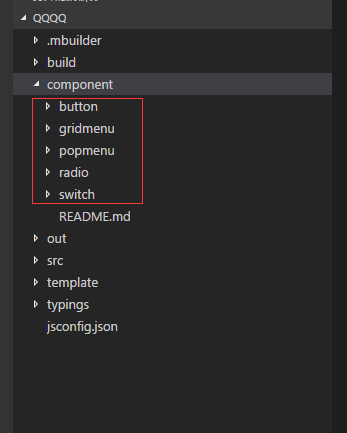
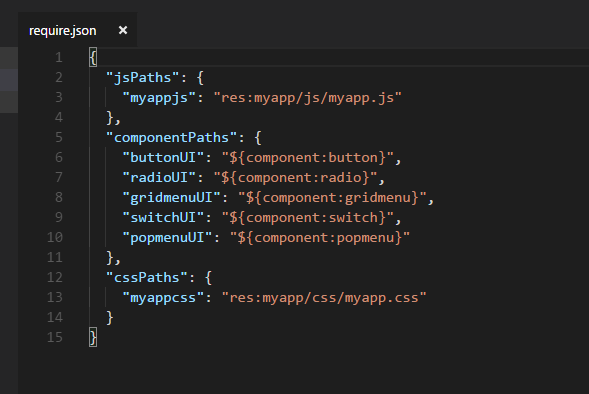
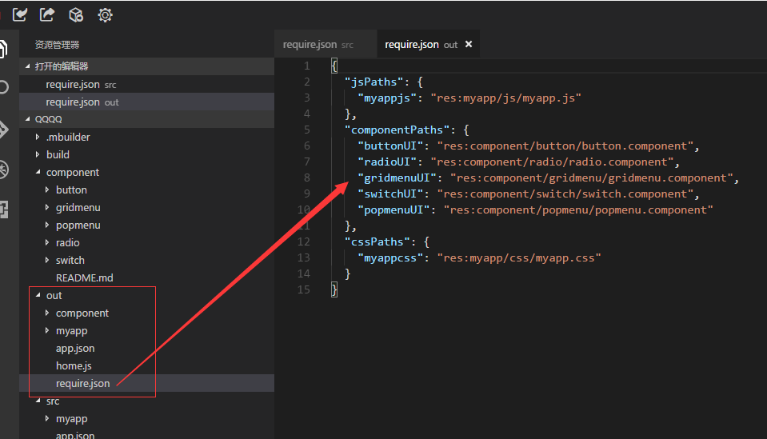
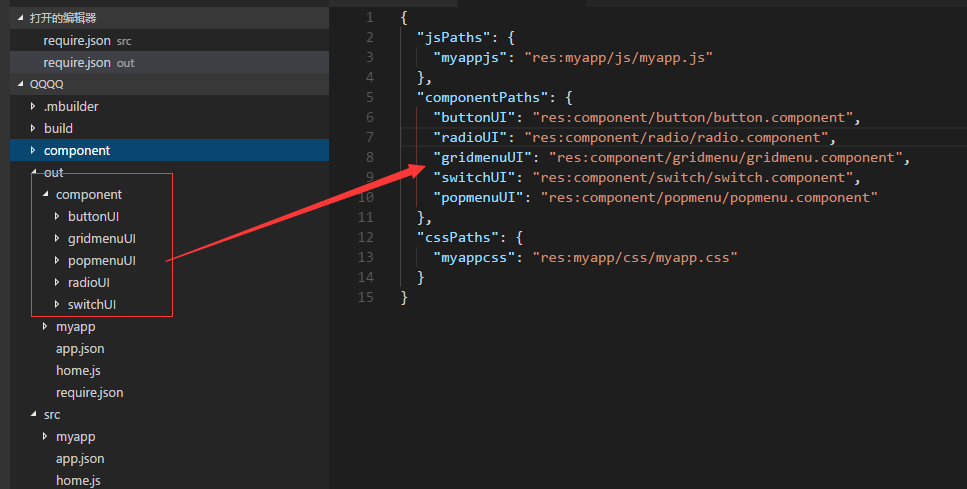

# 官方封装组件使用说明
----------

官方组件基于sprite平台提供的基础组件进行封装，使用官方组件有两种方式：


<h2 id="cid_0">使用Mbuilder组件管理导入组件</h2>


在应用工程目录的component目录上，点击右键，选择“Sprite组件管理”，如图：


然后点击“应用”选择自己需要的组件，会自动在component目录帮你添加好组件目录。



并且还会在入口文件的require.json帮我们配置好需要应用的组件，如图：



注意：只有mbuilder管理的组件才能写成${component:xxxx}这种形式，代码在构建之后会自动在out目录生成实际的组件目录路径，如图：






只有out目录下的资源，才是真正同步到手机的。

如果想删除某个组件，只需要在src目录下的require.json配置中，删掉对应的组件配置代码即可，out目录也会对应删除该组件目录。

如果想修改组件马上看下效果，可以直接修改out目录的代码，不过修改之后自己记得copy出来，否者会在src目录代码下次同步的时候给覆盖掉。如果想自己在官方组件基础之上加点东西，可以参考第二节的做法。

注意：mbuilder对组件管理的目录是component，所以开发者不能在自己的应用中有相同的目录。如果自定义组件，可以另起名字。

另外还需要注意的是，不要修改component目录下的代码，修改了也无效，mbuilder会在下次组件同步的时候给替换掉。


<h2 id="cid_0">自定义目录导入组件</h2>

如果开发者有自己的想法，想修改官方组件可以自己直接从[https://github.com/yuanhongqian/SpriteUI](https://github.com/yuanhongqian/SpriteUI)  下载官方组件源码，然后进行修改。具体使用如下：


首先获取封装组件 sprite_component 把该组件目录放入自己应用某个目录下面，另外还需要在应用程序的入口配置文件require.json里面进行路径配置，配置信息如下，示例中配置是直接把sprite_component放在src更目录下，开发者根据实际目录修改路径配置信息。

注意：这种形式下配置的组件路径，mbuilder不会维护，需要开发者自己管理好代码。如果开发者开发了自己的组件，需要mbuilder进行管理，开发者可以按照官方规定的格式通过edn门户上传组件，审核通过后，便可以在mbuilder中管理自己的组件了（目前上传后所有人都能看到）。


>配置信息如下：  

```javascript
{
	"jsPaths":{
	},
	"componentPaths":{
	"componentUI":"res:sprite_component/tmpl/component.component",
	"buttonUI":"res:sprite_component/button/button.component",
	"titlebarUI":"res:sprite_component/titlebar/titlebar.component",
	"menubarUI":"res:sprite_component/menubar/menubar.component",
	"gridmenuUI":"res:sprite_component/gridmenu/gridmenu.component",
	"newsliderUI":"res:sprite_component/newslider/newslider.component",
	"checkboxUI":"res:sprite_component/checkbox/checkbox.component",
	"radioUI":"res:sprite_component/radio/radio.component",
	"switchUI":"res:sprite_component/switch/switch.component",
	"selectUI":"res:sprite_component/select/select.component",
	"tabbarUI":"res:sprite_component/tabbar/tabbar.component",
	"indexbarUI":"res:sprite_component/indexbar/indexbar.component",
	"popmenuUI":"res:sprite_component/popmenu/popmenu.component",
	"popbottommenuUI":"res:sprite_component/popbottommenu/popbottommenu.component",
	"sliderbarUI":"res:sprite_component/sliderbar/sliderbar.component",
	"audioplayUI":"res:sprite_component/audioplay/audioplay.component",
	"superhandsignUI":"res:sprite_component/superhandsign/superhandsign.component",
	"organizationUI":"res:sprite_component/organization/organization.component",
	"memoryfieldUI":"res:sprite_component/memoryfield/memoryfield.component",
	"audiorecordUI":"res:sprite_component/audiorecord/audiorecord.component"
	},
	"cssPaths":{ 
	
	}
}
```

需要注意的是，这个配置必须写在home.js的最开始位置，因为android客户端需要在最开始的时候初始化这些配置。  

在页面使用具体组件时，只需要在js里面引入对应的组件标识即可，比如引入 require("buttonUI"); ，或者直接引入require("componentUI");这个包含了所有封装的组件，如果引入所有封装组件可能会影响页面打开的速度，建议用到什么组件就导入什么组件。  
  
注1：文档中所有事件描述中没有说明参数的，都带有默认参数e。  

注2：popmenu和popbottommenu组件不支持横竖屏切换。  

注3：考虑组件模板的封装性和独立性，在开发组件模板的时候组件内部所有资源都是基于组件文件自身的相对路径，与外界没有关系，通过组件属性和接口暴露出来的方法，如果需要传入图片路径，组件模板内部会处理成uixml页面的相对路径，开发者可以直接基于自己的uixml页面写相对路径往里面传。  

不过如果有开发者自己开发模板，在模板里面又套用了组件模板，开发者需要在自己的模板里面通过this.getPathLocation()方法得到自己当前模板的绝对位置，然后拼接完整路径传给调用的模板。比如开发者自己开发了一个组件模板xxx.component, 在里面用到了button组件，如果给button组件设置licon属性的时候，开发者需要拼接一个完整图片路径（res:xxx/xxx.png）。如果开发者不作处理在官方封装的组件里面都会处理成uixml页面的相对地址（有些控件的特殊处理会在下面的文档里面说明，比如titlebar组件）。


组件源码查看地址：[https://github.com/yuanhongqian/SpriteUI](https://github.com/yuanhongqian/SpriteUI)  

实例中用的样式文件： [https://github.com/yuanhongqian/SpriteUI/blob/master/src/css.zip](https://github.com/yuanhongqian/SpriteUI/blob/master/src/css.zip)