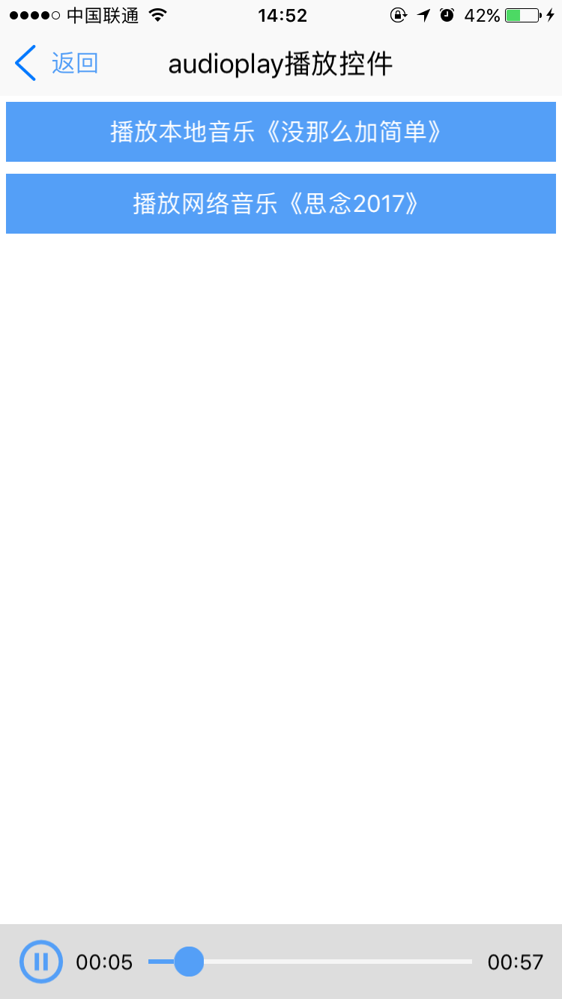
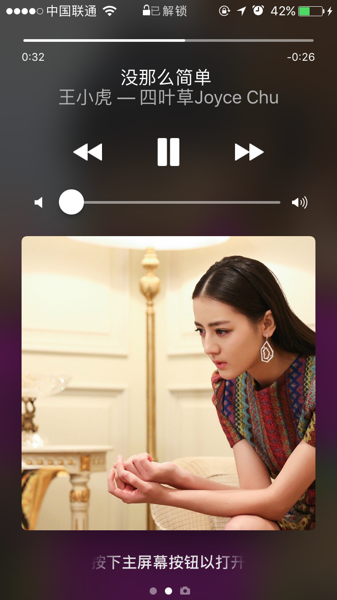

# audioplay组件

----------

<h2 id="cid_0">说明</h2>

audioplay组件是一个播放器组件，可以支持本地音频播放和网络音频播放音频格式建议mp3,其余音频格式要看手机系统自身能否支持。  

用法：在js里面引入require("audioplayUI");  

示例

```html
<audioplay id="play1" style="button-border-color:#549FF7;button-background-color:#549FF7;button-height: 20;height: 50" />
``` 

音频播放需要通过js初始化后播放

```javascript
var json = {};
json.url = "res:yuanhongqian/mp3/mnmjd.mp3";
json.mediaInfo = {};
json.mediaInfo.title = "没那么简单";
json.mediaInfo.artist = "王小虎";
json.mediaInfo.albumTitle = "四叶草Joyce Chu";
json.mediaInfo.cover = "res:yuanhongqian/image/2.jpg";
play1.playinit(json);
play1.start();

``` 

<h2 id="cid_1">属性</h2>

<span id="sx_0">**公共属性**</span>  

[参见公共属性章节](https://gitdocument.exmobi.cn/sprite-api/ggsx.html)，包括：id、style、class；


<h2 id="cid_2">样式</h2>

本节目录：

> [公共样式](#ys_0)
> 
> [sliderbar-color  前面线条颜色](#ys_1)
> 
> [sliderbar-after-color  后部分线条颜色](#ys_2)
> 
> [button-background-color  触摸按钮背景颜色](#ys_3)
> 
> [button-border-color  触摸按钮边框颜色](#ys_4)
> 
>[ button-height	  触摸按钮高度](#ys_5)


<span id="ys_0">**公共样式**</span>

[参见公共样式章节](https://gitdocument.exmobi.cn/sprite-api/ggys.html)，包括： 

> 尺寸，默认height:30;
> 
>定位
>
>外边距
>
>内边距
>
>边框
>
>背景
>
>flexbox布局:align-self

<span id="ys_1">**sliderbar-color**</span>

<code>前面线条颜色</code>

默认#549FF7

	
<span id="ys_2"> **sliderbar-after-color**</span>

<code>后部分线条颜色</code>

默认#f5f5f5

<span id="ys_3"> **button-background-color**</span>

<code>触摸按钮背景颜色</code>

默认#fcfcfc	

<span id="ys_4"> **button-border-color**</span>

<code>触摸按钮边框颜色</code>

默认#d9d9d9	


<span id="ys_5"> **button-height**</span>

<code>触摸按钮高度</code>

设置后宽度同时生效，默认30，如果同时设置height和button-height的时候，需要保证height比button-height的值大


<h2 id="cid_3">js方法</h2>

本节目录：

> [公共方法](#ff_0)
> 
> [playinit(jsondata:Object):void  播放音频之前初始化](#ff_1)
> 
> [start():void   开始播放](#ff_2)
> 
> [pause():void  暂停播放](#ff_3)
> 
> [stop():void  停止播放](#ff_4)
> 
> [getStatus():Number  获得当前播放状态](#ff_5)

<span id="ff_0">**公共方法**</span>  

[事件相关](https://gitdocument.exmobi.cn/sprite-api/ggff.html#cid_0)，包括：

> [on(messageName:string,callback:Function): void   组件注册事件的触发函数](https://gitdocument.exmobi.cn/sprite-api/ggff.html#jjxg_1)   
> 
> [fire(messageName:string,params:Array&lt;any&gt;): void  组件事件的触发函数](https://gitdocument.exmobi.cn/sprite-api/ggff.html#jjxg_2)   
> 
> [off(messageName:string,callback:Function): void  组件移除事件的触发函数](https://gitdocument.exmobi.cn/sprite-api/ggff.html#jjxg_3)  
>  
> [getOn(messageName:string): Array&lt;Function&gt;  获取已绑定的事件的触发函数](https://gitdocument.exmobi.cn/sprite-api/ggff.html#jjxg_4)   

[动画相关](https://gitdocument.exmobi.cn/sprite-api/ggff.html#cid_1)，包括： 
 
> [startAnimation(jsonData:Object,callback:Function): void  启动UI组件动画](https://gitdocument.exmobi.cn/sprite-api/ggff.html#dhxg_1)   
> 
> [startAnimator(jsonData:Object,callback:Function): void  启动UI组件属性动画](https://gitdocument.exmobi.cn/sprite-api/ggff.html#dhxg_2)   
> 
> [startKeyFrameAnimator(jsonData:Object,callback:Function): void  启动UI组件关键帧动画](https://gitdocument.exmobi.cn/sprite-api/ggff.html#dhxg_3)  
>  
> [ releaseAnimator(): void  结束控件动画](https://gitdocument.exmobi.cn/sprite-api/ggff.html#dhxg_4)   

[尺寸和位置](https://gitdocument.exmobi.cn/sprite-api/ggff.html#cid_2)，包括：  

> [getFrame(): Object  获取组件在父容器中的位置](https://gitdocument.exmobi.cn/sprite-api/ggff.html#cchwz_1)   
> 
> [setFrame(frame:Object): void  设置组件在父容器中的位置](https://gitdocument.exmobi.cn/sprite-api/ggff.html#cchwz_2)   
> 
> [getCenter(): Object  获取组件中心点在父容器中的位置](https://gitdocument.exmobi.cn/sprite-api/ggff.html#cchwz_3)  
>
> [getAbsoluteFrame(): Object  获取组件在绘制窗口中的位置](https://gitdocument.exmobi.cn/sprite-api/ggff.html#cchwz_4)   


[普通Dom节点操作](https://gitdocument.exmobi.cn/sprite-api/ggff.html#cid_3)，包括：  

> [getParent(): IElement  获取父节点](https://gitdocument.exmobi.cn/sprite-api/ggff.html#ptdom_1)   
> 
> [getNext(): IElement  获取同级下一个节点](https://gitdocument.exmobi.cn/sprite-api/ggff.html#ptdom_2)   
> 
> [getPrevious(): IElement  获取同级前一个节点](https://gitdocument.exmobi.cn/sprite-api/ggff.html#ptdom_3)  
> 
> [remove(): void  从父容器中移除自身](https://gitdocument.exmobi.cn/sprite-api/ggff.html#ptdom_4)  
> 
> [clone(isDeep:boolean):IElement  对当前Dom节点进行克隆](https://gitdocument.exmobi.cn/sprite-api/ggff.html#ptdom_5)  
>
> [setAttr(attrName:string,attrValue:string): void  设置节点属性](https://gitdocument.exmobi.cn/sprite-api/ggff.html#ptdom_6)   
>
> [getAttr(attrName:string):string  获取节点属性值](https://gitdocument.exmobi.cn/sprite-api/ggff.html#ptdom_7) 
>
> [getAttrs(): Object  获取节点所有属性](https://gitdocument.exmobi.cn/sprite-api/ggff.html#ptdom_8) 
>
> [removeAttr(attrName:string): void  移除节点属性](https://gitdocument.exmobi.cn/sprite-api/ggff.html#ptdom_9) 
>
> [hasAttr(attrName:string): boolean  节点是否具有该属性](https://gitdocument.exmobi.cn/sprite-api/ggff.html#ptdom_10) 
> 
> [setStyle(styleName:string,styleValue:string): void  设置节点样式值](https://gitdocument.exmobi.cn/sprite-api/ggff.html#ptdom_13)  
>
> [getStyle(styleName:string):string  获取节点样式值](https://gitdocument.exmobi.cn/sprite-api/ggff.html#ptdom_14)   
>
> [clearStyle(styleName:string): void  移除节点样式值](https://gitdocument.exmobi.cn/sprite-api/ggff.html#ptdom_15)    
>
> [setClassStyle(className:string,domobj:IElement): void   设置节点对应Class样式](https://gitdocument.exmobi.cn/sprite-api/ggff.htm#ptdom_16) 
>  
> [getClassStyle(): string  获取节点已设置Class样式](https://gitdocument.exmobi.cn/sprite-api/ggff.html#ptdom_17)  
>  
> [getTag(): string  获取UI组件类型](https://gitdocument.exmobi.cn/sprite-api/ggff.html#ptdom_18)  
>  
> [getId(): string  获取UI组件Id标识](https://gitdocument.exmobi.cn/sprite-api/ggff.html#ptdom_19) 


<span id="ff_1">**playinit(jsondata:Object):void**</span>

<code>播放音频之前初始化</code>  

参数：

jsondata，Json数据格式：

> url：音频文件路径支持res:和http://
> 
>mediaInfo：音频文件内容json格式，音频切换换掉后台播放时，可以在手机系统播放状态里面看到。
>
> - title：标题
> 
> - artist：艺术家
> 
> - albumTitle：专辑
> 
> - cover：系统播放界面的状态图片

返回值：无

示例：

```javascript
var json = {};
json.url = "res:yuanhongqian/mp3/mnmjd.mp3";
json.mediaInfo = {};
json.mediaInfo.title = "没那么简单"; 
json.mediaInfo.artist = "王小虎"; 
json.mediaInfo.albumTitle = "四叶草Joyce Chu"; 
json.mediaInfo.cover = "res:yuanhongqian/image/2.jpg";
play1.playinit(json);
```


<span id="ff_2">**start():void **</span>

<code>开始播放</code>  

开始播放，播放之前需要先执行playinit(json)方法

参数：无

返回值：无


<span id="ff_3">**pause():void **</span>

<code>暂停播放</code> 

参数：无

返回值：无


<span id="ff_4">**stop():void **</span>

<code>停止播放</code> 

参数：无

返回值：无


<span id="ff_5">**getStatus():Number **</span>

<code>获得当前播放状态</code> 

参数：无

返回值：数值型

> 0：未播放状态；
> 
>1：播放状态；
>
>2：暂停状态；


<h2 id="cid_4">事件</h2>

无

<h2 id="cid_5">示例</h2>

该示例和list组件混合使用，list需要用到section。

```html
<page>
    <script>
        <![CDATA[
   
        var window = require("Window");
        var document = require("Document");
        var ui = require("UI");
        var time = require("Time");
        var config = require("myconfig");
        var console = require("Console");
        require("titlebarUI");
        require("audioplayUI");
        require("buttonUI");
        var myappjs = require("myapp");
        var screenWidth = window.getScreenWidth();

        window.on("animator", function () {
            //titlebar关闭页面
            var titlebarid = document.getElement("titlebarid");
            var play1 = document.getElement("play1");
            var btn1 = document.getElement("btn1");
            var btn2 = document.getElement("btn2");

            titlebarid.on("liconClick", function (e) {
                var json = {};
                window.close(json);

            });

            titlebarid.on("ltextClick", function (e) {
                var json = {};
                window.close(json);
            });

            btn1.on("click", function (e) {

                if (btn1.getAttr("bofang") == "0") {

                    if (btn2.getAttr("bofang") == "1") {
                        play1.stop();
                    }

                    if (play1.getStatus() == 0) {
                        var json = {};
                        json.url = "res:yuanhongqian/mp3/mnmjd.mp3";
                        json.mediaInfo = {};
                        json.mediaInfo.title = "没那么简单";
                        json.mediaInfo.artist = "王小虎";
                        json.mediaInfo.albumTitle = "四叶草Joyce Chu";
                        json.mediaInfo.cover = "res:yuanhongqian/image/2.jpg";
                        play1.playinit(json);
                        play1.start();
                        btn1.setAttr("bofang", "1");
                        btn2.setAttr("bofang", "0");
                    }
                }
            });

            btn2.on("click", function (e) {
                if (btn2.getAttr("bofang") == "0") {
                    if (btn1.getAttr("bofang") == "1") {
                        play1.stop();
                    }

                    if (play1.getStatus() == 0) {
                        var json = {};
                        // json.url = "http://ar.h5.rh01.sycdn.kuwo.cn/resource/n3/69/69/1177285534.mp3";
                        json.url = "http://mpge.5nd.com/2017/2017-1-9/75862/1.mp3";
                        json.mediaInfo = {};
                        json.mediaInfo.title = "思念2017";
                        json.mediaInfo.artist = "乔冠林";
                        json.mediaInfo.albumTitle = "最新歌曲";
                        json.mediaInfo.cover = "res:yuanhongqian/image/2.jpg";
                        play1.playinit(json);
                        play1.start();
                        btn1.setAttr("bofang", "0");
                        btn2.setAttr("bofang", "1");
                    }
                }
            });
        });	 
    ]]>
    </script>
    <style>
        @import url(res:sprite_component/css/sprite.layout.css);
        @import url(res:sprite_component/css/sprite.color.css);
        text {
            text-overflow: ellipsis;
            singleline: true;
            line-space: 0;
        }
        
        button {
            margin: 4;
        }
    </style>
    }
    <ui>
        <box class="bg-white full" id="box">
            <titlebar id="titlebarid" ltext="返回" title="audioplay播放控件" licon="res:yuanhongqian/image/icon.png" class="titlebar-hasstatus"
                style="licon-width:24;licon-height:24" />
            <scroll style="flex:1;width:fill_screen;align-items:center;">
                <button bofang="0" id="btn1" value="播放本地音乐《没那么加简单》"></button>
                <button bofang="0" id="btn2" value="播放网络音乐《思念2017》"></button>
            </scroll>
            <audioplay id="play1" style="button-border-color:#549FF7;button-background-color:#549FF7;button-height: 20;height: 50" />
        </box>
    </ui>
</page>
```

>代码效果图： 

 
 
