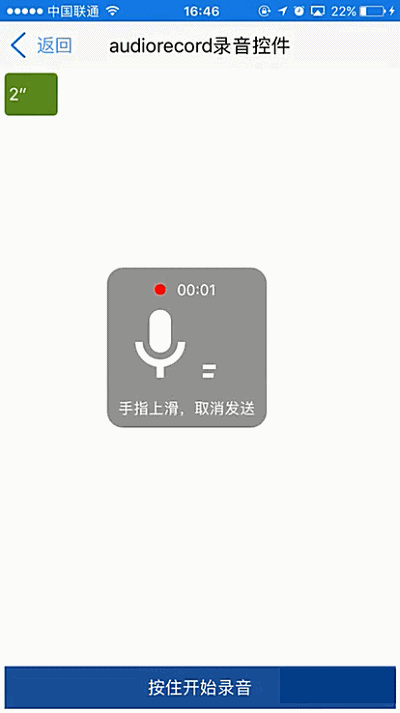

# audiorecord组件

----------

<h2 id="cid_0">说明</h2>

audiorecord组件为录音组件，该组件提供一个录音弹出窗口，类似于微信发送录音效果的弹出框。
该组件有两种使用场景：  

第一种通过点击按钮开始录音，然后在点击按钮停止录音，一般用在表单里面。这种场景只需要用到start()和stop()即可。  

第二种，就是类似微信发送语音消息一样，可以通过按下按钮开始录音，然后移动手势出现一个准备取消录音的状态，然后松开手指停止录音。  

用法：在js里面引入require("audiorecordUI");  

示例：通过js创建该组件，然后在页面加载动画完成时初始化组件数据。  


```javascript
var audiorecord1 = document.createElement("audiorecord");
var jsondata = {};
jsondata.recordingtext = "手指上滑，取消发送";
jsondata.readyendtext = "手指松开，取消发送";
jsondata.folderpah = "res:recorddata/"; //录音存放的目录
jsondata.maxTime = "100"; //秒
//该方法内部有添加控件到根节点的操作，不要放在按钮里面执行，否者会终端touchup等事件
audiorecord1.recordinit(jsondata);
audiorecord1.start();

``` 


<h2 id="cid_1">属性</h2>

无

<h2 id="cid_2">样式</h2>

无

<h2 id="cid_3">js方法</h2>

本节目录：

> [recordinit(jsonData:Object):void  录音初始化](#ff_0)
> 
> [start():void  开始录音](#ff_1)
> 
> [stop():void  停止录音](#ff_2)
> 
> [readycancel():void  准备停止录音](#ff_3)
> 
> [cancelrecord():void  取消录音](#ff_4)


<span id="ff_0">**recordinit(jsonData:Object):void**</span>

<code>录音初始化</code>

参数：

jsonData，json格式：

> recordingtext：正在录音的提示文字
> 
>readyendtext：准备取消录音的提示文字
>
>folderpah：录音文件存放目录
>
>maxTime：最大的录音时间 单位秒

示例：

```javascript
jsondata格式：
var jsondata = {};
jsondata.recordingtext = "手指上滑，取消发送";
jsondata.readyendtext = "手指松开，取消发送";
jsondata.folderpah = "res:recorddata"; //录音存放的目录
jsondata.maxTime = "100"; //秒
audiorecord1.recordinit(jsondata);
```


<span id="ff_1">**start():void**</span>

<code>开始录音</code>

参数：无

返回值：无

<span id="ff_2">**stop():void**</span>

<code>停止录音</code>

参数：无

返回值：无

<span id="ff_3">**readycancel():void**</span>

<code>准备停止录音</code>

参数：无

返回值：无


<span id="ff_4">**cancelrecord():void**</span>

<code>取消录音</code>

参数：无

返回值：无


<h2 id="cid_4">事件</h2>

**finish**

<code>监听录音结束</code>

执行stop()和cancelrecord()都会被finish事件监听到

event对象包括：  
 
> type：事件类型，字符串类型，固定值：okClick；  
> 
>target：触发事件的目标组件，dom对象；  
>
>timestamp：事件触发的时间戳,单位毫秒，数字类型；

time：

返回数值型，标识当前录制了多少秒,取消录音返回时间0。

path：

返回字符串或null，返回录音文件路径，取消录音返回地址为null


<h2 id="cid_5">示例</h2>

```html
<page>
    <script>
        <![CDATA[
        var index = 1;
        var window = require("Window");
        var document = require("Document");
        var ui = require("UI");
        var time = require("Time");
        var config = require("myconfig");
        var console = require("Console");
        var audioplay = require("AudioPlay");
        require("titlebarUI");
        require("buttonUI");
        require("audiorecordUI");

        var myappjs = require("myapp");
        var screenWidth = window.getScreenWidth();
        window.on("animator", function () {

            //titlebar关闭页面
            var titlebarid = document.getElement("titlebarid");
            var btn1 = document.getElement("btn1");
            var btn2 = document.getElement("btn2");
            var scrollid = document.getElement("scrollid");
            var audiorecord1 = document.createElement("audiorecord");
            var readycanceltag = false;

            var jsondata = {};
            jsondata.recordingtext = "手指上滑，取消发送";
            jsondata.readyendtext = "手指松开，取消发送";
            jsondata.folderpah = "res:recorddata"; //录音存放的目录
            jsondata.maxTime = "100"; //秒
            //该方法内部有添加控件到根节点的操作，不要放在按钮里面执行，否者会终端touchup等事件
            audiorecord1.recordinit(jsondata);
            titlebarid.on("liconClick", function (e) {  
                var json = {};
                window.close(json);

            });
            titlebarid.on("ltextClick", function (e) {
                var json = {};
                window.close(json);
            });
            var td_x, td_y;
            btn1.on("touchDown", function (e, param) {
                console.log("touchDown");
                td_y = param.y;
                audiorecord1.start();
            });
            btn1.on("touchUp", function (e) {
                console.log("touchUp");
                if (readycanceltag == false) {
                    audiorecord1.stop();
                }
                else {
                    audiorecord1.cancelrecord();
                }
            });
            btn1.on("touchMove", function (e, param) {
                if (Math.abs(param.y - td_y) > 150) {
                    audiorecord1.readycancel();
                    readycanceltag = true;
                }
                else {
                    readycanceltag = false;
                    audiorecord1.start();
                }
            });

            var olddom = null;
            audiorecord1.on("finish", function (e, t, path) {
                console.log("录制时长：" + t);
                console.log("存放路径：" + path);
                if (path != null) {
                    var width = (t / 20) * 300 > 50 ? (t / 20) * 300 : 50;
                    if (width > 300) {
                        width = 300;
                    }

                    var strxml = '<box mp4file="' + path + '" class="row-flex-start " style="width:' + width + ';height: 40;background-color: #669d2a;margin: 4;border-radius: 4;align-items:center">'
                        + '<text style="color: #ffffff;margin: 4">' + t + '″</text>'
                        + '<box style="flex:1"/>'
                        + '<iconfont id="imageid" style="font-family:Material Design Icons;font-size:20;color:#ffffff;width: 20;height: 20;display:none;margin:0 4 0 0" >\uF05A</iconfont>'
                        + '</box>';

                    var dom = document.createElementByXml(strxml);
                    scrollid.appendChild(dom);
                    document.refresh();
                    dom.on("click", function (e) {
                        if (olddom != null) {
                            olddom.getLastChild().setStyle("display", "none");
                            document.refresh();
                        }
                        olddom = this;
                        var mp4file = this.getAttr("mp4file");
                        var json = {};
                        json.url = mp4file;
                        audioplay.init(json);
                        audioplay.start();
                        this.getLastChild().setStyle("display", "block");
                        document.refresh();
                        var copythis = this;
                        audioplay.on("finish", function () {
                            copythis.getLastChild().setStyle("display", "none");
                            document.refresh();
                        });

                    });
                }

            });
        }); 
    ]]>
    </script>
    <style>
        @import url(res:sprite_component/css/sprite.layout.css);
        @import url(res:sprite_component/css/sprite.color.css);
        text {
            text-overflow: ellipsis;
            singleline: true;
            line-space: 0;
        }
        
        button {
            margin: 4;
        }
    </style>
    <ui>
        <box class="bg-white full" id="box">
            <titlebar id="titlebarid" ltext="返回" title="audiorecord录音控件" licon="res:yuanhongqian/image/icon.png" class="titlebar-hasstatus"
                style="licon-width:24;licon-height:24" />
            <scroll id="scrollid" style="flex:1;width:fill_screen;">
            </scroll>
            <button value="按住开始录音" id="btn1" />
        </box>
    </ui>
</page>

```

>代码效果图： 

 