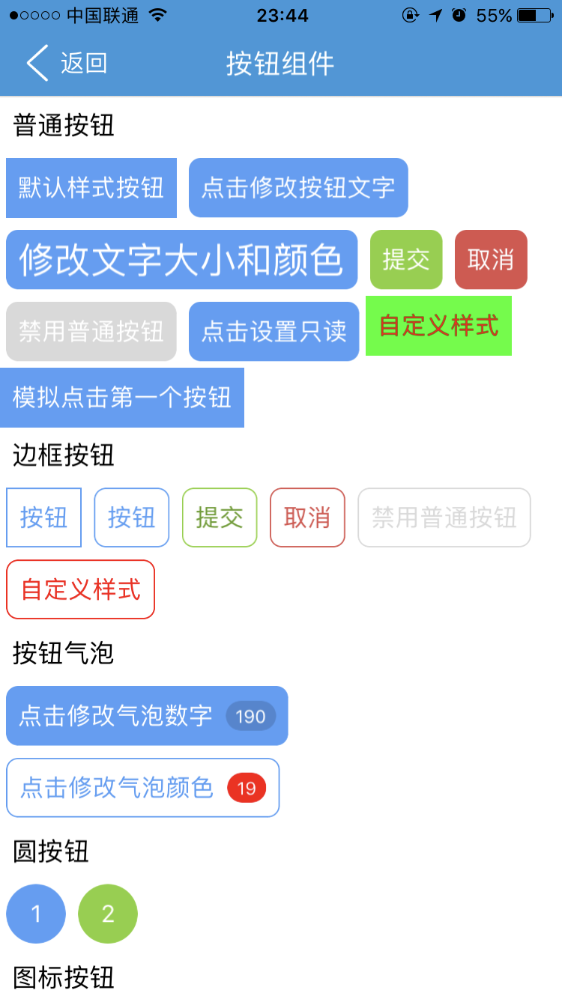

# button组件 

----------

##说明
button组件主要用于按钮形式布局，为方便开发者使用，其封装一些常用样式包括：sumbit cancel outline 注意：混合使用时outline必需在最后。    

用法：在使用button组件的时候需要在js里面引入 require("buttonUI");   
示例代码：  
 
```html
	<button class="margin4 radius8 submit outline"  value="提交"></button>
``` 


<h2 id="header2">属性</h2>
<table><tr><td>属性</td><td>描述说明</td><td>示例</td></tr><tr><td>公共属性</td><td>参见公共属性章节，包括：id，style，class</td><td></td></tr><tr><td>value</td><td>按钮文字（可以通过js修改）</td><td>var btn = document. getElement(“buttonid”);<br/>btn.setAttr(“value”,”按钮”);</td></tr><tr><td>tip</td><td>小气泡数字（可以通过js修改）</td><td>同上</td></tr><tr><td>licon</td><td>按钮上左侧的图片（可以通过js修改）</td><td>同上</td></tr><tr><td>ricon</td><td>按钮上右侧的图片（可以通过js修改）</td><td>同上</td></tr><tr><td>readonly</td><td>只读（可以通过js修改）</td><td>同上</td></tr><tr><td>loading</td><td>加载等待，取值true和false （可以通过js修改）</td><td>一般用于点击按钮时候的等待效果，btn.setAttr(“loading”,”true”);显示等待图标，过程执行结束后再调用btn.setAttr(“loading”,”false”);隐藏等待图标</td></tr></table>


##样式

<table>
   <tr>
      <td>样式</td>
      <td>描述说明</td>
      <td>示例</td>
   </tr>
   <tr>
      <td>box公共样式</td>
      <td>尺寸:height默认40;<br/>定位;<br/>内边距:默认padding:0 8 0 8;<br/>外边距;边框:默认#549FF7;<br/>背景:默认#549FF7;<br/>flexbox布局：align-self，flex</td>
      <td></td>
   </tr>
   <tr>
      <td>color</td>
      <td>按钮文字颜色，默认#ffffff （可以通过js修改）</td>
      <td>var btn = document. getElement(“buttonid”);<br/>btn.setStyle(“color”,”red”);</td>
   </tr>
   <tr>
      <td>color-click</td>
      <td>按钮文字点击颜色 默认#ffffff</td>
      <td></td>
   </tr>
   <tr>
      <td>border-color-click</td>
      <td>边框点击颜色，默认#295b9d</td>
      <td></td>
   </tr>
   <tr>
      <td>background-color-click</td>
      <td>按钮背景点击色，点击按钮会渐变到该色值，默认#295b9d。</td>
      <td></td>
   </tr>
   <tr>
      <td>tip-color</td>
      <td>小气泡字体颜色（可以通过js修改），默认#ffffff</td>
      <td>同color</td>
   </tr>
   <tr>
      <td>tip-background-color</td>
      <td>小气泡背景颜色（可以通过js修改），当按钮样式有outline是背景色是red，其他样式基于按钮本身背景色半透明</td>
      <td>同color</td>
   </tr>
   <tr>
      <td>font-size</td>
      <td>按钮文字字体大小 （可以通过js修改），默认大小16dp</td>
      <td>同color</td>
   </tr>
   <tr>
      <td>licon-width: </td>
      <td>按钮左侧图片宽度（可以通过js修改），默认24</td>
      <td></td>
   </tr>
   <tr>
      <td>licon-height: </td>
      <td>按钮左侧图片高度（可以通过js修改）,默认24</td>
      <td></td>
   </tr>
   <tr>
      <td>ricon-width: </td>
      <td>按钮右侧图片宽度（可以通过js修改）,默认24</td>
      <td></td>
   </tr>
   <tr>
      <td>ricon-height: </td>
      <td>按钮右侧图片高度（可以通过js修改）,默认24</td>
      <td></td>
   </tr>
</table>

##js方法 

<table>
   <tr>
      <td>Js方法</td>
      <td>描述说明</td>
      <td>示例</td>
   </tr>
   <tr>
      <td>box公共方法</td>
      <td>见设计文档box章节（不包括容器类Dom节点操作）</td>
      <td></td>
   </tr>
   <tr>
      <td>click()</td>
      <td>模拟点击一次按钮</td>
      <td>var btn = document. getElement(“buttonid”);btn.click();</td>
   </tr>
</table>

##事件</h2>  

<table>
   <tr>
      <td>事件</td>
      <td>描述说明</td>
      <td>示例</td>
   </tr>
   <tr>
      <td>box公共事件</td>
      <td>见设计文档box章节</td>
      <td></td>
   </tr>
   <tr>
      <td>change</td>
      <td>当按钮属性通过js修改发生变化时会触发。<br/>
     参数event对象包括： 。<br/> type：事件类型，字符串类型，固定值：change；。<br/>target：触发事件的目标组件，dom对象；<br/>timestamp：事件触发的时间戳,单位毫秒，数字类型；</td>
      <td>var btn = document.getElement(“buttonid”);<br/>btn.on(“change”,function(e){//to do});</td>
   </tr>
</table>  

##示例

```html
	<page>
		<script><![CDATA[
	    var window = require("Window");
	    var document = require("Document");
	    var ui = require("UI");   
		var console = require("Console");
			 
	    //引用自定义UI模板库
	    require("componentUI"); 
	   // require("buttonUI"); 
	   // require("titlebarUI");
	    var myappjs = require("myapp"); 
	    var screenWidth = window.getScreenWidth();
	    window.on("loaded",function(){
	    	
			    var titlebarid = document.getElement("titlebarid");
			    var btn0 = document.getElement("btn0");
			    var btn1 = document.getElement("btn1");
			    var btn2 = document.getElement("btn2");
			    var btn3 = document.getElement("btn3");
			    var btn4 = document.getElement("btn4");
			    var btn5 = document.getElement("btn5");
			    var btn6 = document.getElement("btn6");
			    var btn7 = document.getElement("btn7");
			    var btn8 = document.getElement("btn8");
	
			    titlebarid.on("ltextClick",function(e){		    	
			    	var tag = e.target;		    	
			        var json = {};
			        window.close(json);      
			    });
			    titlebarid.on("liconClick",function(e){
					var tag = e.target;		    	
			 	 	var json = {};
			        window.close(json); 
			    });
				
				btn1.on("click",function(e){
				  // myappjs.alert("触发点击事件");
				      btn1.setAttr("value","11111111");	  		
				   				
				});
	
				btn1.on("touchDown",function(e){
				  // myappjs.alert("触发点击事件");
				   var jsondata = {"content":"触发touchDown事件","duration":"1"};
	               ui.toast(jsondata);	
				});
				btn2.on("click",function(e){ 
	               btn2.setStyle("font-size","16");
				   btn2.setStyle("color","#000000");
				   btn2.setStyle("background-color","red");
				});
	
	
				btn3.on("click",function(e){
				   btn3.setAttr("tip",10);	 			  				   				
				});
	
				btn4.on("click",function(e){
				  
				   btn4.setStyle("tip-color","red");	
				   btn4.setStyle("tip-background-color","blue");
				  		   				
				});
	
				btn5.on("click",function(e){
	
					btn5.setAttr("icon","res:yuanhongqian/image/touxiang4.png");
				});
	
				btn6.on("click",function(e){
					if(btn6.getAttr("readonly") != "true"){
						  btn6.setAttr("readonly","true");
					}				
				});
	
				btn7.on("click",function(e){
					 btn0.click();				
				});
	
				btn0.on("click",function(e){
	                   // myappjs.alert("监听到了按钮1的点击事件");
	               var jsondata = {"content":"监听到了按钮1的点击事件","duration":"1"};
	               ui.toast(jsondata);	
				});
				btn1.on("change",function(e){			  	  		
				   // myappjs.alert("触发change事件"+e.type);
				    var jsondata = {"content":"触发change事件","duration":"1"};
	                ui.toast(jsondata);	
				});
				btn8.on("click",function(e){
					 btn8.setAttr("loading","true");				
				});
	    });
	    ]]>
		</script>
		<style>
	       @import url(res:sprite_component/css/sprite.layout.css);
		   @import url(res:sprite_component/css/sprite.color.css); 
	    </style>
		<ui>
			<box  class="bg-white full" id="box">
				
				<titlebar id="titlebarid" ltext="返回" title="按钮组件"   licon="res:yuanhongqian/image/back1.png"   class="titlebar-hasstatus bg-peter-river" style="title-color:#ffffff;left-color:#ffffff"/>
	
				<line />
				<scroll class="flex1">
					<box class="title" ><text class="title-text">普通按钮</text></box>
				<box id="boxid" class="row-flex-start flex-wrap full-width">
					 <button id="btn0" class="margin4"  value="默认样式按钮" ></button>
					 <button id="btn1"  class="margin4 radius8" value="点击修改按钮文字" ></button>
					 <button id="btn2" class="margin4 radius8" style="font-size:24"  value="修改文字大小和颜色"></button>
					 <button class="margin4 radius8 submit"  value="提交"></button>
					 <button class="margin4 radius8 cancel"  value="取消"></button>
					 <button class="margin4 radius8"  readonly="true"  value="禁用普通按钮"></button>
	
					 <button class="margin4 radius8"  id="btn6"  value="点击设置只读"></button>
	
					  <button  value="自定义样式" style="color:red;background-color:green;background-color-click:blue;color-click:yellow" ></button>
					   <button id="btn7"  value="模拟点击第一个按钮" ></button>
									 
				</box>
				<box class="title" ><text class="title-text">边框按钮</text></box>
				<box id="boxid" class="row-flex-start flex-wrap full-width">
					 <button id="btn1" class="outline margin4"  value="按钮" ></button>
					 <button class="margin4 radius8 outline"  value="按钮"></button>
					 <button class="margin4 radius8 submit outline"   value="提交"></button>
					 <button class="margin4 radius8 cancel outline"  value="取消"></button>
					 <button class="margin4 radius8 outline"  readonly="true"  value="禁用普通按钮"></button>
					  <button  value="自定义样式"  class="margin4 radius8 outline" style="color:red;border-color:red;background-color-click:blue;border-color-click:blue;color-click:yellow" ></button>
					
				</box>
				<box class="title" ><text class="title-text">按钮气泡</text></box>
				<box id="boxid" class="row-flex-start flex-wrap full-width">
	
					<button id="btn3"  class="margin4 radius8"  value="点击修改气泡数字" tip="190"></button>
					<button id="btn4" class="margin4 radius8 outline"  value="点击修改气泡颜色" tip="19"></button>
					 										
				</box>
			
				<box class="title" ><text class="title-text">圆按钮</text></box>
				<box id="boxid" class="row-flex-start flex-wrap full-width">
					 <button class="margin4 radius8 round"  value="1" ></button>
					 <button class="margin4 radius8 submit round"  value="2" ></button>			 
				</box>
				
				<box class="title" ><text class="title-text">图标按钮</text></box>
				<box id="boxid" class="row-flex-start flex-wrap full-width">
					 
					 <button loading="true" id="btn5" licon="res:yuanhongqian/image/new_select.png" ricon="res:yuanhongqian/image/new_select.png" class="margin4 radius8 " style="licon-width:30"  value="点击修改图标" tip="109"></button> 
					 <button licon="res:yuanhongqian/image/new_select.png" class="margin4 radius8 outline"  value="普通按钮" tip="109"></button>
				</box>
				<box class="title" ><text class="title-text">Loading按钮</text></box>
				<box id="boxid" class="row-flex-start flex-wrap full-width">
					 <button  class="margin4 radius8 " loading="true"  value="普通按钮" ></button> 
					 <button id="btn8"  class="margin4 radius8 outline" loading="false"  value="普通按钮" ></button>	 
				</box>	
				</scroll>
			</box>
		</ui>
	</page>
```

>代码效果图： 

 