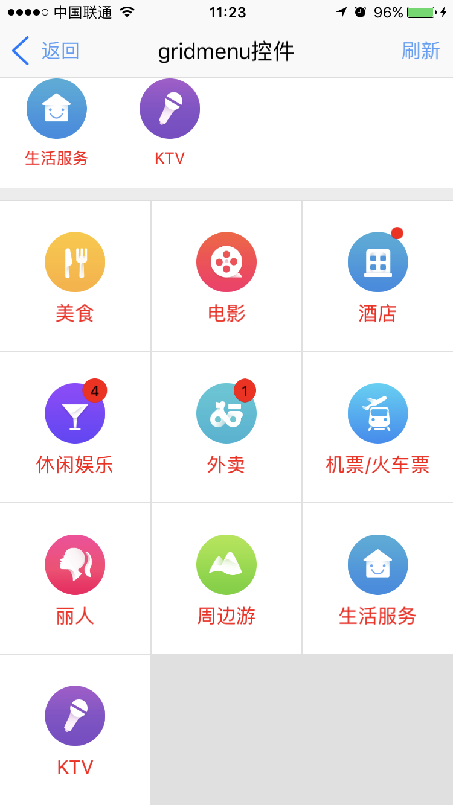

<h1>gridmenu组件 </h1> 

----------

## 说明  

gridmenu组件主要用于网格布局的暂时，该组件是基于基础组件grid进行封装，基本上具备grid所有属性和样式，除了具备grid本身属性和样式外，该组件还扩展了一些自己的属性和样式，方便开发者布局使用。  

在使用建议放在垂直布局容器中，宽度会自动填满父容器，如果放在水平布局容器中一定要给出width。
用法：在js里面引入require("gridmenuUI");  

示例：  
 
```html
<gridmenu  id="gridmenu1" style="cell-scale:1.2"  col="5" landcol="8"/>
```   
 
gridmenu内容只能通过loadData(json)方法动态加载。     

```javascript
var gridmenu1 = document.getElement("gridmenu1");
var json = {};
var arr = new Array();
var itemJson = {};
itemJson.icon = "res:yuanhongqian/image/20160126194705meishi.png";
itemJson.text = "美食";   
arr.push(itemJson);
var itemJson = {};
itemJson.icon = "res:yuanhongqian/image/20160126202805dianying.png";
itemJson.iconClick = "res:yuanhongqian/image/napp-active.png";
itemJson.text = "电影";  
arr.push(itemJson);
var itemJson = {};
itemJson.icon = "res:yuanhongqian/image/20160126203337jiudian.png";
itemJson.iconClick = "res:yuanhongqian/image/nme-active.png";
itemJson.isSmallTip = true;
itemJson.text = "酒店";   
arr.push(itemJson);
var itemJson = {};
itemJson.icon = "res:yuanhongqian/image/20160126202841xiuxianyule.png";
itemJson.text = "休闲娱乐";
itemJson.tip = "4";
arr.push(itemJson);
var itemJson = {};
itemJson.icon = "res:yuanhongqian/image/20160126203251waimai.png";
itemJson.text = "外卖";
           
itemJson.tip = "1";//如果是0或者空不显示
arr.push(itemJson);
var itemJson = {};
itemJson.icon = "res:yuanhongqian/image/2016101111034420161011huochejipiao.png";
itemJson.text = "机票/火车票";
arr.push(itemJson);
var itemJson = {};
itemJson.icon = "res:yuanhongqian/image/20160126202946liren.png";
itemJson.text = "丽人";
arr.push(itemJson);
var itemJson = {};
itemJson.icon = "res:yuanhongqian/image/20160126203440zhoubianyou.png";
itemJson.text = "周边游";
arr.push(itemJson);
json.datas = arr;
gridmenu1.loadData(json);
``` 
  
## 属性  

<table>
   <tr>
      <td>属性</td>
      <td>描述说明</td>
      <td>示例</td>
   </tr>
   <tr>
      <td>公共属性</td>
      <td>参见公共属性章节，包括：<br/>id;<br/>style;<br/>class;</td>
      <td></td>
   </tr>
   <tr>
      <td>col</td>
      <td>竖屏状态下一行现实的网格个数（可通过js修改）</td>
      <td></td>
   </tr>
   <tr>
      <td>landcol</td>
      <td>横屏切换时候的col，横屏状态下一行显示网格个数</td>
      <td></td>
   </tr>
</table>

 
## 样式  

<table>
   <tr>
      <td>样式</td>
      <td>描述说明</td>
      <td>示例</td>
   </tr>
   <tr>
      <td>grid公共样式</td>
      <td>尺寸;<br/>定位;<br/>外边距;<br/>内边距;<br/>边框;<br/>背景:默认#ffffff;<br/>flexbox布局:align-self，flex;</td>
      <td></td>
   </tr>
   <tr>
      <td>grid原本样式</td>
      <td>col-spacing: cell列间距，单位dp，默认为0;<br/>row-spacing:cell行间距，单位dp，默认为0;<br/>cell-scale: cell单元格，高度与宽度比例，数字，默认为1</td>
      <td></td>
   </tr>
   <tr>
      <td>color </td>
      <td>文字颜色，默认色值#000000</td>
      <td></td>
   </tr>
   <tr>
      <td>color-click: </td>
      <td>文字点击颜色，默认色值#549FF7</td>
      <td></td>
   </tr>
   <tr>
      <td>background-color-click: </td>
      <td>背景点击颜色，默认色值#f5f5f5</td>
      <td></td>
   </tr>
   <tr>
      <td>icon-width: </td>
      <td>图片宽度，默认45dp</td>
      <td></td>
   </tr>
   <tr>
      <td>icon-height: </td>
      <td>图片高度，默认45dp</td>
      <td></td>
   </tr>
   <tr>
      <td>font-size: </td>
      <td>字体大小，默认13dp</td>
      <td></td>
   </tr>
   <tr>
      <td>tip-color: </td>
      <td>气泡字体颜色，默认#ffffff</td>
      <td></td>
   </tr>
   <tr>
      <td>tip-background-color</td>
      <td>气泡背景色，默认red</td>
      <td></td>
   </tr>
  
</table>  

注：除了box公共样式以外，其他菜单样式通过js修改后，需重新执行loadData()才生效。  

## js方法  

<table>
   <tr>
      <td>Js方法</td>
      <td>描述说明</td>
      <td>示例</td>
   </tr>
   <tr>
      <td>grid公共方法</td>
      <td>见设计文档grid章节（不包括容器类Dom节点操作）</td>
      <td></td>
   </tr>
   <tr>
      <td>loadData(json)</td>
      <td>格式json.datas数组，属性如下<br/>itemJson.icon = "res:yuanhongqian/image/nxinxi.png";<br/>itemJson.text = "消息";<br/>itemJson.isSmallTip = true;<br/> 设置后tip值无效;itemJson.tip = "4";</td>
      <td></td>
   </tr>
   <tr>
      <td>refresh()</td>
      <td>修改菜单json数据属性后，执行refresh()，才可生效。</td>
      <td></td>
   </tr>
</table>


## 事件  

<table>
   <tr>
      <td>事件</td>
      <td>描述说明</td>
      <td>示例</td>
   </tr>
   <tr>
      <td>grid本身事件</td>
      <td>参见详细设计文档grid章节</td>
      <td></td>
   </tr>
   <tr>
      <td>gridMenuClick</td>
      <td>参数(e, index) 监听gridmenu点击事件，返回点击标识</td>
      <td>gridmenu3.on("gridMenuClick ",function(e,index){});</td>   
   </tr>
</table>


## 示例  

```html
<page>
    <script>
        <![CDATA[
        var index = 1;
        var window = require("Window");
        var document = require("Document");
        var ui = require("UI");
        var console = require("Console");
        var app = require("App");
        //引用自定义UI模板库
        //require("componentUI");
        require("titlebarUI");
        require("buttonUI");
        require("gridmenuUI");

        var myappjs = require("myapp");
        var screenWidth = window.getScreenWidth();

        window.on("loaded", function () {
            var gridmenu1 = document.getElement("gridmenu1");

            var gridmenu2 = document.getElement("gridmenu2");
            var gridmenu3 = document.getElement("gridmenu3");
            //关闭页面
            var titlebarid = document.getElement("titlebarid");
            titlebarid.on("liconClick", function (e) {
                var json = {};
                window.close(json);
            });

            titlebarid.on("ltextClick", function (e) {
                var json = {};
                window.close(json);
            });
            titlebarid.on("rtextClick", function (e) {
                var itemJson = json.datas[4];

                itemJson.icon = "res:yuanhongqian/image/20160126203251waimai.png";
                itemJson.text = "外卖123";
                itemJson.isSmallTip = true;

                var itemJson = json.datas[3];

                itemJson.icon = "res:yuanhongqian/image/20160126194705meishi.png";
                itemJson.text = "休闲123";
                itemJson.tip = "10";
                var itemJson = json.datas[2];

                itemJson.icon = "res:yuanhongqian/image/20160126203337jiudian.png";
                itemJson.iconClick = "res:yuanhongqian/image/nme-active.png";
                itemJson.isSmallTip = false;
                itemJson.text = "酒店123";
                var itemJson = json.datas[0];
                itemJson.icon = "res:yuanhongqian/image/20160126194705meishi.png";
                itemJson.text = "美食";
                itemJson.tip = "10";
                gridmenu1.refresh();
            });

            var json = {};
            var arr = new Array();
            var itemJson = {};
            itemJson.icon = "res:yuanhongqian/image/20160126194705meishi.png";
            itemJson.text = "美食";
            arr.push(itemJson);
            var itemJson = {};
            itemJson.icon = "res:yuanhongqian/image/20160126202805dianying.png";
            itemJson.iconClick = "res:yuanhongqian/image/napp-active.png";
            itemJson.text = "电影";
            arr.push(itemJson);
            var itemJson = {};
            itemJson.icon = "res:yuanhongqian/image/20160126203337jiudian.png";
            itemJson.iconClick = "res:yuanhongqian/image/nme-active.png";
            itemJson.isSmallTip = true;
            itemJson.text = "酒店";
            arr.push(itemJson);

            var itemJson = {};
            itemJson.icon = "res:yuanhongqian/image/20160126202841xiuxianyule.png";
            itemJson.text = "休闲娱乐";
            itemJson.tip = "4";
            arr.push(itemJson);
            var itemJson = {};
            itemJson.icon = "res:yuanhongqian/image/20160126203251waimai.png";
            itemJson.text = "外卖";

            itemJson.tip = "1";//如果是0或者空不显示
            arr.push(itemJson);

            var itemJson = {};
            itemJson.icon = "res:yuanhongqian/image/2016101111034420161011huochejipiao.png";
            itemJson.text = "机票/火车票";
            arr.push(itemJson);

            var itemJson = {};
            itemJson.icon = "res:yuanhongqian/image/20160126202946liren.png";
            itemJson.text = "丽人";
            arr.push(itemJson);

            var itemJson = {};
            itemJson.icon = "res:yuanhongqian/image/20160126203440zhoubianyou.png";
            itemJson.text = "周边游";
            arr.push(itemJson);

            var itemJson = {};
            itemJson.icon = "res:yuanhongqian/image/20160126205426shenghuofuwu.png";
            itemJson.text = "生活服务";
            arr.push(itemJson);

            var itemJson = {};
            itemJson.icon = "res:yuanhongqian/image/20160126203542ktv.png";
            itemJson.text = "KTV";
            arr.push(itemJson);
            json.datas = arr;
            gridmenu1.loadData(json);
            gridmenu2.loadData(json);
            gridmenu3.loadData(json);
            gridmenu1.on("gridMenuClick", function (e, tag) {
                myappjs.alert(tag);
            });

        });

        app.on("orientation", function (e, orientation) {
            var screenWidth = window.getScreenWidth();

        });
	
    ]]>
    </script>
    <style>
        @import url(res:sprite_component/css/sprite.layout.css);
        @import url(res:sprite_component/css/sprite.color.css);
    </style>
    <ui>
        <box class="bg-white full" id="box">
            <titlebar id="titlebarid" class="titlebar-hasstatus" title="gridmenu控件" licon="res:yuanhongqian/image/icon.png" style="licon-width:24;licon-height:24"
                ltext="返回" rtext="刷新" />
            <line />
            <scroll class="flex1" style="background-color:#ececec">

                <gridmenu id="gridmenu1" style="cell-scale:1.2" col="5" landcol="8" />

                <box style="height:10;" />
                <line style="line-size:0.5" />
                <gridmenu id="gridmenu2" style="icon-width:50;icon-height:50;color:red;tip-color:#000000;cell-scale:1.2;" col="4" landcol="6"
                />
                <box style="height:10;" />
                <line style="line-size:0.5" />

                <gridmenu id="gridmenu3" style="icon-width:50;icon-height:50;color:red;tip-color:#000000;font-size: 16;col-spacing:1;row-spacing:1;;cell-scale:1;background-color: #e0e0e0"
                    col="3" landcol="6" />
            </scroll>
        </box>
    </ui>
</page>

```

>代码效果图： 

 
 