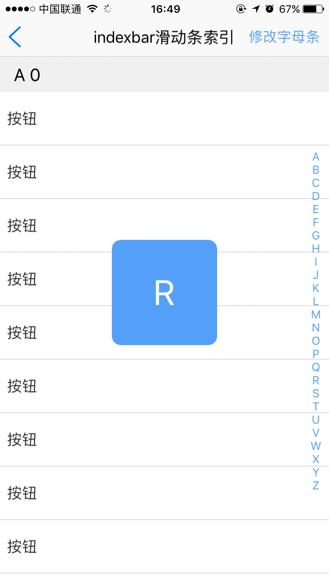
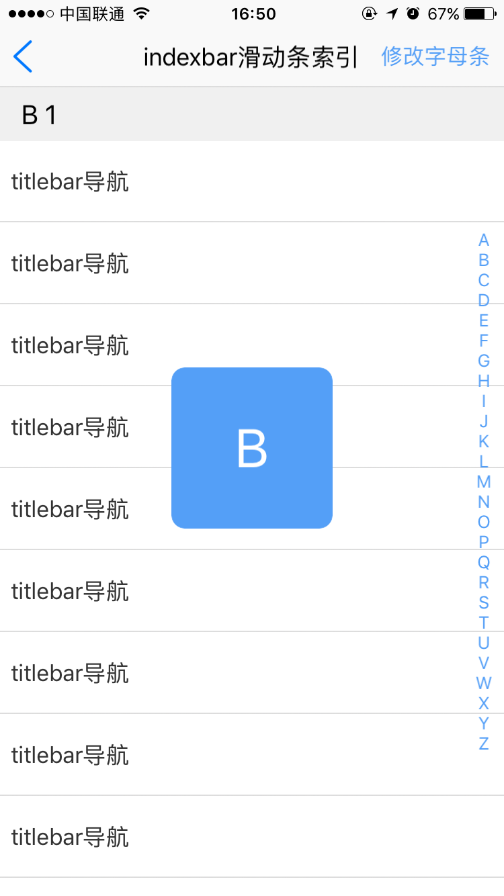

# indexbar组件
----------

<h2 id="cid_0">说明</h2>

inderbar组件主要用于字母导航条，类似于手机通讯录字母条的效果，通过触摸滑动字母条可以快速检索到对应字母的内容，该组件一般和list组件一起使用，组件本身只提供字母条的样式效果。该控使用绝对定位布局，默认定位在页面右侧。由于是绝对定位，在使用的时候建议把该控件放在页面布局代码的最下面，否者会被其他控件遮罩。  


用法：在js里面引入require("inderbarUI");  

示例：  
  
```html
<indexbar id="indexbarid"  ispop="true"/>
``` 


<h2 id="cid_1">属性</h2>

<span id="sx_0">**公共属性**</span>  

[参见公共属性章节](https://gitdocument.exmobi.cn/sprite-begin/ggsx.html)，包括：id、style、class；

**ispop**

<code>是否弹出pop</code>

是否弹出pop，取值true,false，默认true

<h2 id="cid_2">样式</h2>

**公共样式**

> 尺寸:默认width:30;
> 
>定位:position:absolute;top:0;right: 0;
>
>bottom: 0;
>
>外边距
>
>内边距
>
>边框
>
>背景

**pop-background-color**

<code>pop窗口背景色</code>

pop窗口背景色; 默认#549FF7
 
**pop-text-color**

<code>pop 窗口中文字颜色</code>

默认#ffffff

**indexbar-text-color**

<code>字母条的文字颜色</code>

默认#549FF7

     
<h2 id="cid_3">js方法</h2>

**公共方法**  

[事件相关](https://gitdocument.exmobi.cn/sprite-begin/ggff.html#cid_0)，包括：

> [on(messageName:string,callback:Function): void   组件注册事件的触发函数](https://gitdocument.exmobi.cn/sprite-begin/ggff.html#jjxg_1)   
> 
> [fire(messageName:string,params:Array&lt;any&gt;): void  组件事件的触发函数](https://gitdocument.exmobi.cn/sprite-begin/ggff.html#jjxg_2)   
> 
> [off(messageName:string,callback:Function): void  组件移除事件的触发函数](https://gitdocument.exmobi.cn/sprite-begin/ggff.html#jjxg_3)  
>  
> [getOn(messageName:string): Array&lt;Function&gt;  获取已绑定的事件的触发函数](https://gitdocument.exmobi.cn/sprite-begin/ggff.html#jjxg_4)   

[动画相关](https://gitdocument.exmobi.cn/sprite-begin/ggff.html#cid_1)，包括： 
 
> [startAnimation(jsonData:Object,callback:Function): void  启动UI组件动画](https://gitdocument.exmobi.cn/sprite-begin/ggff.html#dhxg_1)   
> 
> [startAnimator(jsonData:Object,callback:Function): void  启动UI组件属性动画](https://gitdocument.exmobi.cn/sprite-begin/ggff.html#dhxg_2)   
> 
> [startKeyFrameAnimator(jsonData:Object,callback:Function): void  启动UI组件关键帧动画](https://gitdocument.exmobi.cn/sprite-begin/ggff.html#dhxg_3)  
>  
> [ releaseAnimator(): void  结束控件动画](https://gitdocument.exmobi.cn/sprite-begin/ggff.html#dhxg_4)   

[尺寸和位置](https://gitdocument.exmobi.cn/sprite-begin/ggff.html#cid_2)，包括：  

> [getFrame(): Object  获取组件在父容器中的位置](https://gitdocument.exmobi.cn/sprite-begin/ggff.html#cchwz_1)   
> 
> [setFrame(frame:Object): void  设置组件在父容器中的位置](https://gitdocument.exmobi.cn/sprite-begin/ggff.html#cchwz_2)   
> 
> [getCenter(): Object  获取组件中心点在父容器中的位置](https://gitdocument.exmobi.cn/sprite-begin/ggff.html#cchwz_3)  
>
> [getAbsoluteFrame(): Object  获取组件在绘制窗口中的位置](https://gitdocument.exmobi.cn/sprite-begin/ggff.html#cchwz_4)   


[普通Dom节点操作](https://gitdocument.exmobi.cn/sprite-begin/ggff.html#cid_3)，包括：  

> [getParent(): IElement  获取父节点](https://gitdocument.exmobi.cn/sprite-begin/ggff.html#ptdom_1)   
> 
> [getNext(): IElement  获取同级下一个节点](https://gitdocument.exmobi.cn/sprite-begin/ggff.html#ptdom_2)   
> 
> [getPrevious(): IElement  获取同级前一个节点](https://gitdocument.exmobi.cn/sprite-begin/ggff.html#ptdom_3)  
> 
> [remove(): void  从父容器中移除自身](https://gitdocument.exmobi.cn/sprite-begin/ggff.html#ptdom_4)  
> 
> [clone(isDeep:boolean):IElement  对当前Dom节点进行克隆](https://gitdocument.exmobi.cn/sprite-begin/ggff.html#ptdom_5)  
>
> [setAttr(attrName:string,attrValue:string): void  设置节点属性](https://gitdocument.exmobi.cn/sprite-begin/ggff.html#ptdom_6)   
>
> [getAttr(attrName:string):string  获取节点属性值](https://gitdocument.exmobi.cn/sprite-begin/ggff.html#ptdom_7) 
>
> [getAttrs(): Object  获取节点所有属性](https://gitdocument.exmobi.cn/sprite-begin/ggff.html#ptdom_8) 
>
> [removeAttr(attrName:string): void  移除节点属性](https://gitdocument.exmobi.cn/sprite-begin/ggff.html#ptdom_9) 
>
> [hasAttr(attrName:string): boolean  节点是否具有该属性](https://gitdocument.exmobi.cn/sprite-begin/ggff.html#ptdom_10) 
> 
> [setStyle(styleName:string,styleValue:string): void  设置节点样式值](https://gitdocument.exmobi.cn/sprite-begin/ggff.html#ptdom_13)  
>
> [getStyle(styleName:string):string  获取节点样式值](https://gitdocument.exmobi.cn/sprite-begin/ggff.html#ptdom_14)   
>
> [clearStyle(styleName:string): void  移除节点样式值](https://gitdocument.exmobi.cn/sprite-begin/ggff.html#ptdom_15)    
>
> [setClassStyle(className:string,domobj:IElement): void   设置节点对应Class样式](https://gitdocument.exmobi.cn/sprite-begin/ggff.htm#ptdom_16) 
>  
> [getClassStyle(): string  获取节点已设置Class样式](https://gitdocument.exmobi.cn/sprite-begin/ggff.html#ptdom_17)  
>  
> [getTag(): string  获取UI组件类型](https://gitdocument.exmobi.cn/sprite-begin/ggff.html#ptdom_18)  
>  
> [getId(): string  获取UI组件Id标识](https://gitdocument.exmobi.cn/sprite-begin/ggff.html#ptdom_19) 


** loadData(arr:Array&lt;string&gt;):void**

<code>注入数据到字母条</code>

数组格式["a","b","c"];如果不传值默认[A-Z]

   
<h2 id="cid_4">事件</h2>


**changeIndex**

<code>监听返回的字母</code>

event对象包括：  
 
> type：事件类型，字符串类型，固定值：changeIndex； 
>  
>target：触发事件的目标组件，dom对象； 
> 
>timestamp：事件触发的时间戳,单位毫秒，数字类型；

text：

返回对应字母


<h2 id="cid_5">示例</h2>

该示例和list组件混合使用，list需要用到section。

```html
	<page>
    <script><![CDATA[
    var index = 1;
    var window = require("Window");
    var document = require("Document");
    var ui = require("UI");           
    var console = require("Console");
    var app = require("App");
    var ListAdapter = require("ListAdapter");

    require("titlebarUI");
    require("indexbarUI");
    var myappjs = require("myapp");
    var screenWidth = window.getScreenWidth();
    
   var datas = new Array();
   var adapter = null;
   var list = null;
   
    window.on("loaded",function(){
        var titlebarid = document.getElement("titlebarid");
        //关闭页面
        titlebarid.on("liconClick",function(e)
        {
            var json = {};
            window.close(json);
        });
        titlebarid.on("rtextClick",function(e){

             var zmarr = ["热门","A","B","C","D","E"];
            indexbarid.loadData(zmarr);
        });

        var indexbarid = document.getElement("indexbarid"); 
        list = document.getElement("list");

        indexbarid.on("changeIndex",function(e,zm){

          for(var i=0;i<datas.length;i++){
                 if(zm == datas[i].title){
                    
                   var json = {};
                   json.sectionIndex = i;
                   json.index = 0;
                   json.animated = false;
                   list.scrollToPosition(json);

                    break;
                 }
          }
        });
        indexbarid.loadData();
        initAdapter();
        loadData();
        adapter.refresh();      
        
    });
 
    app.on("orientation",function(e,orientation){
        var screenWidth = window.getScreenWidth();
        
    });

    function initAdapter()
    {
        if(adapter == null)
        {
            adapter = new ListAdapter();
            adapter.on("getCellId",function(e,position,sectionindex)
            {
                var sectionJson = datas[sectionindex];
                var data = sectionJson.cells[position];
                return data.type;
            });
            adapter.on("getView",function(e,position,sectionindex)
            {
               var sectionJson = datas[sectionindex];
                var data = sectionJson.cells[position];
                var text = e.target.getElement("text");
                text.setText(data.text);
              //设置列表点击背景色
                var boxObj = e.target;
                var event = boxObj.getOn("touchUp");
                if(event.length == 0){
                    boxObj.on("touchDown",function(e)
                    {
                        e.target.setStyle("background-color","#dddddd");
                    });
                    boxObj.on("touchUp",function(e)
                    {
                        e.target.setStyle("background-color","transparent");
                    });
                }
            });
            adapter.on("getCount",function(e,sectionindex)
            {
                   var sectionJson = datas[sectionindex];
                    return sectionJson.cells.length;
            });
            adapter.on("getItem",function(e,position,sectionindex)
            {
                var sectionJson = datas[sectionindex];
                    return sectionJson.cells[position];
            });
            adapter.on("getSectionCount", function(e) {
                    return datas.length;
              });
            adapter.on("getSectionText", function(e, sectionindex) {
                    var text = "";
                    var sectionJson = datas[sectionindex];
                    text = sectionJson.title+" "+sectionindex;
                    return text;
              });
            list.setAdapter(adapter);
         }
    }
    function loadData()
    {
        var sectionJson = {};
        sectionJson.title = "A";
        sectionJson.cells = new Array();
        for(var i=0;i<20;i++){
          json = {};
          json.type   = "cell";      
          json.text   = "按钮"; 
          sectionJson.cells.push(json);     
      }
        datas.push(sectionJson); 
       var sectionJson = {};
        sectionJson.title = "B";
        sectionJson.cells = new Array();
        for(var i=0;i<30;i++){
          json = {};
          json.type   = "cell";
          json.text   = "titlebar导航";
          sectionJson.cells.push(json);
       }
         datas.push(sectionJson); 
        var sectionJson = {};
        sectionJson.title = "C";
        sectionJson.cells = new Array();
        for(var i=0;i<30;i++){
           json = {};
            json.type   = "cell";       
            json.text   = "tabbar样式";       
            sectionJson.cells.push(json);
       }  
       datas.push(sectionJson);  
        var sectionJson = {};
        sectionJson.title = "D";
        sectionJson.cells = new Array();
        for(var i=0;i<30;i++){
           json = {};
            json.type   = "cell";       
            json.text   = "menubar样式";       
            sectionJson.cells.push(json);
       }          
datas.push(sectionJson); 
        var sectionJson = {};
        sectionJson.title = "E";
        sectionJson.cells = new Array();
        for(var i=0;i<30;i++){
           json = {};
            json.type   = "cell";       
            json.text   = "menubar23234样式";       
            sectionJson.cells.push(json);
       }  

        datas.push(sectionJson); 
    }
    ]]>
    </script>
    <style>
       @import url(res:sprite_component/css/sprite.layout.css);
       @import url(res:sprite_component/css/sprite.color.css);  
        .listcell
       {
            flex-direction:row;
            justify-content:flex-start;
            flex-wrap:nowrap;
            height:60;
            align-items:center;
            background-color:transparent;
       }
    </style>
    <ui>
        <box  class="full" style="" id="box">  
           <titlebar id="titlebarid" licon="res:yuanhongqian/image/icon.png" title="indexbar滑动条索引" style="licon-width:24;licon-height:24"   class="titlebar-hasstatus" rtext="修改字母条"/> 
            <line />
          <box class="flex1" id="bodyid">
              <list id="list" style="flex:1" >
                <cell id="cell" >
                   <box class="listcell">         
                    <text id="text" style="flex:1;color:#333333;text-align:left;margin:8;font-size:17"></text>
                   </box>      
                   <line style="line-size:1;" /> 
               </cell>
               <cell id="cell_section" >
                   <box class="listcell" style="background-color:#dddddd;height:30">         
                    <text id="text" style="flex:1;color:#333333;text-align:left;margin:8;font-size:17"></text>
                   </box>      
                   <line style="line-size:1;" /> 
               </cell>
            </list>
            <indexbar id="indexbarid"  ispop="true"/>          
         </box>
        </box>
    </ui>
</page>

```

>代码效果图： 

 
 