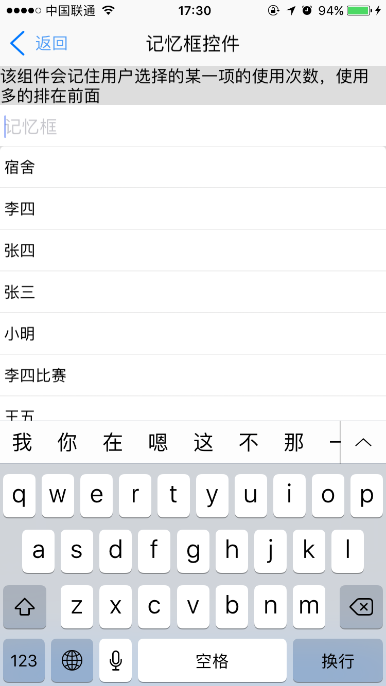
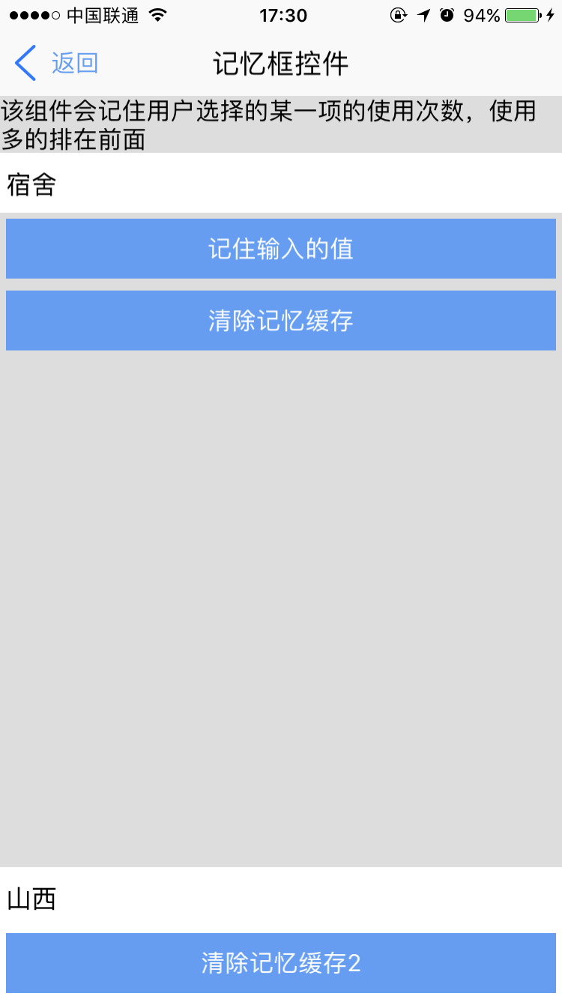
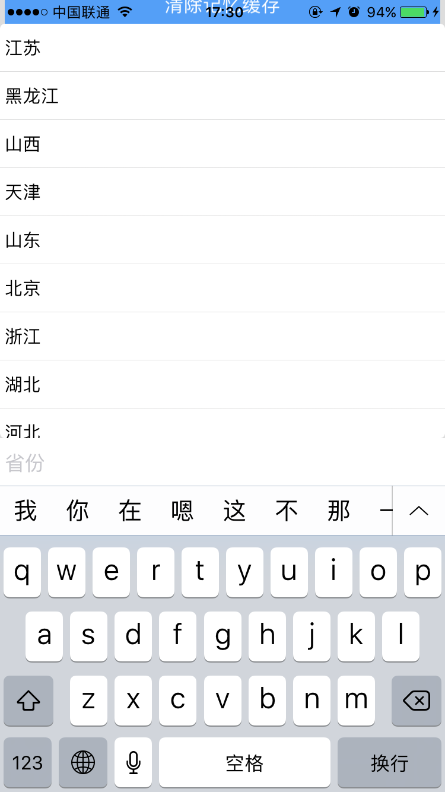

# memoryfield组件

----------

<h2 id="cid_0">说明</h2>

memoryfield组件主要用于记忆框快捷输入场景，类似百度搜索，在输入一个关键词时会弹出关键词相关内容。需要注意的是建议在屏幕键盘上方区域使用该控件，比如页面头部，如果在内容区域使用，建议放在scroll容器中。避免键盘弹起时整个页面往上移动。  

该组件在基础组件textfield上进行扩展，具备textfield组件的所有样式，属性，方法和事件。  

该组件会记住用户选择的某一项的使用次数，使用多的排在前面 。

**注：** 由于该控件有记忆功能，并且是靠控件id作为存储数据的key值，所以使用该控件是必须具有id属性。

用法：在js里面引入require("superhandsignUI");  

示例：


```html
<memoryfield  id="memoryfield"   prompt="记忆框" style="background-color: #ffffff;"/>
``` 


<h2 id="cid_1">属性</h2>

<span id="sx_0">**公共属性**</span>  

[参见公共属性章节](https://gitdocument.exmobi.cn/sprite-begin/ggsx.html)，包括：id、style、class；

<span id="sx_1">**textfield组件的所有属性**</span>

[详细见textfield组件属性](https://gitdocument.exmobi.cn/sprite_advanced/textfield.html)


<h2 id="cid_2">样式</h2>

**textfield控件的所有样式**

[详细见textfield控件样式](https://gitdocument.exmobi.cn/sprite_advanced/textfield.html#cid_1)

<h2 id="cid_3">js方法</h2>

**textfield控件的所有方法**

[详细见textfield控件样式](https://gitdocument.exmobi.cn/sprite_advanced/textfield.html#cid_3)


**void loadData(jsonDatas)**

<code>加载初始数据</code>

注意该方法一定要执行，如果什么数据都不想注入，只写执行loadData([])即可。

参数：

jsonData 是json数组，各子项属性为：

> text: 文字内容
> 
> 其他key值

返回值： 无

**void hidepop()**

<code>隐藏pop弹出框</code>

参数： 无 

返回值： 无


**void showpop()**

<code>显示pop弹出框</code>

参数： 无 

返回值： 无


**void cacheData()**

<code>缓存数据</code> 

缓存数据，以后还会有效，当用户觉得输入值可以下次利用，可以执行该方法把数据存起来，存起来后数据会和用户初始导入的数据在一起。缓存内部还会记录数据使用频率，数据按照使用频率高低进行排列。

参数： 无 

返回值： 无


**void clearCacheData()**

<code>清除缓存数据</code> 

清除后只能显示用户初始导入的数据，并且使用频率排序也会清除；清除后下次重新进入页面才会生效。

参数： 无 

返回值： 无


<h2 id="cid_4">事件</h2>

**继承了textfield所有事件**

[详细见textfield组件事件](https://gitdocument.exmobi.cn/sprite_advanced/textfield.html#cid_2)

<h2 id="cid_5">示例</h2>

该示例和list组件混合使用，list需要用到section。

```html
<page>
    <script>
        <![CDATA[
        var window = require("Window");
        var document = require("Document");
        var ui = require("UI");
        var time = require("Time");
        var config = require("myconfig");
        var console = require("Console");
        require("titlebarUI");
        require("buttonUI");
        require("memoryfieldUI");
        var myappjs = require("myapp");
        var screenWidth = window.getScreenWidth();
        var jsonData = [
            {
                text: "张三",//必须
                code: "100"//用户自己定义属性，可以和业务有关，如果业务系统需要提交的是对应编号，到时候可以根据text反向找到code（注：一般用于固定内容展示，比如填写国家,城市，民族等，某种情况下可以替代select）。
            },
            {
                text: "张四",
                code: "101"
            },
            {
                text: "李四",
                code: "104"
            },
            {
                text: "王五",
                code: "105"
            },
            {
                text: "小明",
                code: "106"
            }
        ];
        var shengfen = [
            { 'code': '11', 'text': '北京' },
            { 'code': '12', 'text': '天津' },
            { 'code': '13', 'text': '河北' },
            { 'code': '14', 'text': '山西' },
            { 'code': '15', 'text': '内蒙古' },
            { 'code': '21', 'text': '辽宁' },
            { 'code': '22', 'text': '吉林' },
            { 'code': '23', 'text': '黑龙江' },
            { 'code': '31', 'text': '上海' },
            { 'code': '32', 'text': '江苏' },
            { 'code': '33', 'text': '浙江' },
            { 'code': '34', 'text': '安徽' },
            { 'code': '35', 'text': '福建' },
            { 'code': '36', 'text': '江西' },
            { 'code': '37', 'text': '山东' },
            { 'code': '41', 'text': '河南' },
            { 'code': '42', 'text': '湖北' },
            { 'code': '43', 'text': '湖南' },
            { 'code': '44', 'text': '广东' },
            { 'code': '45', 'text': '广西' },
            { 'code': '46', 'text': '海南' },
            { 'code': '50', 'text': '重庆' },
            { 'code': '51', 'text': '四川' },
            { 'code': '52', 'text': '贵州' },
            { 'code': '53', 'text': '云南' },
            { 'code': '54', 'text': '西藏' },
            { 'code': '61', 'text': '陕西' },
            { 'code': '62', 'text': '甘肃' },
            { 'code': '63', 'text': '青海' },
            { 'code': '64', 'text': '宁夏' },
            { 'code': '65', 'text': '新疆' },
            { 'code': '71', 'text': '台湾' },
            { 'code': '81', 'text': '香港' }
        ]
        window.on("animator", function () {
            //titlebar关闭页面
            var titlebarid = document.getElement("titlebarid");
            var memoryfield = document.getElement("memoryfield");
            var memoryfield2 = document.getElement("memoryfield2");
            var scrollbox = document.getElement("box");
            var btn = document.getElement("btn");
            var btn2 = document.getElement("btn2");
            var btn3 = document.getElement("btn3");
            scrollbox.on("click", function (e) {
                window.hideSip();
            });
            titlebarid.on("ltextClick", function (e) {
                window.close({});
            });
            titlebarid.on("liconClick", function (e) {
                window.close({});
            });
            memoryfield.loadData(jsonData);
            memoryfield2.loadData(shengfen);
            memoryfield.on("focus", function (e) {
                console.log("外面进入了focus");
            });
            btn.on("click", function (e) {
                memoryfield.cacheData();
            });
            btn2.on("click", function (e) {
                memoryfield.clearCacheData();
            });
            btn3.on("click", function (e) {
                memoryfield2.clearCacheData();
                this.setStyle("width", "200");
            });
        });	 
    ]]>
    </script>
    <style>
        @import url(res:sprite_component/css/sprite.layout.css);
        @import url(res:sprite_component/css/sprite.color.css);
        text {
            line-space: 0;
        }
        
        button {
            margin: 4;
        }
    </style>
    <ui>
        <box class="bg-white full" id="box">
            <titlebar id="titlebarid" ltext="返回" title="记忆框控件" licon="res:yuanhongqian/image/icon.png" class="titlebar-hasstatus" style="licon-width:24;licon-height:24"
            />

            <scroll class="flex1" style="background-color: #dddddd">
                <text style="">该组件会记住用户选择的某一项的使用次数，使用多的排在前面</text>
                <memoryfield id="memoryfield" prompt="记忆框" style="background-color: #ffffff;" />
                <button id="btn" value="记住输入的值"></button>
                <button id="btn2" value="清除记忆缓存"></button>
                <box style="height: 400" />
            </scroll>
            <box>
                <memoryfield id="memoryfield2" prompt="省份" style="background-color: #ffffff;border-radius:8" />
            </box>
            <button id="btn3" value="清除记忆缓存2"></button>
        </box>
    </ui>
</page>
```

>代码效果图： 

 
 
 