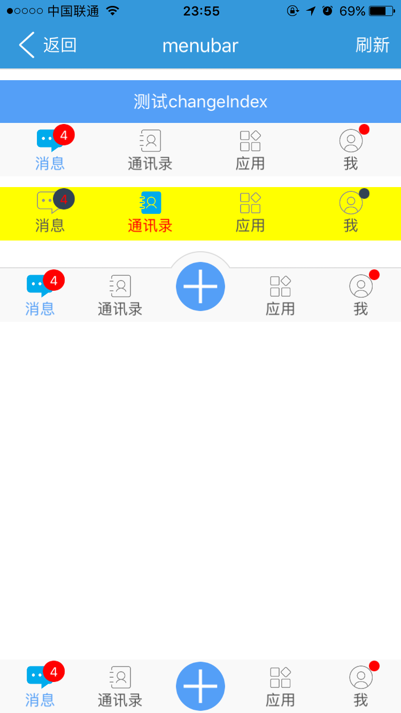
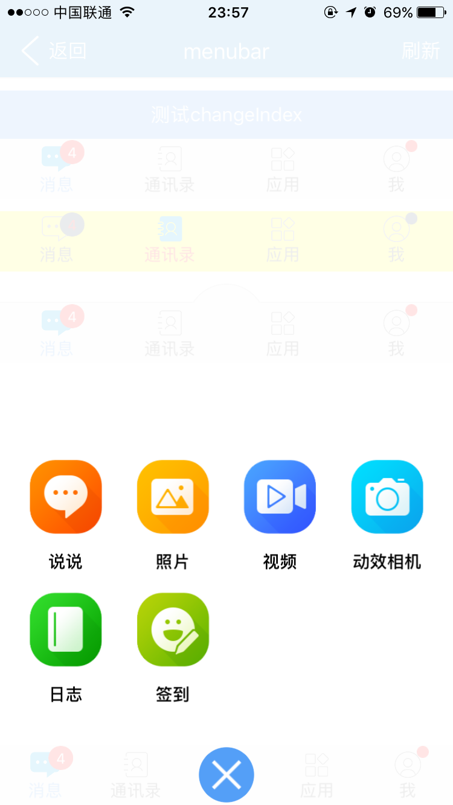

# menubar组件  

----------

<h2 id="cid_0">说明</h2>

menubar组件主要用于页面底部菜单展示，一般建议菜单个数不要超过5个，menubar封装了两种菜单类型normal和middleMain，其中middleMain菜单可以在中间定义一个圆形的大菜单，在点击的时候，组件内部会旋转135度，类似QQ空间的底部菜单效果。  

在使用建议放在垂直布局容器中，宽度会自动填满父容器，如果放在水平布局容器中一定要给出width。  

用法：在js里面引入require("menubarUI");  

示例，normal类型：  
  
```html
<menubar type="normal" id="menubar1" />
```   

示例，middleMain类型：  

```html
<menubar id="menubar4" type="middleMain" mainicon="res:yuanhongqian/image/feedback_plus.png" style="main-transfer-y:-8" index = "0"/>
```    

menubar菜单内容只能通过loadData(json)方法动态加载。   

```javascript
var menubar1 = document.getElement("menubar1");
var json = {};
var arr = new Array();
var itemJson = {};
itemJson.icon = "res:yuanhongqian/image/nxinxi.png";
itemJson.iconCurrent = "res:yuanhongqian/image/nxinxi-active.png";
itemJson.text = "消息";
itemJson.tip = "4";
arr.push(itemJson);
var itemJson = {};
itemJson.icon = "res:yuanhongqian/image/ncontact.png";
itemJson.iconCurrent = "res:yuanhongqian/image/ncontact-active.png";
itemJson.text = "通讯录";	 
arr.push(itemJson);
var itemJson = {};
itemJson.icon = "res:yuanhongqian/image/napp.png";
itemJson.iconCurrent = "res:yuanhongqian/image/napp-active.png";
itemJson.text = "应用";	 
arr.push(itemJson);
var itemJson = {};
itemJson.icon = "res:yuanhongqian/image/nme.png";
itemJson.iconCurrent = "res:yuanhongqian/image/nme-active.png";
itemJson.isSmallTip = true;
itemJson.text = "我";	 
arr.push(itemJson);
json.datas = arr;
menubar1.loadData(json);
``` 
  
<h2 id="cid_1">属性</h2>

<table>
   <tr>
      <td>属性</td>
      <td>描述说明</td>
      <td>示例</td>
   </tr>
   <tr>
      <td>公共属性</td>
      <td>参见公共属性章节，包括：<br/>id;<br/>style;<br/>class</td>
      <td></td>
   </tr>
   <tr>
      <td>index</td>
      <td>设置选中菜单项，值从0开始，如果不设置默认为0对应第一个菜单(通过js可以动态修改)</td>
      <td>var menubar1 = document.getElement("menubar1");<br/>menubar1.setAttr("index","2");</td>
   </tr>
   <tr>
      <td>mainicon</td>
      <td>主菜单图片路径，支持res:</td>
      <td></td>
   </tr>
   <tr>
      <td>type</td>
      <td>menubar样式（取值normal, middleMain）</td>
      <td></td>
   </tr>
  
</table> 

 
<h2 id="cid_2">样式</h2>

<table>
   <tr>
      <td>样式</td>
      <td>描述说明</td>
      <td>示例</td>
   </tr>
   <tr>
      <td>box公共样式</td>
      <td>尺寸:height默认50dp;<br/>定位;<br/>外边距;<br/>边框;<br/>背景:默认#f9f9f9;<br/>flexbox布局:align-self，flex;</td>
      <td></td>
   </tr>
   <tr>
      <td>color</td>
      <td>菜单文字颜色，默认色值#565656；</td>
      <td></td>
   </tr>
   <tr>
      <td>current-color </td>
      <td>菜单文字选择颜色，默认色值#549FF7</td>
      <td></td>
   </tr>
   <tr>
      <td>tip-color</td>
      <td>气泡数字颜色，默认色值#ffffff</td>
      <td></td>
   </tr>
   <tr>
      <td>tip-background-color</td>
      <td>气泡背景颜色，默认色值red</td>
      <td></td>
   </tr>
   <tr>
      <td>icon-width</td>
      <td>菜单图标宽度，默认25dp</td>
      <td></td>
   </tr>
   <tr>
      <td>icon-height</td>
      <td>菜单图标高度，默认25dp</td>
      <td></td>
   </tr>
   <tr>
      <td>font-size</td>
      <td>菜单字体大小，默认14dp</td>
      <td></td>
   </tr>
   <tr>
      <td>main-background-color</td>
      <td>middleMain样式下，主菜单背景颜色，默认#549FF7</td>
      <td></td>
   </tr>
   <tr>
      <td>main-transfer-y</td>
      <td>主菜单基于当前坐标y偏移距离,默认0 (赋值的时候这里不要带dp单位)</td>
      <td></td>
   </tr>
   <tr>
      <td>main-transfer-x</td>
      <td>主菜单基于基于当前坐标x偏移距离; 默认0 (赋值的时候这里不要带dp单位)</td>
      <td></td>
   </tr>
   <tr>
      <td>text-margin</td>
      <td>菜单文字外边距，默认margin:0 0 0 0</td>
      <td></td>
   </tr>
   <tr>
      <td>icon-margin</td>
      <td>图片外边距,默认margin:0 25 0 25</td>
      <td></td>
    
   </tr>
   
</table>  

<h2 id="cid_3">js方法</h2>

<table>
   <tr>
      <td>Js方法</td>
      <td>描述说明</td>
      <td>示例</td>
   </tr>
   <tr>
      <td>box公共方法</td>
      <td>见设计文档box章节（不包括容器类Dom节点操作）</td>
      <td></td>
   </tr>
   <tr>
      <td>loadData(json)</td>
      <td>格式json.datas数组，属性如下;<br/>itemJson.icon :菜单图标;<br/>itemJson.iconCurrent:菜单选中图标;<br/>itemJson.text :菜单文字;<br/>itemJson.isSmallTip:圆点气泡，设置后tip值无效;itemJson.tip = "4":小气泡内容;</td>
      <td></td>
   </tr>
   <tr>
      <td>refresh()</td>
      <td>修改菜单json数据属性后，执行refresh()，才可生效。</td>
      <td></td>
   </tr>
   
</table>


<h2 id="cid_4">事件</h2>

<table>
   <tr>
      <td>事件</td>
      <td>描述说明</td>
      <td>示例</td>
   </tr>
   <tr>
      <td>selectedItem</td>
      <td>参数(e、index) 监听选中菜单标识</td>
      <td>menubar1.on("selectedItem",function(e,index){myappjs.alert("选择的item的坐标："+index);});</td>
   </tr>
   <tr>
      <td>middleMainClick</td>
      <td>参数(e, tag:1标示已旋转 0标示还原) 监听主菜单点击事件;</td>
	  <td>menubar3.on("middleMainClick",function(e,tag){<br/>//1标示已旋转，0标示回归原位<br/>myappjs.alert("按钮状态:"+tag);<br/>});</td>
   </tr>

</table>


<h2 id="cid_5">示例</h2>

```html
<page>
	<script><![CDATA[
    var window = require("Window");
    var document = require("Document");
    var ui = require("UI");
	var console = require("Console");
	var app = require("App");
	var time = require("Time");
	//引用自定义UI模板库
     //require("componentUI");
     require("titlebarUI");
     require("buttonUI");
     require("menubarUI");
    var myappjs = require("myapp");
 
	window.on("loaded",function(){
	  var screenWidth = window.getScreenWidth();
	  var titlebarid = document.getElement("titlebarid");
	    //关闭页面
	    titlebarid.on("ltextClick",function(e)
	    {
	        var json = {};
	        window.close(json);      
	    });
	    titlebarid.on("liconCurrent",function(e)
	    {
	        var json = {};
	        window.close(json);      
	    });
	    titlebarid.on("rtextClick",function(e)
	    {
	    	 var itemJson = json.datas[0];
			  itemJson.icon = "res:yuanhongqian/image/ncontact.png";
			  itemJson.iconCurrent = "res:yuanhongqian/image/ncontact-active.png";
			  itemJson.text = "消息123";
			  itemJson.tip = "1";
			  menubar1.refresh();
	    });
	  var json = {};
	  var arr = new Array();
	  var itemJson = {};
	  itemJson.icon = "res:yuanhongqian/image/nxinxi.png";
	  itemJson.iconCurrent = "res:yuanhongqian/image/nxinxi-active.png";
	  itemJson.text = "消息";
	  itemJson.tip = "4";
	 
	  arr.push(itemJson);
	  var itemJson = {};
	  itemJson.icon = "res:yuanhongqian/image/ncontact.png";
	  itemJson.iconCurrent = "res:yuanhongqian/image/ncontact-active.png";
	  itemJson.text = "通讯录";	 
	  arr.push(itemJson);

	  var itemJson = {};
	  itemJson.icon = "res:yuanhongqian/image/napp.png";
	  itemJson.iconCurrent = "res:yuanhongqian/image/napp-active.png";
	  itemJson.text = "应用";	 
	  arr.push(itemJson);

	  var itemJson = {};
	  itemJson.icon = "res:yuanhongqian/image/nme.png";
	  itemJson.iconCurrent = "res:yuanhongqian/image/nme-active.png";
	  itemJson.isSmallTip = true;
	  itemJson.text = "我";	 
	  arr.push(itemJson);

	  json.datas = arr;

	  var menubar1 = document.getElement("menubar1");
	  var menubar2 = document.getElement("menubar2");
	  var menubar3 = document.getElement("menubar3");
	  var menubar4 = document.getElement("menubar4");
	  var btn1 = document.getElement("btn1");
	  var pop =  document.getElement("pop");	 
	  var caidan = document.getElement("caidan");

	  menubar1.loadData(json);
      menubar2.loadData(json);
      menubar4.loadData(json);
	  menubar3.loadData(json);
	  menubar3.on("middleMainClick",function(e,tag){
	  		//1标示已旋转，0标示回归原位
	  	   // myappjs.alert("按钮状态:"+tag);
	  	    var m = tag;
            //console.log("tag:"+tag+"pop.getStyle:"+pop.getStyle("display"));
			if(m==1){
				pop.setStyle("display","block");
				document.refresh();					
			}          
	  	    var jsonData0 = {};
			var animationSet = new Array();
			var transferAni = {};
			transferAni.type = "transfer";
			
			transferAni.duration = 200;
			transferAni.curve = "linear";
           if(m == 0){	    
		    transferAni.delay = 0;
			transferAni.fromY = 0;
			transferAni.toY = 250;
			}
			else{		 
			   transferAni.delay = 0;
			   transferAni.fromY = 250;
			   transferAni.toY = 0;
			}
			
			animationSet.push(transferAni);
			jsonData0.animationSet = animationSet;
				//启动动画	
			caidan.startAnimation(jsonData0,function(){
                  //console.log(caidan); 
                   
					if(m==0){				
						pop.setStyle("display","none");		
					}
					document.refresh();
			});	  
	  });

	  menubar1.on("selectedItem",function(e,index){
          console.log("selectedItem:"+ index);
	  	  myappjs.alert("选择的item的坐标："+index);
	  });

	  btn1.on("click",function(e){
	  	 menubar1.setAttr("index","2");
	  });
	
	});
	
	app.on("orientation",function(e,orientation){	
	});
    ]]>
	</script>
	<style>
       @import url(res:sprite_component/css/sprite.layout.css);
	   @import url(res:sprite_component/css/sprite.color.css); 
	   text{
	   	 text-align: center;
	   } 
    </style>
	<ui>
		<box  class="bg-white full" id="box">		
			<titlebar id="titlebarid" ltext="返回" rtext="刷新" title="menubar"   licon="res:yuanhongqian/image/back1.png"   class="titlebar-hasstatus bg-peter-river" style="title-color:#ffffff;left-color:#ffffff;right-color:#ffffff"/>
			<line />
			<scroll class="flex1">
			    <box style="height:10;" class="full-width"></box>
				<box  class="column-flex-start flex-wrap full-width">
					<button value="测试changeIndex" id="btn1"></button>
					<menubar type="normal" id="menubar1" />
					<box style="height:10;" class="full-width"></box>
					<menubar type="normal" id="menubar2" style="current-color:red;background-color:yellow;tip-color:red;tip-background-color:#324254;icon-margin:4 25 0 25;text-margin:0 0 8 0" index = "1"/>
					<box style="height:10;" class="full-width"></box>
					
					<box class="menubar-out" id="menubaroutid">
					    <line />
						<box class="menubar-out-z" >
							<box class="menubar-item-main-out"  style="background-color:#f9f9f9">						
							</box>
						</box>
						 <menubar id="menubar4" type="middleMain" mainicon="res:yuanhongqian/image/feedback_plus.png" style="main-transfer-y:-8" index = "0"/>
					</box>	
					<box style="height:10;" class="full-width"></box>		
				</box>
				
			</scroll>
			
            <menubar id="menubar3" type="middleMain" mainicon="res:yuanhongqian/image/feedback_plus.png" style="" index = "0"/>
			<box id="pop" class="full absolute" style="background-color:rgba(255, 255, 255, 0.9);display:none">
				 
				<box class="flex1"/>	
				<box id="caidan"  style="margin:0 0 70 0;width:fill_screen"  >
				   <box  class="flex1 row-flex-start" style="height:100;padding:0 10 0 10;margin:10 0 5 0">
					  <box class="flex1 " style="align-items:center;justify-content:center;height:100">	     					 
							 <image src="res:yuanhongqian/image/shuoshuo.png" style="width:70;height:70"/>
							 <text style="margin:10 0 4 0;color:#000000;font-size:14;font-weight:bold;">说说</text>				 				 
					  </box>
					  <box class="flex1 " style="align-items:center;justify-content:center;height:100">	     
							 <image src="res:yuanhongqian/image/zhaopian.png" style="width:70;height:70"/>
							 <text style="margin:10 0 4 0;color:#000000;font-size:14;font-weight:bold;">照片</text>				 				 
					  </box>
					  <box class="flex1 " style="align-items:center;justify-content:center;height:100">	     
							 <image src="res:yuanhongqian/image/shipin.png" style="width:70;height:70"/>
							 <text style="margin:10 0 4 0;color:#000000;font-size:14;font-weight:bold;">视频</text>				 				 
					  </box>
					  <box class="flex1 " style="align-items:center;justify-content:center;height:100">			     
							 <image src="res:yuanhongqian/image/shuiyinxiangji.png" style="width:70;height:70"/>
							 <text style="margin:10 0 4 0;color:#000000;font-size:14;font-weight:bold;">动效相机</text> 
					  </box>
				   </box>
				   <box  class="flex1 row-flex-start" style="height:100;padding:0 10 0 10;;margin:5 0 10 0">
					   <box class="flex1 " style="align-items:center;justify-content:center;height:100">	     
							 <image src="res:yuanhongqian/image/rizhi.png" style="width:70;height:70"/>
							 <text style="margin:10 0 4 0;color:#000000;font-size:14;font-weight:bold;">日志</text>				 				 
					  </box>
					  <box class="flex1 " style="align-items:center;justify-content:center;height:100">			     
							 <image src="res:yuanhongqian/image/qiandao.png" style="width:70;height:70"/>
							 <text style="margin:10 0 4 0;color:#000000;font-size:14;font-weight:bold;">签到</text> 
					  </box>
					  <box class="flex1 " style="align-items:center;justify-content:center;height:100">	     
					  </box>
					  <box class="flex1 " style="align-items:center;justify-content:center;height:100">	     
					  </box>
				   </box>
				   
				</box>
				
			</box>
		</box>
	</ui>
</page>

```

>代码效果图： 

 
 