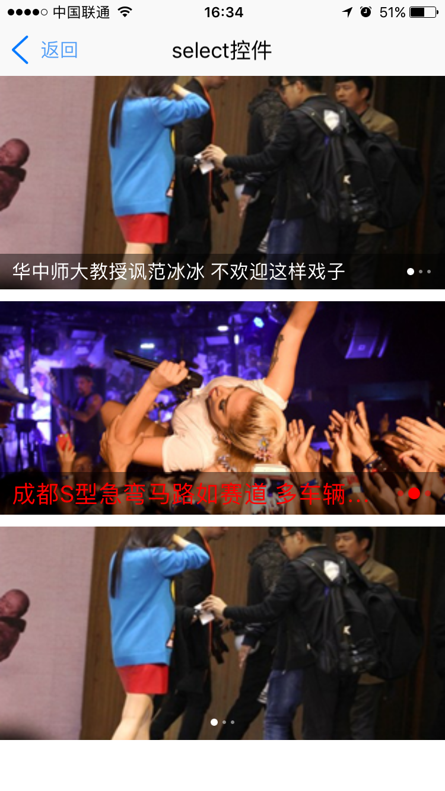

# newslider组件  

----------

<h2 id="cid_0">说明</h2>

newslider主要用于主页广告滑动栏效果布局，基于基础组件slider进行封装，具有slider组件全部属性，该控件建议放在垂直布局的容器中使用，如果放在水平布局的容器中，一定要给出width，否则组件可能不显示。组件内部已经给出了默认高度height值为180dp，使用是可以根据自己的实际情况通过样式进行调整。  

用法：在js里面引入require("newsliderUI");  

示例：  
 
 
```html
<newslider id="newslider2" index="1" loop="true" style="color:red;font-size:20;mark-point-color:red;bottom-mark-height:36;mark-point-width:10;mark-point-height:10"/>
```   
 
newslider内容只能通过loadData(json)方法动态加载，还需要注意的是只有内容大于两个的时候才能支持循环滑动。     

```javascript
var newslider1 = document.getElement("newslider1");	
var data = {};
data.text = "华中师大教授讽范冰冰 不欢迎这样戏子";
data.imageurl = "http://cms-bucket.nosdn.127.net/d325d6e7b40e45598aadb2fcc67249c220161028103329.png";
data.defaulturl = "res:spritetest/image/wangyi/default_null_big_src.png";
datas.push(data);

var data = {};
data.text = "成都S型急弯马路如赛道 多车辆压线";
data.imageurl = "http://cms-bucket.nosdn.127.net/a54d528ac2c04d7fb5cf544d82e3e0db20161029081754.jpeg";
data.defaulturl = "res:spritetest/image/wangyi/default_null_big_src.png";
datas.push(data);
var data = {};
data.text = "成都S型急弯马路如赛道 多车辆压线2";
data.imageurl = "http://cms-bucket.nosdn.127.net/a54d528ac2c04d7fb5cf544d82e3e0db20161029081754.jpeg";
data.defaulturl = "res:spritetest/image/wangyi/default_null_big_src.png";
datas.push(data);
json.datas = datas;
newslider1.loadData(json);
``` 
  
<h2 id="cid_1">属性</h2>

<table>
   <tr>
      <td>属性</td>
      <td>描述说明</td>
      <td>示例</td>
   </tr>
   <tr>
      <td>公共属性</td>
      <td>参见公共属性章节，包括：<br/>id;<br/>style;<br/>class;</td>
      <td></td>
   </tr>
   <tr>
      <td>type</td>
      <td>normal和notext( 没有文字时标记点居中 ) 两种类型</td>
      <td></td>
   </tr>
   <tr>
      <td>index</td>
      <td>当前显示页索引，默认为0，支持设置及获取（支持js动态修改）</td>
      <td></td>
   </tr>
   <tr>
      <td>direction</td>
      <td>滚动方向，【horizontal，vertical】;<br/>horizontal：横向滚动；（默认）;<br/>vertical：纵向滚动； </td>
      <td></td>
   </tr>
   <tr>
      <td>drag</td>
      <td>是否允许手动拖动切换，【true，false】;<br/>true：允许手动拖动切换（默认）；false：不允许手动拖动切换；</td>
      <td></td>
   </tr>
   <tr>
      <td>loop</td>
      <td>是否支持循环滑动，【true，false】;<br/>true：支持循环；false：不支持循环（默认）；注：循环滑动子容器应不少于3个</td>
      <td></td>
   </tr>
   <tr>
      <td>autoPlay</td>
      <td>是否自动切换，【true，false】;<br/>true：自动切换；false：不自动切换（默认）；</td>
      <td></td>
   </tr>
   <tr>
      <td>interval</td>
      <td>自动切换间隔时间，数字，单位s;默认3s</td>
      <td></td>
   </tr>
   <tr>
      <td>bounces</td>
      <td>是否支持弹动，可选项，【true，false】;<br/>true：支持弹动（默认）;false：不支持弹动;<br/>注：仅iOS支持</td>
      <td></td>
   </tr>
</table>

 
<h2 id="cid_2">样式</h2>

<table>
   <tr>
      <td>样式</td>
      <td>描述说明</td>
      <td>示例</td>
   </tr>
   <tr>
      <td>box公共样式</td>
      <td>尺寸:默认height:180;<br/>定位;<br/>外边距;<br/>内边距;<br/>边框;<br/>背景:默认#ffffff;<br/>flexbox布局：align-self，flex</td>
      <td></td>
   </tr>
   <tr>
      <td>bottom-mark-height:</td>
      <td>底部文字描述条高度;默认30dp</td>
      <td></td>
   </tr>
   <tr>
      <td>mark-point-width:</td>
      <td>标记点宽度;默认6dp</td>
      <td></td>
   </tr>
   <tr>
      <td>mark-point-height:</td>
      <td>标记点高度;默认6dp</td>
      <td></td>
   </tr>
   <tr>
      <td>mark-point-color:</td>
      <td>标记点颜色;默认#ffffff</td>
      <td></td>
   </tr>
   <tr>
      <td>color:</td>
      <td>底部描述文字颜色;默认#ffffff</td>
      <td></td>
   </tr>
   <tr>
      <td>font-size: </td>
      <td>底部描述文字大小;默认15dp</td>
      <td></td>
   </tr>
   
</table>

注：除了box公共样式以外，其他菜单样式通过js修改后，需重新执行loadData()才生效。  

<h2 id="cid_3">js方法</h2>

<table>
   <tr>
      <td>Js方法</td>
      <td>描述说明</td>
      <td>示例</td>
   </tr>
   <tr>
      <td>box公共方法</td>
      <td>见设计文档box章节（不包括容器类Dom节点操作）</td>
      <td></td>
   </tr>
   <tr>
      <td>loadData(json)</td>
      <td>格式json.datas数组，属性如下:<br/>data.text = "华中师大教授讽范冰冰 不欢迎这样戏子";<br/>data.imageurl = "http://cms-bucket.nosdn.127.net/d325d6e7b40e45598aadb2fcc67249c220161028103329.png"; //支持本地res: 和网络http: 图片;<br/>data.defaulturl = "res:spritetest/image/wangyi/default_null_big_src.png";</td>
      <td></td>
   </tr>
   <tr>
      <td>refresh()</td>
      <td>修改菜单json数据属性后，执行refresh()，才可生效。</td>
      <td></td>
   </tr>
  
</table>


<h2 id="cid_4">事件</h2>

<table>
   <tr>
      <td>事件</td>
      <td>描述说明</td>
      <td>示例</td>
   </tr>
   <tr>
      <td>newsliderClick</td>
      <td>参数(e, index):监听newslider点击事件，返回点击标识</td>
      <td></td>
   </tr>
   <tr>
      <td>pageSelected</td>
      <td>参数(e,index) : 监听newslider切换事件，返回切换后的标识</td>
      <td></td>
   </tr>
</table>


<h2 id="cid_5">示例</h2>

```html
<page>
    <script>
        <![CDATA[
        var index = 1;
        var window = require("Window");
        var document = require("Document");
        var console = require("Console");
        var ui = require("UI");
        var ListAdapter = require("ListAdapter");
        var console = require("Console");

        //引用自定义UI模板库
        require("titlebarUI");
        require("newsliderUI");

        var myappjs = require("myapp");
        var screenWidth = window.getScreenWidth();
        var json = {};
        var datas = new Array();

        window.on("animator", function () {
            //titlebar关闭页面
            var titlebarid = document.getElement("titlebarid");
            titlebarid.on("ltextClick", function (e) {
                var json = {};
                window.close(json);

            });

            titlebarid.on("liconClick", function (e) {
                var json = {};
                window.close(json);
            });

            var newslider1 = document.getElement("newslider1");
            var newslider2 = document.getElement("newslider2");
            var newslider3 = document.getElement("newslider3");
            var data = {};
            data.text = "华中师大教授讽范冰冰 不欢迎这样戏子";
            data.imageurl = "http://cms-bucket.nosdn.127.net/d325d6e7b40e45598aadb2fcc67249c220161028103329.png";
            data.defaulturl = "res:spritetest/image/wangyi/default_null_big_src.png";
            datas.push(data);
            var data = {};
            data.text = "成都S型急弯马路如赛道 多车辆压线";
            data.imageurl = "http://cms-bucket.nosdn.127.net/a54d528ac2c04d7fb5cf544d82e3e0db20161029081754.jpeg";
            data.defaulturl = "res:spritetest/image/wangyi/default_null_big_src.png";
            datas.push(data);
            var data = {};
            data.text = "成都S型急弯马路如赛道 多车辆压线2";
            data.imageurl = "http://cms-bucket.nosdn.127.net/a54d528ac2c04d7fb5cf544d82e3e0db20161029081754.jpeg";
            data.defaulturl = "res:spritetest/image/wangyi/default_null_big_src.png";
            datas.push(data);
            json.datas = datas;

            newslider1.loadData(json);
            newslider2.loadData(json);
            newslider3.loadData(json);

            newslider1.on("newsliderClick", function (e, param) {

                var message = {};
                message.content = JSON.stringify(param);
                ui.toast(message);
            });
            newslider1.on("pageSelected", function (e, param) {
                var message = {};
                message.content = JSON.stringify(param);
                ui.toast(message);
            });
        });
    ]]>

    </script>
    <style>
        @import url(res:sprite_component/css/sprite.layout.css);
        @import url(res:sprite_component/css/sprite.color.css);
    </style>
    <ui>
        <box class="bg-white full" id="box">
            <titlebar id="titlebarid" ltext="返回" title="select控件" licon="res:yuanhongqian/image/icon.png" class="titlebar-hasstatus"
                style="licon-width:24;licon-height:24" />
            <scroll style="flex:1;width:fill_screen;">
                <newslider id="newslider1" />
                <box style="height:10" />
                <newslider id="newslider2" index="1" loop="true" style="color:red;font-size:20;mark-point-color:red;bottom-mark-height:36;mark-point-width:10;mark-point-height:10"
                />
                <box style="height:10" />
                <newslider id="newslider3" type="notext" />
            </scroll>
        </box>
    </ui>
</page>

```

>代码效果图： 

 
