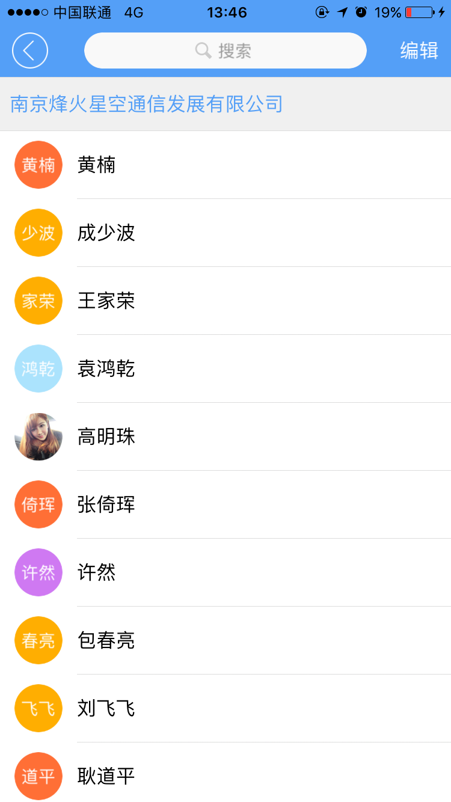
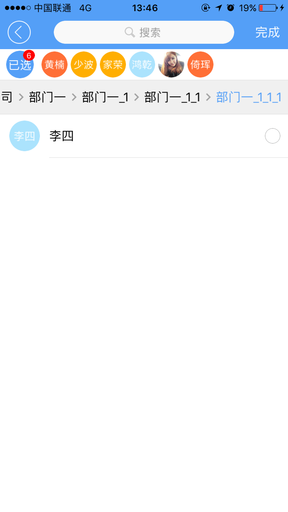
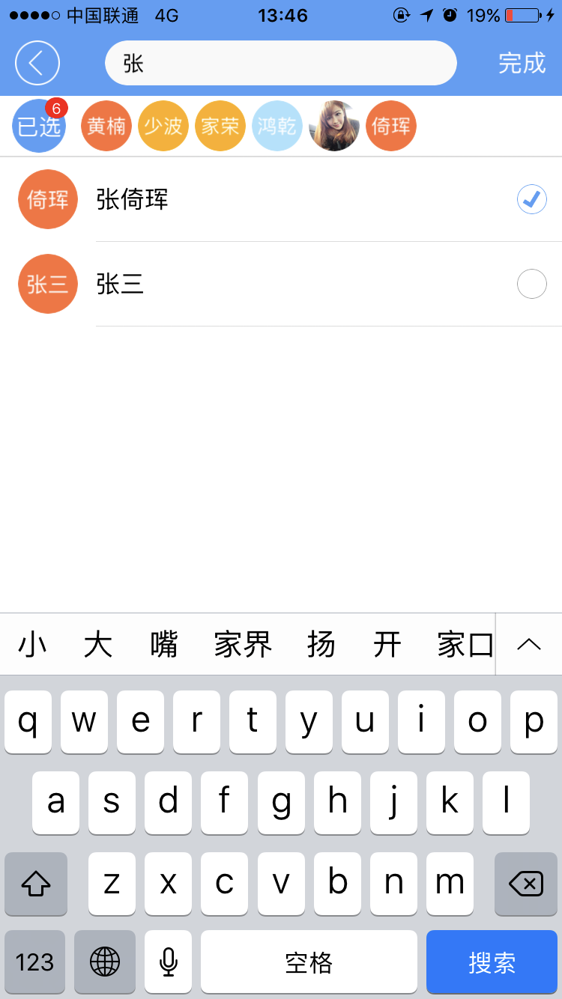

# organization组件

----------

<h2 id="cid_0">说明</h2>

organization组件是专门为组织架构选人场景封装的，该组件支持一次性导入所有数据，也支持异步方式一级级的导入。  

该组件没有封装搜索界面，不过提供了用于搜索注入的js方法，开发者而已通过组件的js方法，自己实现搜索界面。  

用法：在js里面引入require("organizationUI");  

示例，注意该控件需要放在垂直布局的容器中，如果在横向布局的容器里面需要指定width。  

```html
<organization id="organization" rootid="root" ischeckbox="false" rootname="南京先维信息技术有限公司"/>
``` 

<h2 id="cid_1">属性</h2>


<span id="sx_0">**公共属性**</span>  

[参见公共属性章节](https://gitdocument.exmobi.cn/sprite-api/ggsx.html)，包括：id、style、class；

**rootid**

<code>根节点ID</code>

必须设置，否则后续的组织架构无法加载其上。rootid = "root"
    
**ischeckbox**

<code>是否有checkbox</code>

取值true和false，可通过setAttr动态设置(可通过js修改)。不设置默认false
   
**rootname**

<code>根节点名称</code>

如：rootname="南京先维信息技术有限公司"
 

<h2 id="cid_2">样式</h2>

无

<h2 id="cid_3">js方法</h2>

**loadData(datas:Array&lt;Object&gt;):void**

<code>组织架构数据注入</code>

组织架构数据注入方法。如果一次性加载所有数据，这个方法只需要执行一次，如果异步加载数据，这个方法执行多次加载即可，多次加载时只需要加载当前部门下的数据即可。

参数：

datas格式为json数组，子项元素：
> 
> name: 节点名称
> 
> id: 当前节点id
> 
> pid: 父节点id,必须设置，而且有效<br/>

> iscollapse: bool型（true和false），是否有子节点，如果没有自己就是最后子节点，如果有子节点设置true，不设置默认为false
> 
> userdata: 用户自定义数据，点击某一项时，会原封返回。

返回值：无

示例：

```javascript
//数组元素
var datas = [];
var json = {}; 
json.name = "张三"; //必须json.id = "2"; //必须而且必须唯一
json.pid = "root"; //必须
json.iscollapse = false; //是否有子节点，如果没有自己就是最后子节点，一般部门这里设置true
json.userdata = {"phone":"12323232222","QQ":"233333333"}; //可以自定义一些数据，点击后返回可以得到
datas.push(json);
```
**loadSearchData(datas:Array&lt;Object&gt;):void**

<code>用于搜索的时候加载数据</code>

数据格式同上


     
**reset():void**

<code>复位列表</code>

可在查询完后复位到组织架构列表

参数：无

返回值：无

 
**clearSelectDatas():void**

<code>清除已选数据</code>

参数：无

返回值：无  


**getSelectDatas():Array&lt;Object&gt;**

<code>得到已选择的数据</code>

参数：无

返回值：

datas格式为json数组，子项元素：
> 
> name: 节点名称
> 
> id: 当前节点id
> 
> pid: 父节点id,必须设置，而且有效<br/>
>
> iscollapse: bool型（true和false），是否有子节点，如果没有自己就是最后子节点，如果有子节点设置true，不设置默认为false
> 
> userdata: 用户自定义数据，点击某一项时，会原封返回。


<h2 id="cid_4">事件</h2>

**itemClick**

<code>监听点击列表</code>

event对象包括：  
 
> type：事件类型，字符串类型，固定值：itemClick； 
>  
>target：触发事件的目标组件，dom对象； 
> 
>timestamp：事件触发的时间戳,单位毫秒，数字类型；

data：

得到单条记录的json数据：

> name: 节点名称
> 
> id: 当前节点id
> 
> pid: 父节点id,必须设置，而且有效<br/>
>
> iscollapse: bool型（true和false），是否有子节点，如果没有自己就是最后子节点，如果有子节点设置true，不设置默认为false
> 
> userdata: 用户自定义数据，点击某一项时，会原封返回。


isgroup：

是否是部门，true为部门，false为成员

ishaschild：

该节点下是否还有数据，取值[true,false]

> false: 如果没有数据，又是部门可以发起ajax请求再次异步注入数据
>
>true：有数据的情况下，可以用直接进入下级节点，不需要操作。


<h2 id="cid_5">示例</h2>

该示例和list组件混合使用，list需要用到section。

```html
<page>
    <script>
        <![CDATA[
        var window = require("Window");
        var document = require("Document");
        var time = require("Time");
        var ui = require("UI");
        var console = require("Console");
        var myappjs = require("myapp");
        var app = require("App");
        require("titlebarUI");
        require("buttonUI");
        require("organizationUI");
        var screenWidth = window.getScreenWidth();
        var datas = [];
        var selecteddatas = [];
        var searchdatas = [];
        window.on("loaded", function () {
            var titleid = document.getElement("titleid");
            var organization = document.getElement("organization");
            var xmlstr = '<box id="search"   class="row-flex-center align-items-center flex1" style="height:30dp;border-radius:15;background-color:#f9f9f9;margin:0 70 0 70" >'
                + '<box id="searchbox" class="row-flex-center align-items-center flex1"><image style="width:16;height:16"  src="res:yuanhongqian/image/icon_search.png" />'
                + '<text class="margin4" style="font-size:14dp;color:#999999">搜索</text></box>'
                + ' <textfield id="searchedit"  value="" returnKeyType="search"  prompt="搜索" class="flex1" style="padding:2 2 2 12;font-size:14;display: none"  />'
                + '</box>';
            titleid.setTitleContent(xmlstr);
            titleid.getDomById("search").on('click', function (e) {
                titleid.getDomById("searchbox").setStyle("display", "none");
                titleid.getDomById("searchedit").setStyle("display", "block");
                titleid.getDomById("searchedit").setFocus();
                document.refresh();
            });

            titleid.getDomById("searchedit").on("return", function (e) {
                var editevalue = titleid.getDomById("searchedit").getAttr("value");
                searchdatas = [];
                //myappjs.alert("开始搜索");
                if (editevalue != "") {
                    for (var i = 0; i < datas.length; i++) {
                        if (datas[i].name.indexOf(editevalue) > -1) {
                            searchdatas.push(datas[i]);
                        }
                    }
                }
                organization.loadSearchData(searchdatas);
            });
            titleid.getDomById("searchedit").on("blur", function (e) {
                console.log("失去了焦点" + titleid.getDomById("searchedit").value);
                if (titleid.getDomById("searchedit").getAttr("value") == "") {
                    titleid.getDomById("searchbox").setStyle("display", "block");
                    titleid.getDomById("searchedit").setStyle("display", "none");
                    organization.reset();
                    document.refresh();
                }
            });
            titleid.on("liconClick", function (e) {
                var json = {};
                window.close(json);
            });

            titleid.on("rtextClick", function (e) {

                if (organization.getAttr("ischeckbox") == "false") {
                    organization.setAttr("ischeckbox", "true");
                    titleid.setAttr("rtext", "完成");
                }
                else {
                    organization.setAttr("ischeckbox", "false");
                    titleid.setAttr("rtext", "编辑");
                    //这里为了演示每次都清空一下当前数组
                    selecteddatas.splice(0, selecteddatas.length);
                    //为了演示，这里做数据深度拷贝，否则可以直接selecteddatas=organization.getSelectDatas()
                    for (var i = 0; i < organization.getSelectDatas().length; i++) {

                        selecteddatas.push(organization.getSelectDatas()[i]);
                    }
                    var message = {};
                    message.content = JSON.stringify(selecteddatas);
                    ui.toast(message);
                    organization.clearSelectDatas();//清空已经选择的数据,注意如果在外部保留已选数据，需要深度拷贝
                }
            });

            var json = {};
            json.name = "黄楠";
            json.id = "2";
            json.pid = "root";
            json.iscollapse = false; //是否有子节点，如果没有自己就是最后子节点
            json.userdata = { "phone": "12323232222", "QQ": "233333333" }; //可以自定义一些数据，点击后返回可以得到
            datas.push(json);

            var json = {};
            json.name = "成少波";
            json.id = "15";
            json.pid = "root";
            json.iscollapse = false; //是否有子节点，如果没有自己就是最后子节点
            datas.push(json);

            var json = {};
            json.name = "王家荣";
            json.id = "16";
            json.pid = "root";
            json.iscollapse = false; //是否有子节点，如果没有自己就是最后子节点
            datas.push(json);

            var json = {};
            json.name = "袁鸿乾";
            json.id = "3";
            json.pid = "root";
            json.iscollapse = false; //是否有子节点，如果没有自己就是最后子节点
            datas.push(json);

            var json = {};
            json.icon = "res:yuanhongqian/image/touxiang.png";
            json.name = "高明珠";
            json.id = "4";
            json.pid = "root";
            json.iscollapse = false; //是否有子节点，如果没有自己就是最后子节点
            datas.push(json);

            var json = {};
            json.name = "张倚珲";
            json.id = "5";
            json.pid = "root";
            json.iscollapse = false; //是否有子节点，如果没有自己就是最后子节点
            datas.push(json);

            var json = {};
            json.name = "许然";
            json.id = "6";
            json.pid = "root";
            json.iscollapse = false; //是否有子节点，如果没有自己就是最后子节点
            datas.push(json);

            var json = {};
            json.name = "包春亮";
            json.id = "9";
            json.pid = "root";
            json.iscollapse = false;
            datas.push(json);

            var json = {};
            json.name = "刘飞飞";
            json.id = "10";
            json.pid = "root";
            json.iscollapse = false;
            datas.push(json);

            var json = {};
            json.name = "耿道平";
            json.id = "11";
            json.pid = "root";
            json.iscollapse = false;
            datas.push(json);

            var json = {};
            json.name = "王雨";
            json.id = "13";
            json.pid = "root";
            json.iscollapse = false;
            datas.push(json);

            var json = {};
            json.name = "景鹤";
            json.id = "30";
            json.pid = "root";
            json.selected = false;
            json.iscollapse = false;
            datas.push(json);

            var json = {};
            json.name = "部门一";
            json.id = "bm1";
            json.pid = "root";
            json.iscollapse = true; //是否有子节点，如果没有自己就是最后子节点
            datas.push(json);

            var json = {};
            json.name = "部门二";
            json.id = "bm2";
            json.pid = "root";
            json.iscollapse = true; //是否有子节点，如果没有自己就是最后子节点
            datas.push(json);

            var json = {};
            json.name = "张三";
            json.id = "7";
            json.pid = "bm1";
            json.iscollapse = false; //是否有子节点，如果没有自己就是最后子节点
            datas.push(json);

            var json = {};
            json.icon = "res:yuanhongqian/image/20160126205426shenghuofuwu.png";
            json.name = "部门一_1";
            json.id = "bm3";
            json.pid = "bm1";
            json.iscollapse = true; //是否有子节点，如果没有自己就是最后子节点
            datas.push(json);

            var json = {};
            json.name = "部门一_1_1";
            json.id = "bm4";
            json.pid = "bm3";
            json.iscollapse = true; //是否有子节点，如果没有自己就是最后子节点
            datas.push(json);

            var json = {};
            json.name = "部门一_1_1_1";
            json.id = "bm5";
            json.pid = "bm4";
            json.iscollapse = true; //是否有子节点，如果没有自己就是最后子节点
            datas.push(json);

            organization.loadData(datas);
            organization.on("itemClick", function (e, data, isgroup, ishaschild) {
                //data是单条记录的json数据；isgroup是否是部门；ishaschild该节点下是否还有数据，如果是部门又没有数据可以发起ajax请求再次异步注入数据
                // console.log("data:"+JSON.stringify(data));
                // console.log("isgroup:"+isgroup);
                //console.log("ishaschild:"+ishaschild);
                if (isgroup == false) {
                    //这里可以跳转到人员详细页面或者做其他操作           
                    var message = {};
                    message.content = JSON.stringify(data);
                    ui.toast(message);
                }
                else {
                    //进入下级部门
                    if (ishaschild == false) {
                        //如果下级部门没有子节点数据，可以进行ajax请求获取
                        var json = {};
                        json.name = "李四";
                        json.id = data.id + "8";
                        json.pid = data.id;
                        json.iscollapse = false; //是否有子节点，如果没有自己就是最后子节点
                        datas.push(json);

                        var message = {};
                        message.content = "数据加载中...";
                        ui.toast(message);
                        time.setTimeout(function () {
                            organization.loadData(datas);
                        }, 1000);
                    }
                    else {
                        //这里可以什么都不做，有子节点数据会自动进入下级页面
                    }
                }
            });
        });
        app.on("orientation", function (e, orientation) {
            var screenWidth = window.getScreenWidth();
        });  
    ]]>
    </script>
    <style>
        @import url(res:sprite_component/css/sprite.layout.css);
        @import url(res:sprite_component/css/sprite.color.css);
    </style>
    <ui>
        <box class="full" style="" id="box">
            <titlebar id="titleid" class="titlebar-hasstatus" style="background-color:#549FF7;title-color:#ffffff;right-color:#ffffff"
                title="组织架构" rtext="编辑" licon="res:yuanhongqian/image/back.png"></titlebar>
                <organization id="organization" rootid="root" ischeckbox="false" rootname="南京先维信息技术有限公司" />
        </box>
    </ui>
</page>
```

>代码效果图： 

 
 
 
