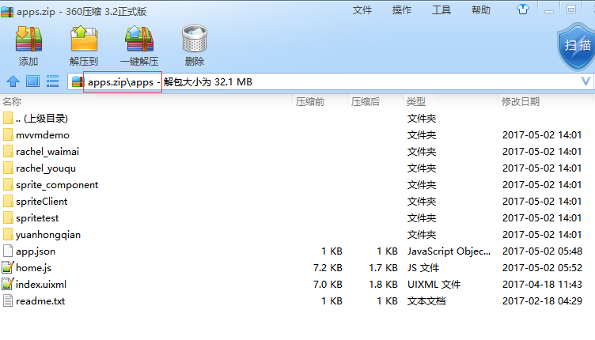
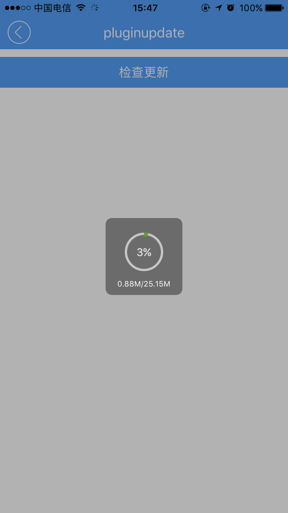

# pluginupdate组件  

----------

<h2 id="cid_0">说明</h2>

pluginupdate主要用于应用资源升级，该组件提供升级进度效果，封装了版本请求和资源下载请求，下载完成后自动解压资源目录。  

使用该升级组件需要把资源包压缩成如图格式，资源包目录名直接为更目录:

 

用法：在js里面引入require("pluginupdateUI");  

示例，需要在js里面创建组件对象。
   
```javascript
var pluginupdate = document.createElement("pluginupdate");
var pluginjson = {};
// pluginjson.lineColor = "#ff0000";//线条初始颜色，可选项
// pluginjson.lineProgressColor = "#000000";//线条进度颜色，可选项
pluginjson.versionUrl = "http://192.168.10.159:8001/process/service/testserver/getversion";//版本号请求验证地址，必须项


//组件数据初始化   
pluginupdate.pluginupdateInit(pluginjson);
``` 
  
<h2 id="cid_1">属性</h2>

无

 
<h2 id="cid_2">样式</h2>

无  

<h2 id="cid_3">js方法</h2>

**plugininit(jsonData:Object):void** 

<code>初始化数据</code>

参数为json数据：

> plugininit : 线条初始颜色，可选项  
> 
> lineProgressColor：线条进度颜色，可选项  
> 
> versionUrl：版本号请求地址  


返回值： 无
	
示例：

```javascript
var pluginupdate = document.createElement("pluginupdate");
var pluginjson = {};
// pluginjson.lineColor = "#ff0000";//线条初始颜色，可选项
// pluginjson.lineProgressColor = "#000000";//线条进度颜色，可选项
pluginjson.versionUrl = "http://192.168.10.159:8001/process/service/testserver/getversion";//版本号请求验证地址，必须项


//组件数据初始化   
pluginupdate.pluginupdateInit(pluginjson);
```

**getVersion(callback:Function):void**

<code>请求版本号信息</code>

参数：

callback：请求版本信息回调，含有2个参数：

> code：成功标识，1：成功；-1：失败

> datastr：返回请求内容，字符串，一般应该含有版本号信息。

返回值：无

**pluginDown(callback:Function):void**

<code>下载应用资源并更新</code>

参数：

callback：下载应用资源回调，含有1个参数

> code：成功标识，1：成功；-1：请求失败；-2：解压失败


返回值：无
    

<h2 id="cid_4">事件</h2>

无


<h2 id="cid_5">示例</h2>

```html
<page>
    <script>
        <![CDATA[
            var index = 1;
            var window = require("Window");
            var document = require("Document");
            var ui = require("UI");

            var console = require("Console");
            var myappjs = require("myapp");
            var app = require("App");
            var file = require("File");


            require("titlebarUI"); require("buttonUI"); require("pluginupdateUI");


            window.on("animator", function() {
                var titleid = document.getElement("titleid");
                var update1 = document.getElement("update1");


                //定义pluginupdate组件对象
                var pluginupdate = document.createElement("pluginupdate");
                // var pluginupdate = document.getElement("pluginupdateid");

                var pluginjson = {};
                // pluginjson.lineColor = "#ff0000";//线条初始颜色，可选项
                // pluginjson.lineProgressColor = "#000000";//线条进度颜色，可选项
                pluginjson.versionUrl = "http://192.168.10.159:8001/process/service/testserver/getversion"; //版本号请求验证地址，必须项

                //组件数据初始化   
                pluginupdate.pluginupdateInit(pluginjson);

                titleid.on("liconClick", function(e) {
                    var json = {};
                    window.close(json);
                });


                update1.on("click", function(e) {


                    pluginupdate.getVersion(function(code, datastr) {
                        //得到接口返回来的版本号信息，自己根据返回的数据格式做处理
                        if (code == 1) {
                            //请求成功后，对比版本号，版本号在app.json文件里面
                            var jsonstr = file.readTextFile("res:app.json");
                            var appjson = JSON.parse(jsonstr);
                            var datajson = JSON.parse(datastr);
                            var appversion_a = appjson.appversion; //本地的版本号
                            var appversion_b = datajson.version; //服务器上的版本号

                            var _a = toNum(appversion_a),
                                _b = toNum(appversion_b);

                            if (_b > _a) {
                                console.log("有新版本" + _b);
                                //这里做资源包下载操作
                                var confirmjson = {};
                                confirmjson.title = "更新";
                                confirmjson.content = "有新版本是否需要更新";


                                ui.confirm(confirmjson, function(n) {
                                    if (n == 0) {
                                        //确认
                                        pluginupdate.pluginDown(function(code) {
                                            if (code == 1) {
                                                ui.toast({
                                                    "content": "更新成功",
                                                    "duration": 0
                                                });
                                                //重启应用
                                                app.reload();
                                            } else if (code == -1) {
                                                ui.toast({
                                                    "content": "网络请求失败",
                                                    "duration": 0
                                                });
                                            } else if (code == -2) {
                                                ui.toast({
                                                    "content": "资源包解压失败",
                                                    "duration": 0
                                                });
                                            }
                                        }, "http://192.168.10.159:8001/process/service/testserver/plugindown");

                                    } else {
                                        //取消 
                                    }

                                });

                            } else {
                                ui.toast({
                                    "content": "暂无新版本",
                                    "duration": 0
                                });
                            }
                        } else {
                            ui.toast({
                                "content": datastr,
                                "duration": 0
                            });
                        }

                    });
                });

                function toNum(a) {
                    var a = a.toString();
                    console.log(a.toString());
                    var c = a.split('.');
                    var num_place = ["", "0", "00", "000", "0000"],
                        r = num_place.reverse();
                    for (var i = 0; i < c.length; i++) {
                        var len = c[i].length;
                        c[i] = r[len] + c[i];
                    }
                    var res = c.join('');
                    return res;
                }
            });
            app.on("orientation", function(e, orientation) {
                var screenWidth = window.getScreenWidth();

            });
        ]]>
    </script>
    <style>
        @import url("spriteLayout");
        @import url("spriteColor");
    </style>
    <ui>
        <box class="full" style="" id="box">

            <titlebar id="titleid" class="titlebar-hasstatus" style="background-color:#549FF7;title-color:#ffffff;right-color:#ffffff" title="pluginupdate" licon="../image/back.png"></titlebar>
            <box class="flex1" style="padding:10 0 0 0">
                <button value="检查更新" id="update1"></button>
            </box>

        </box>
    </ui>
</page>
```

> 代码效果图： 

 
