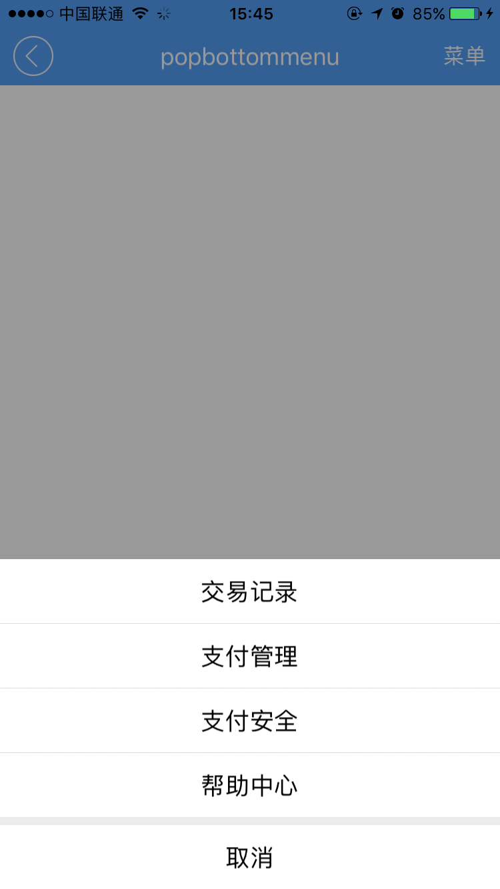

# popbottommenu组件  

----------

<h2 id="cid_0">说明</h2>

popbottommenu组件主要用于页面底部弹出菜单，效果类似微信钱包里面的弹出菜单。  

用法：在js里面引入require("popbottommenuUI");  

示例：需要在js里面创建组件对象。  
   
```javascript
var popbottommenu =  document.createElement("popbottommenu");
var popjson =  {
    datas:[
        {
            text:"交易记录",
            handler:function(e){
                console.log(e.target);
                myappjs.alert("你点击了 交易记录,隐藏pop");
                popbottommenu.hide(); 
            }
        },
        {
            text:"支付管理",
            handler:function(e){
                console.log(e.target);
                myappjs.alert("你点击了 支付管理");
                popbottommenu.hide();
            }
        },
        {
            text:"支付安全",
            handler:function(e){
                console.log(e.target);
                myappjs.alert("你点击了 支付安全");
                popbottommenu.hide();
            }
        },
        {
            "text":"帮助中心",
            handler:function(e){
                console.log(e.target);
                myappjs.alert("你点击了 帮助中心");
                popbottommenu.hide();
            }
        }
    ]
};
popbottommenu.popinit(popjson);
popbottommenu.show(); 

``` 
  
<h2 id="cid_1">属性</h2>

无

 
<h2 id="cid_2">样式</h2>

无  

<h2 id="cid_3">js方法</h2>

**popinit(popjson:Object):void **

在模板里面使用时，该方法不能放在created里面执行，因为popinit时组件内部需要布局刷新，created时候是不允许执行刷新操作的。

<code>初始化pop数据</code>

参数为json数据：

> datas：菜单子项数据，格式json数组。子项数据格式为json：  
> 
> - text：菜单文字内容  
> 
> - handler：点击菜单回调方法  

返回值： 无

示例：

```javascript
var popjson = {};
//菜单子项数据
popjson.datas = [;
{
text:"菜单1", 
handler:function(e){
myappjs.alert("你点击了 菜单1");
   popbottommenu.hide();
   }
 }
]
```


**show():void**

<code>显示pop弹窗 </code>

参数：无

返回值：无

**hide():void**

<code>隐藏pop窗口</code>

参数：无

返回值：无


<h2 id="cid_4">事件</h2>

无


<h2 id="cid_5">示例</h2>

```html
<page>
    <script>
        <![CDATA[
        var index = 1;
        var window = require("Window");
        var document = require("Document");
        var time = require("Time");
        var ui = require("UI");
        var console = require("Console");
        var myappjs = require("myapp");
        var app = require("App");
        require("titlebarUI");
        require("buttonUI");
        require("popbottommenuUI");
        var screenWidth = window.getScreenWidth();
        window.on("animator", function () {
            //关闭页面
            var titleid = document.getElement("titleid");
            var popbottommenu = document.createElement("popbottommenu");
            var popjson = {
                datas: [
                    {
                        text: "交易记录",
                        handler: function (e) {
                            console.log(e.target);
                            myappjs.alert("你点击了 交易记录,隐藏pop");

                            popbottommenu.hide();
                        }
                    },
                    {
                        text: "支付管理",
                        handler: function (e) {
                            console.log(e.target);
                            myappjs.alert("你点击了 支付管理");
                            popbottommenu.hide();
                        }
                    },
                    {
                        text: "支付安全",
                        handler: function (e) {
                            console.log(e.target);
                            myappjs.alert("你点击了 支付安全");
                            popbottommenu.hide();
                        }
                    },
                    {
                        "text": "帮助中心",
                        handler: function (e) {
                            console.log(e.target);
                            myappjs.alert("你点击了 帮助中心");
                            popbottommenu.hide();
                        }
                    }
                ]
            };

            popbottommenu.popinit(popjson);
            titleid.on("liconClick", function (e) {
                var json = {};
                window.close(json);
            });

            titleid.on("rtextClick", function (e) {
                popbottommenu.show();
            });
        });
 
    ]]>
    </script>
    <style>
        @import url(res:sprite_component/css/sprite.layout.css);
        @import url(res:sprite_component/css/sprite.color.css);
    </style>
    <ui>
        <box class="full" style="" id="box">
            <titlebar id="titleid" class="titlebar-hasstatus" style="background-color:#549FF7;title-color:#ffffff;right-color:#ffffff"
                title="popbottommenu" licon="res:yuanhongqian/image/back.png" rtext="菜单"></titlebar>
                <box class="flex1">
                </box>
        </box>
    </ui>
</page>
```

>代码效果图： 

 

