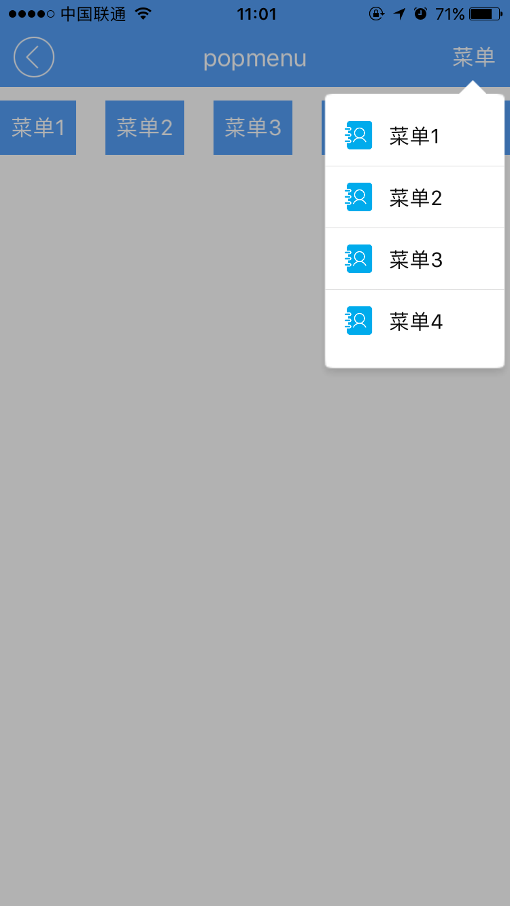
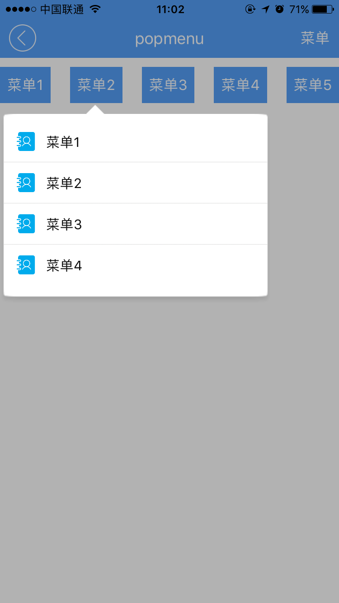

# popmenu组件  

----------

<h2 id="cid_0">说明</h2>

popmenu主要用于气泡弹出框，效果类似点击QQ右上角菜单，菜单弹出效果。该控件一般用于页面头部菜单点击弹出效果，暂未考虑底部弹出菜单，如果需要底部弹出菜单请使用popbottommenu组件。  

用法：在js里面引入require("popmenuUI");  

示例，需要在js里面创建组件对象。
   
```javascript
//定义popmenu组件对象
var popmenu = document.createElement("popmenu");
var popjson = {};
popjson.height = 220;
popjson.width = 140;
popjson.fontColor = "#0e0e0e";
popjson.domobj = titleid.rtextObj; 
popjson.datas = [
{
  text:"菜单1",
  icon:"res:yuanhongqian/image/ncontact-active.png",
  handler:function(e){
        var message = {};
        message.content = "点击了菜单1";
        ui.toast(message);
    popmenu.hide();
  }
},
{
  text:"菜单2",
  icon:"res:yuanhongqian/image/ncontact-active.png",
  handler:function(e){
        var message = {};
        message.content = "点击了菜单2";
        ui.toast(message);
    popmenu.hide();
  }
},
{
  text:"菜单3",
  icon:"res:yuanhongqian/image/ncontact-active.png",
  handler:function(e){
        var message = {};
        message.content = "点击了菜单3";
        ui.toast(message);
    popmenu.hide();
  }
},
{
  text:"菜单4",
  icon:"res:yuanhongqian/image/ncontact-active.png",
  handler:function(e){
    console.log(e.target);
     var message = {};
        message.content = "点击了菜单4";
        ui.toast(message);
    popmenu.hide();
  }
}
];
popmenu.popinit(popjson);
popmenu.show();

``` 
  
<h2 id="cid_1">属性</h2>

无

 
<h2 id="cid_2">样式</h2>

无  

<h2 id="cid_3">js方法</h2>

**popinit(popjson:Object):void** 

<code>初始化pop数据</code>

在模板里面使用时，该方法不能放在created里面执行，因为popinit时组件内部需要布局刷新，created时候是不允许执行刷新操作的。

参数为json数据：

> height : 自身高度  
> 
> width：自身宽度  
> 
> domobj：设置基于某个控件位置弹出  
> 
> datas：菜单子项数据，格式json数组。子项数据格式为json：  
> 
> - text：菜单文字内容  
> 
> - icon：菜单图标  
> 
> - handler：点击菜单回调方法  

返回值： 无
	
示例：

```javascript
var popjson = {};
popjson.height = 180; //自身高度
popjson.width = 300; //自身宽度
popjson.domobj = domobj; //设置基于某个控件位置弹出
//菜单子项数据
popjson.datas = [
  {
    text:"菜单1", 
    icon:"res:yuanhongqian/image/ncontact-active.png",
    handler:function(e){
	myappjs.alert("你点击了 菜单1");
	popmenu.hide();
	}
  }
]
popmenu.popinit(popjson);
```

**show():void**

<code>显示pop弹窗 </code>

参数：无

返回值：无

**hide():void**

<code>隐藏pop窗口</code>

参数：无

返回值：无
    

<h2 id="cid_4">事件</h2>

无


<h2 id="cid_5">示例</h2>

```html
<page>
    <script>
        <![CDATA[
        var index = 1;
        var window = require("Window");
        var document = require("Document");
        var ui = require("UI");
        var console = require("Console");
        var myappjs = require("myapp");
        var app = require("App");
        require("titlebarUI");
        require("buttonUI");
        require("popmenuUI");
        var myappjs = require("myapp");
        window.on("loaded", function () {
            var titleid = document.getElement("titleid");
            var caidan1 = document.getElement("caidan1");
            var caidan2 = document.getElement("caidan2");
            var caidan3 = document.getElement("caidan3");
            var caidan4 = document.getElement("caidan4");
            var caidan5 = document.getElement("caidan5");
            //定义popmenu组件对象
            var popmenu = document.createElement("popmenu");
            var popjson = {};
            popjson.height = 220;
            popjson.width = 140;
            popjson.fontColor = "#0e0e0e";
            popjson.domobj = titleid.rtextObj;

            popjson.datas = [
                {
                    text: "菜单1",
                    icon: "res:yuanhongqian/image/ncontact-active.png",
                    handler: function (e) {
                        console.log(e.target);
                        var message = {};
                        message.content = "点击了菜单1";
                        ui.toast(message);
                        popmenu.hide();
                    }
                },
                {
                    text: "菜单2",
                    icon: "res:yuanhongqian/image/ncontact-active.png",
                    handler: function (e) {
                        console.log(e.target);
                        var message = {};
                        message.content = "点击了菜单2";
                        ui.toast(message);
                        popmenu.hide();
                    }

                },
                {
                    text: "菜单3",
                    icon: "res:yuanhongqian/image/ncontact-active.png",
                    handler: function (e) {
                        console.log(e.target);
                        var message = {};
                        message.content = "点击了菜单3";
                        ui.toast(message);
                        popmenu.hide();
                    }

                },
                {
                    text: "菜单4",
                    icon: "res:yuanhongqian/image/ncontact-active.png",
                    handler: function (e) {
                        console.log(e.target);
                        var message = {};
                        message.content = "点击了菜单4";
                        ui.toast(message);
                        popmenu.hide();
                    }
                }

            ];

            popmenu.popinit(popjson);

            titleid.on("liconClick", function (e) {
                var json = {};
                window.close(json);
            });

            titleid.on("rtextClick", function (e) {
                popmenu.show();
            });
            caidan1.on("click", function (e) {
                //定义popmenu组件对象
                var popmenu = null;
                popmenu = document.createElement("popmenu");
                popjson.height = 220;
                popjson.width = 300;
                popjson.domobj = caidan1;
                popmenu.popinit(popjson);
                popmenu.show();

            });

            caidan2.on("click", function (e) {
                //定义popmenu组件对象
                var popmenu = document.createElement("popmenu");
                popjson.height = 220;
                popjson.width = 300;
                popjson.domobj = caidan2;
                popmenu.popinit(popjson);
                popmenu.show();

            });
            caidan3.on("click", function (e) {
                //定义popmenu组件对象
                var popmenu = document.createElement("popmenu");
                //得到popmenu组件对象                      
                popjson.height = 220;
                popjson.width = 300;
                popjson.domobj = caidan3;
                popmenu.popinit(popjson);
                popmenu.show();

            });
            caidan4.on("click", function (e) {
                //定义popmenu组件对象
                var popmenu = document.createElement("popmenu");
                popjson.height = 220;
                popjson.width = 300;
                popjson.domobj = caidan4;
                popmenu.popinit(popjson);
                popmenu.show();
            });

            caidan5.on("click", function (e) {
                //定义popmenu组件对象
                var popmenu = document.createElement("popmenu");
                popjson.height = 220;
                popjson.width = 300;
                popjson.domobj = caidan5;
                popmenu.popinit(popjson);
                popmenu.show();
            });

        });
        app.on("orientation", function (e, orientation) {
            var screenWidth = window.getScreenWidth();
        });
    ]]>
    </script>
    <style>
        @import url(res:sprite_component/css/sprite.layout.css);
        @import url(res:sprite_component/css/sprite.color.css);
    </style>
    <ui>
        <box class="full" style="" id="box">
            <titlebar id="titleid" class="titlebar-hasstatus" style="background-color:#549FF7;title-color:#ffffff;right-color:#ffffff"
                title="popmenu" licon="res:yuanhongqian/image/back.png" rtext="菜单"></titlebar>
                <box class="flex1" style="padding:10 0 0 0">
                    <box class="row-flex-center" style="justify-content:space-between">
                        <button value="菜单1" id="caidan1"></button>
                        <button value="菜单2" id="caidan2"></button>
                        <button value="菜单3" id="caidan3"></button>
                        <button value="菜单4" id="caidan4"></button>
                        <button value="菜单5" id="caidan5"></button>
                    </box>
                </box>
        </box>
    </ui>
</page>
```

>代码效果图： 

 
 
