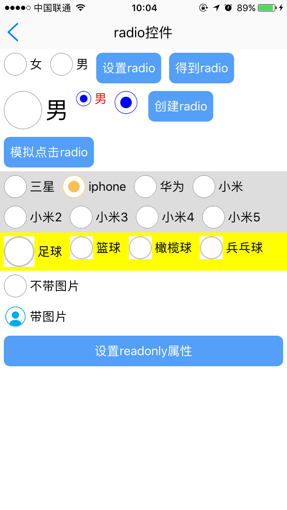

# radio组件

----------

<h2 id="cid_0">说明</h2>

radio组件主要用于单项选择，radio除了自己的状态样式外，开发者还可以自己设置图片当做状态样式，该组件可作为表单控件使用。该组件封装了change事件，只要该控件内部定义的属性发生变化都会触发该事件（用户自己写的属性改变不会触发change事件）。  

用法：在js里面引入require("radioUI");  

示例：如果需要让radio之间相互排斥需要设置group属性，并且值要求一样。  

  
```html
<radio  group="radiotest"   caption="女"  />
<radio  group="radiotest"   id="radio_test" checked="false" caption="男" style="checked-color:red;"/>

``` 

<h2 id="cid_1">属性</h2>

<table>
   <tr>
      <td>属性</td>
      <td>描述说明</td>
      <td>示例</td>
   </tr>
   <tr>
      <td>公共属性</td>
      <td>参考详细设计文档公共属性章节，包括：<br/>id<br/>style<br/>class</td>
      <td></td>
   </tr>
   <tr>
      <td>checked</td>
      <td>选择状态，true选中，false 未选中(通过js可以修改), 注意通过js设置checked如果存在同组的radio不具备排斥性，如需通过js控制可以调用click()方法，模拟radio点击；不写默认false</td>
      <td></td>
   </tr>
   <tr>
      <td>group</td>
      <td>radion组，同组的radion选择状态排斥；</td>
      <td></td>
   </tr>
   <tr>
      <td>caption</td>
      <td>文字内容(通过js可以修改)；</td>
      <td></td>
   </tr>
   <tr>
      <td>checkedimage</td>
      <td>选中状态的图片路径；设置后默认选中样式失效</td>
      <td></td>
   </tr>
   <tr>
      <td>nocheckedimage： </td>
      <td>未选中状态的图片路径；设置后默认未选择状态失效</td>
      <td></td>
   </tr>
   <tr>
      <td>readonly</td>
      <td>是否只读，取值true和false，不写默认false；(通过js可以修改)；</td>
      <td></td>
   </tr>
   <tr>
      <td>value</td>
      <td>提交值</td>
      <td></td>
   </tr>
</table>


<h2 id="cid_2">样式</h2>

<table>
   <tr>
      <td>样式</td>
      <td>描述说明</td>
      <td>示例</td>
   </tr>
   <tr>
      <td>box公共样式</td>
      <td>尺寸:默认height:30<br/>定位<br/>外边距<br/>内边距<br/>边框<br/>背景<br/>flexbox布局：align-self</td>
      <td></td>
   </tr>
   <tr>
      <td>color</td>
      <td>文字颜色(通过js可以修改); 默认#000000</td>
      <td></td>
   </tr>
   <tr>
      <td>height</td>
      <td>radio图标的高度(通过js可以修改); 设置后图标的高宽同时生效，一定保证是正方形或者圆形。默认30dp</td>
      <td></td>
   </tr>
   <tr>
      <td>font-size</td>
      <td>字体大小(通过js可以修改)；默认16dp</td>
      <td></td>
   </tr>
   <tr>
      <td>readonly-radius </td>
      <td>只读状态遮罩区域的弧度，一般用于有图片的时候设置，比如如果用的图片是圆形为了保证效果只读状态下遮罩区域也是圆形可以设置该值,默认0</td>
      <td></td>
   </tr>
   <tr>
      <td>checked-color</td>
      <td>checked时候的背景色; 默认#549FF7</td>
      <td></td>
   </tr>
   <tr>
      <td>nochecked-color</td>
      <td>为未选中状态下背景色(对于radio效果在边框上)；默认#9B9C9C</td>
      <td></td>
   </tr>
</table>

<h2 id="cid_3">js方法</h2>

<table>
   <tr>
      <td>Js方法</td>
      <td>描述说明</td>
      <td>示例</td>
   </tr>
   <tr>
      <td>box公共方法</td>
      <td>见详细设计文档box章节（不包括容器类Dom节点操作）</td>
      <td></td>
   </tr>
   <tr>
      <td>click()</td>
      <td>模拟点击radio组件，执行click()方法，相当于手动点击了一下radio</td>
      <td></td>
   </tr>
</table>

<h2 id="cid_4">事件</h2>


<table>
   <tr>
      <td>事件</td>
      <td>描述说明</td>
      <td>示例</td>
   </tr>
   <tr>
      <td>box公共事件</td>
      <td>见详细设计文档box章节</td>
      <td></td>
   </tr>
   <tr>
      <td>change</td>
      <td>监听radio属性改变</td>
      <td></td>
   </tr>
</table>  

<h2 id="cid_5">示例</h2>

```html
<page>
    <script>
        <![CDATA[
        var window = require("Window");
        var document = require("Document");
        var console = require("Console");
        var ui = require("UI");
        var ListAdapter = require("ListAdapter");
        var console = require("Console");
        require("titlebarUI");
        require("buttonUI");
        require("radioUI");
        var myappjs = require("myapp");
        var screenWidth = window.getScreenWidth();
        window.on("animator", function () {
            var setradio = document.getElement("setradio");
            var getradio = document.getElement("getradio");
            var creatradio = document.getElement("creatradio");
            var radio_test = document.getElement("radio_test");
            var clickradio = document.getElement("clickradio");
            setradio.on("click", function (e) {
                var checked = radio_test.getAttr("checked");
                if (checked == "true") {
                    radio_test.setAttr("checked", "false");

                }
                else {
                    radio_test.setAttr("checked", "true");
                }

            });

            getradio.on("click", function (e) {
                myappjs.alert(radio_test.getAttr("checked"));
            });

            radio_test.on("change", function (e) {
                myappjs.alert(radio_test.getAttr("checked"));
            });

            clickradio.on("click", function (e) {
                var radio1 = document.getElement("radio1");
                radio1.click();
            });

            var i = 9;
            creatradio.on("click", function (e) {
                var jsonattr = {};
                jsonattr.id = "radio_" + i;
                i = i + 1;
                jsonattr.caption = "小米5";
                jsonattr.group = "radioname";
                var radiodom = document.createElement("radio", jsonattr);
                radiodom.setStyle("checked-color", "red");
                //console.log(radiodom);
                var radiobox1 = document.getElement("radiobox1");
                radiobox1.appendChild(radiodom);
                document.refresh();

            });

            var testreadonlybutton = document.getElement("testreadonlybutton");
            var testreadonly2 = document.getElement("testreadonly2");
            var testreadonly = document.getElement("testreadonly");
            testreadonlybutton.on("click", function (e) {

                if (testreadonly.getAttr("readonly") == "true") {

                    testreadonly.setAttr("readonly", "false");
                    testreadonly2.setAttr("readonly", "false");
                }
                else {
                    testreadonly.setAttr("readonly", "true");
                    testreadonly2.setAttr("readonly", "true");

                }
            });
            //titlebar关闭页面
            var title = document.getElement("title");
            title.on("liconClick", function (e) {
                var json = {};
                window.close(json);

            });
        });
	
    ]]>
    </script>
    <style>
        @import url(res:sprite_component/css/sprite.layout.css);
        @import url(res:sprite_component/css/sprite.color.css);
        radio {
            margin: 5;
        }        
        button {
            margin: 8;
            border-radius: 8;
        }
    </style>
    <ui>
        <box class="white full" id="box">
            <titlebar title="radio控件" class="titlebar-hasstatus" licon="res:yuanhongqian/image/icon.png" style="licon-width:24;licon-height:24"
                id="title" />
            <scroll style="flex:1;width:fill_screen;font-size:12;">
                <box style="flex-direction:row;flex-wrap:wrap;align-items:flex-start;width:fill_screen;">
                    <radio group="radiotest" caption="女" />
                    <radio group="radiotest" id="radio_test" checked="false" caption="男" style="checked-color:red;" />

                    <button value="设置radio" id="setradio" />
                    <button value="得到radio" id="getradio" />

                    <radio caption="男" style="checked-color:blue;height:50;font-size:30" />
                    <radio checked="true" caption="男" style="checked-color:blue;height:20;color:red" />
                    <radio checked="true" caption="" style="checked-color:blue;height:30;color:red" />

                    <button value="创建radio" id="creatradio" />
                    <button value="模拟点击radio" id="clickradio" />
                </box>
                <box id="radiobox1" style="flex-direction:row;flex-wrap:wrap;align-items:flex-start;width:fill_screen;background-color:#dddddd">
                    <radio id="radio1" group="radioname" caption="三星" style="" />
                    <radio id="radio2" checked="true" group="radioname" caption="iphone" style="checked-color:#F8BF53;" />
                    <radio id="radio3" group="radioname" caption="华为" style="checked-color:#F8BF53;" />
                    <radio id="radio4" group="radioname" caption="小米" style="checked-color:#F8BF53;" />
                    <radio id="radio5" group="radioname" caption="小米2" style="checked-color:#F8BF53;" />
                    <radio id="radio6" group="radioname" caption="小米3" style="checked-color:#F8BF53;" />
                    <radio id="radio7" group="radioname" caption="小米4" style="checked-color:#F8BF53;" />
                    <radio id="radio8" group="radioname" caption="小米5" style="checked-color:#F8BF53;" />
                </box>
                <box style=";background-color:yellow;flex-direction:row;flex-wrap:wrap;align-items:flex-start;width:fill_screen;">
                    <radio checkedimage="res:yuanhongqian/image/rad_pressed.png" nocheckedimage="res:yuanhongqian/image/rad_normal.png" group="radioname2"
                        caption="足球" style="checked-color:#F8BF53;height:40" />
                    <radio checkedimage="res:yuanhongqian/image/rad_pressed.png" nocheckedimage="res:yuanhongqian/image/rad_normal.png" group="radioname2"
                        caption="篮球" style="checked-color:#F8BF53;" />
                    <radio checkedimage="res:yuanhongqian/image/rad_pressed.png" nocheckedimage="res:yuanhongqian/image/rad_normal.png" group="radioname2"
                        caption="橄榄球" style="checked-color:#F8BF53;" />
                    <radio checkedimage="res:yuanhongqian/image/rad_pressed.png" nocheckedimage="res:yuanhongqian/image/rad_normal.png" group="radioname2"
                        caption="兵乓球" style="checked-color:#F8BF53;" />
                </box>
                <radio id="testreadonly" caption="不带图片" />
                <radio id="testreadonly2" style="readonly-radius:15" checkedimage="res:yuanhongqian/image/nme-active.png" nocheckedimage="res:yuanhongqian/image/nme.png"
                    caption="带图片" />
                <button value="设置readonly属性" id="testreadonlybutton" />
            </scroll>
        </box>
    </ui>
</page>
```

>代码效果图： 

 