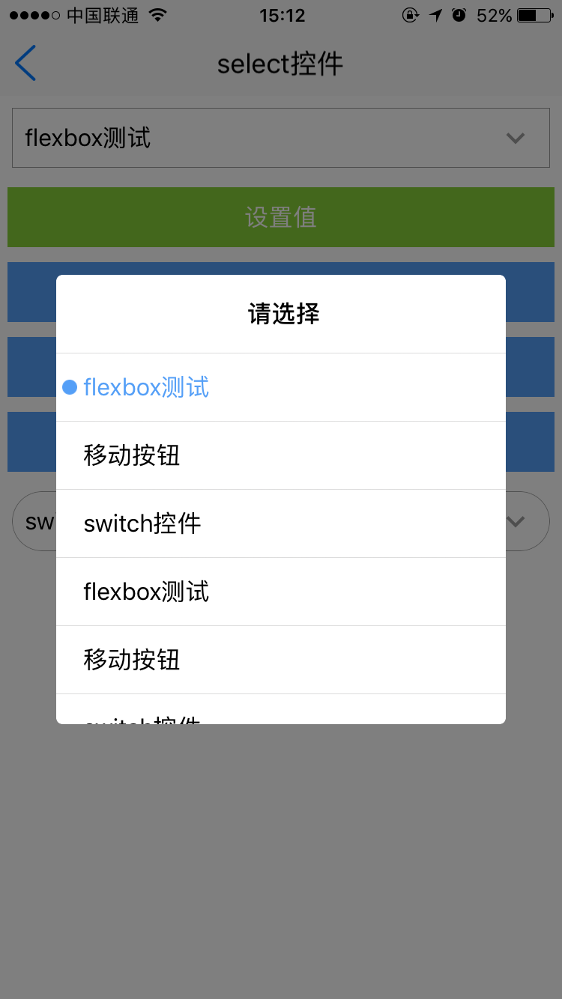

<h1>select组件</h1>

----------

## 说明  

select组件主要用于弹出框选项效果，该组件可作为表单控件使用。该组件封装了change事件，只要该控件内部定义的属性发生变化都会触发该事件（用户自己写的属性改变不会触发change事件）。  

用法：在js里面引入require("selectUI");  

示例：
 
```html
<select readonly="true" id="select1" style="margin:8" value="100"  title="请选择"/>
``` 

select选项内容必须通过loadData()方法动态加载  

```javascript
var select1 = document.getElement("select1");
var datas = new Array();
json = {};
json.type   = "cell";
json.text   = "flexbox测试";
json.selected = "false";
json.value   = "100";
datas.push(json); 
json = {};
json.type   = "cell";			
json.text   = "移动按钮";
json.selected = "false";
json.value   = "101";			
datas.push(json);  
json = {};
json.type   = "cell";			
json.text   = "switch控件";	
json.selected = "false";
json.value   = "102";			
datas.push(json);
select1.loadData(datas);

``` 

## 属性  

<table>
   <tr>
      <td>属性</td>
      <td>描述说明</td>
      <td>示例</td>
   </tr>
   <tr>
      <td>公共属性</td>
      <td>参考详细设计文档公共属性章节，包括：<br/>id<br/>style<br/>class</td>
      <td></td>
   </tr>
   <tr>
      <td>readonly</td>
      <td>是否只读，取值true和false，不写默认false</td>
      <td></td>
   </tr>
   <tr>
      <td>value</td>
      <td>提交值，如果该值和注入的数据内容的value一致，那么注入数据对应的选项就是选中状态。</td>
      <td></td>
   </tr>
   <tr>
      <td>title</td>
      <td>设置弹出框的title文字内容</td>
      <td></td>
   </tr>
</table>


## 样式  

<table>
   <tr>
      <td>样式</td>
      <td>描述说明</td>
      <td>示例</td>
   </tr>
   <tr>
      <td>box公共样式</td>
      <td>尺寸:默认height:40<br/>定位<br/>外边距<br/>内边距<br/>边框<br/>背景<br/>flexbox布局：align-self</td>
      <td></td>
   </tr>
   <tr>
      <td>selected-color</td>
      <td>选中状态下文字颜色; 默认#549FF7</td>
      <td></td>
   </tr>
</table>

## js方法 

<table>
   <tr>
      <td>Js方法</td>
      <td>描述说明</td>
      <td>示例</td>
   </tr>
   <tr>
      <td>box公共方法</td>
      <td>见设计文档box章节（不包括容器类Dom节点操作）</td>
      <td></td>
   </tr>
   <tr>
      <td>click()</td>
      <td>模拟点击select组件，执行click()方法，相当于手动点击了一下select</td>
      <td></td>
   </tr>
   <tr>
      <td>getSelectedIndex</td>
      <td>得到当前索引从0开始</td>
      <td></td>
   </tr>
</table>

## 事件  


<table>
   <tr>
      <td>事件</td>
      <td>描述说明</td>
      <td>示例</td>
   </tr>
   <tr>
      <td>box公共事件</td>
      <td>见详细设计文档box章节</td>
      <td></td>
   </tr>
   <tr>
      <td>change</td>
      <td>监听select属性改变</td>
      <td></td>
   </tr>
</table>  

## 示例  

```html
<page>
    <script>
        <![CDATA[
        var index = 1;
        var window = require("Window");
        var document = require("Document");
        var console = require("Console");
        var ui = require("UI");
        var ListAdapter = require("ListAdapter");
        var console = require("Console");

        require("titlebarUI");
        require("buttonUI");
        require("selectUI");
        require("selectpopUI");

        var myappjs = require("myapp");
        var screenWidth = window.getScreenWidth();
        var datas = new Array();
        var datas2 = new Array();
        window.on("animator", function () {
            var testbtn = document.getElement("testbtn");
            var select1 = document.getElement("select1");
            var testbtn2 = document.getElement("testbtn2");
            var testbtn3 = document.getElement("testbtn3");
            var testbtn4 = document.getElement("testbtn4");
            testbtn.on("click", function (e) {
                //myappjs.alert(datas[0].selected);
                select1.setAttr("value", "1000");

            })

            testbtn2.on("click", function (e) {
                //myappjs.alert(datas[0].selected);
                myappjs.alert(select1.getAttr("value"));
            })
            testbtn3.on("click", function (e) {

                var index = select1.getSelectedIndex();
                myappjs.alert(index);

            })
            testbtn4.on("click", function (e) {
                if (select1.getAttr("readonly") == "false") {

                    select1.setAttr("readonly", "true");
                }
                else {
                    select1.setAttr("readonly", "false");
                }
            });
            //titlebar关闭页面
            var title = document.getElement("title");
            title.on("liconClick", function (e) {
                var json = {};
                window.close(json);

            });
            //多个true 只是显示第一个，select控件如果有value值并且value值能对应上data里面的value，以value值对应的数据为选择项

            for (i = 0; i < 5; i++) {
                json = {};
                json.type = "cell";
                json.text = "flexbox测试";
                json.selected = "false";
                json.value = "100" + i;
                datas.push(json);

                json = {};
                json.type = "cell";
                json.text = "移动按钮";
                json.selected = "false";
                json.value = "101" + i;
                datas.push(json);

                json = {};
                json.type = "cell";
                json.text = "switch控件";
                json.selected = "false";
                json.value = "102" + i;
                datas.push(json);

            }

            var select1 = document.getElement("select1");
            var select2 = document.getElement("select2");

            select1.loadData(datas);

            select1.on("change", function (e) {

                myappjs.alert("监听change事件");
            })
            json = {};
            json.type = "cell";
            json.text = "flexbox测试";
            json.selected = "false";
            json.value = "100";
            datas2.push(json);

            json = {};
            json.type = "cell";
            json.text = "switch控件";
            json.selected = "true";
            json.value = "102";
            datas2.push(json);
            select2.loadData(datas2);

        });
	
    ]]>
    </script>
    <style>
        @import url(res:sprite_component/css/sprite.layout.css);
        @import url(res:sprite_component/css/sprite.color.css);
        button {
            margin: 5 5 5 5;
        }
    </style>
    <ui>
        <box class="white full" id="box">
            <titlebar title="select控件" class="titlebar-hasstatus" licon="res:yuanhongqian/image/icon.png" style="licon-width:24;licon-height:24"
                id="title" />

            <scroll style="flex:1;width:fill_screen;">
                <select readonly="true" id="select1" style="margin:8" value="1001" title="请选择" />
                <button value="设置值" id="testbtn" class="submit" />
                <button value="得到当前select的value" id="testbtn2" />
                <button value="得到当前selected的索引" id="testbtn3" />
                <button value="设置readonly" id="testbtn4" />

                <select id="select2" style="margin:8;select-color:red;border-radius:20" />
            </scroll>
        </box>
    </ui>
</page>
```

>代码效果图： 

  