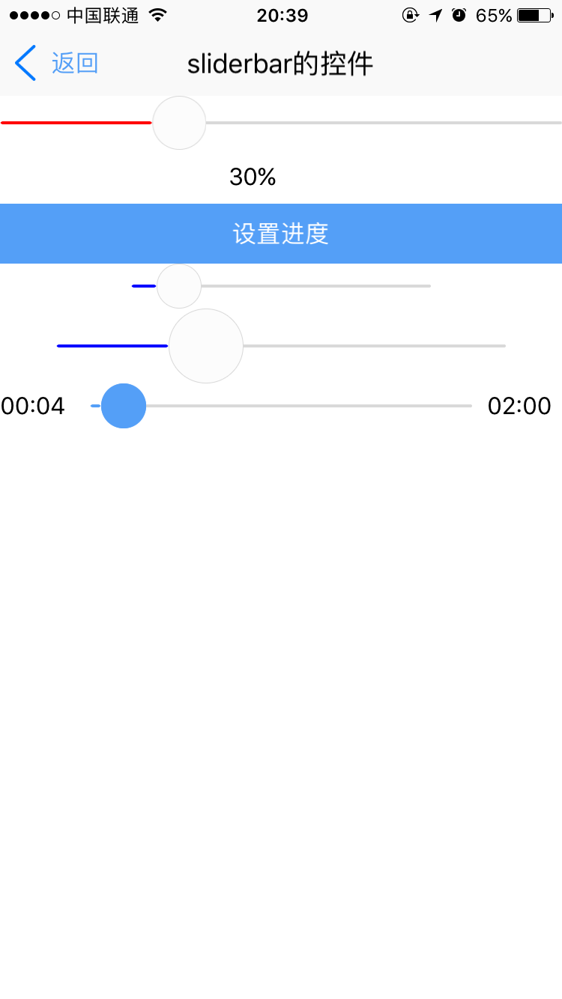

# sliderbar组件

----------

<h2 id="cid_0">说明</h2>

sliderbar是滑动条组件，类似控制播放的进度条，一般用于拖动滑动条来设置一个区间范围值。  

用法：在js里面引入require("sliderbarUI");  

示例：

  
```html
<sliderbar id="slidebar_id"  style="sliderbar-color:red;height:36;width:fill_screen" x_progress="30"  />
``` 

<h2 id="cid_1">属性</h2>

<span id="sx_0">**公共属性**</span>  

[参见公共属性章节](https://gitdocument.exmobi.cn/sprite-api/ggsx.html)，包括：id、style、class；

**x_progress**

<code>当前进度和总进度的百分比</code>

数值0-100 (可通过js动态修改)
     

<h2 id="cid_2">样式</h2>


**公共样式**	
>尺寸:默认height:30;
>
> 定位
> 
>外边距
>
>内边距
>
>边框
>
>背景
>
>flexbox布局:align-self


**sliderbar-color**	

<code>前面线条颜色</code>

默认#549FF7	

**sliderbar-after-color**	

<code>后部分线条颜色</code>

默认#f5f5f5	

**button-background-color**	

<code>触摸按钮背景颜色</code>

默认#fcfcfc	

**button-border-color**	

<code>触摸按钮边框颜色</code>

默认#d9d9d9	

**button-height**
	
<code>触摸按钮高度</code>

设置后宽度同时生效，默认30，如果同时设置height和button-height的时候，需要保证height比button-height的值大


<h2 id="cid_3">js方法</h2>

**公共方法**  

[事件相关](https://gitdocument.exmobi.cn/sprite-api/ggff.html#cid_0)，包括：

> [on(messageName:string,callback:Function): void   组件注册事件的触发函数](https://gitdocument.exmobi.cn/sprite-api/ggff.html#jjxg_1)   
> 
> [fire(messageName:string,params:Array&lt;any&gt;): void  组件事件的触发函数](https://gitdocument.exmobi.cn/sprite-api/ggff.html#jjxg_2)   
> 
> [off(messageName:string,callback:Function): void  组件移除事件的触发函数](https://gitdocument.exmobi.cn/sprite-api/ggff.html#jjxg_3)  
>  
> [getOn(messageName:string): Array&lt;Function&gt;  获取已绑定的事件的触发函数](https://gitdocument.exmobi.cn/sprite-api/ggff.html#jjxg_4)   

[动画相关](https://gitdocument.exmobi.cn/sprite-api/ggff.html#cid_1)，包括： 
 
> [startAnimation(jsonData:Object,callback:Function): void  启动UI组件动画](https://gitdocument.exmobi.cn/sprite-api/ggff.html#dhxg_1)   
> 
> [startAnimator(jsonData:Object,callback:Function): void  启动UI组件属性动画](https://gitdocument.exmobi.cn/sprite-api/ggff.html#dhxg_2)   
> 
> [startKeyFrameAnimator(jsonData:Object,callback:Function): void  启动UI组件关键帧动画](https://gitdocument.exmobi.cn/sprite-api/ggff.html#dhxg_3)  
>  
> [ releaseAnimator(): void  结束控件动画](https://gitdocument.exmobi.cn/sprite-api/ggff.html#dhxg_4)   

[尺寸和位置](https://gitdocument.exmobi.cn/sprite-api/ggff.html#cid_2)，包括：  

> [getFrame(): Object  获取组件在父容器中的位置](https://gitdocument.exmobi.cn/sprite-api/ggff.html#cchwz_1)   
> 
> [setFrame(frame:Object): void  设置组件在父容器中的位置](https://gitdocument.exmobi.cn/sprite-api/ggff.html#cchwz_2)   
> 
> [getCenter(): Object  获取组件中心点在父容器中的位置](https://gitdocument.exmobi.cn/sprite-api/ggff.html#cchwz_3)  
>
> [getAbsoluteFrame(): Object  获取组件在绘制窗口中的位置](https://gitdocument.exmobi.cn/sprite-api/ggff.html#cchwz_4)   


[普通Dom节点操作](https://gitdocument.exmobi.cn/sprite-api/ggff.html#cid_3)，包括：  

> [getParent(): IElement  获取父节点](https://gitdocument.exmobi.cn/sprite-api/ggff.html#ptdom_1)   
> 
> [getNext(): IElement  获取同级下一个节点](https://gitdocument.exmobi.cn/sprite-api/ggff.html#ptdom_2)   
> 
> [getPrevious(): IElement  获取同级前一个节点](https://gitdocument.exmobi.cn/sprite-api/ggff.html#ptdom_3)  
> 
> [remove(): void  从父容器中移除自身](https://gitdocument.exmobi.cn/sprite-api/ggff.html#ptdom_4)  
> 
> [clone(isDeep:boolean):IElement  对当前Dom节点进行克隆](https://gitdocument.exmobi.cn/sprite-api/ggff.html#ptdom_5)  
>
> [setAttr(attrName:string,attrValue:string): void  设置节点属性](https://gitdocument.exmobi.cn/sprite-api/ggff.html#ptdom_6)   
>
> [getAttr(attrName:string):string  获取节点属性值](https://gitdocument.exmobi.cn/sprite-api/ggff.html#ptdom_7) 
>
> [getAttrs(): Object  获取节点所有属性](https://gitdocument.exmobi.cn/sprite-api/ggff.html#ptdom_8) 
>
> [removeAttr(attrName:string): void  移除节点属性](https://gitdocument.exmobi.cn/sprite-api/ggff.html#ptdom_9) 
>
> [hasAttr(attrName:string): boolean  节点是否具有该属性](https://gitdocument.exmobi.cn/sprite-api/ggff.html#ptdom_10) 
> 
> [setStyle(styleName:string,styleValue:string): void  设置节点样式值](https://gitdocument.exmobi.cn/sprite-api/ggff.html#ptdom_13)  
>
> [getStyle(styleName:string):string  获取节点样式值](https://gitdocument.exmobi.cn/sprite-api/ggff.html#ptdom_14)   
>
> [clearStyle(styleName:string): void  移除节点样式值](https://gitdocument.exmobi.cn/sprite-api/ggff.html#ptdom_15)    
>
> [setClassStyle(className:string,domobj:IElement): void   设置节点对应Class样式](https://gitdocument.exmobi.cn/sprite-api/ggff.htm#ptdom_16) 
>  
> [getClassStyle(): string  获取节点已设置Class样式](https://gitdocument.exmobi.cn/sprite-api/ggff.html#ptdom_17)  
>  
> [getTag(): string  获取UI组件类型](https://gitdocument.exmobi.cn/sprite-api/ggff.html#ptdom_18)  
>  
> [getId(): string  获取UI组件Id标识](https://gitdocument.exmobi.cn/sprite-api/ggff.html#ptdom_19) 

<h2 id="cid_4">事件</h2>

**change**

<code>监听触摸时的实时进度值</code>

event对象包括：  
 
> type：事件类型，字符串类型，固定值：change； 
>  
>target：触发事件的目标组件，dom对象； 
> 
>timestamp：事件触发的时间戳,单位毫秒，数字类型；

param：

返回进度值：[0-100]
      

<h2 id="cid_5">示例</h2>

```html
<page>
    <script>
        <![CDATA[
        var window = require("Window");
        var document = require("Document");
        var ui = require("UI");
        var time = require("Time");
        var config = require("myconfig");
        var console = require("Console");

        require("titlebarUI");
        require("sliderbarUI");
        require("buttonUI");
        var myappjs = require("myapp");

        var screenWidth = window.getScreenWidth();
        window.on("animator", function () {

            //titlebar关闭页面
            var titlebarid = document.getElement("titlebarid");
            titlebarid.on("liconClick", function (e) {
                var json = {};
                window.close(json);

            });

            titlebarid.on("ltextClick", function (e) {
                var json = {};
                window.close(json);

            });

            var slidebar_id = document.getElement("slidebar_id");
            var slider_n = document.getElement("slider_n");

            slider_n.setText(slidebar_id.getAttr("x_progress") + "%");

            slidebar_id.on("change", function (e, param1) {
                //console.log(param1);
                slider_n.setText(param1 + "%");
            });

            var setProgress_btn = document.getElement("setProgress_btn");
            setProgress_btn.on("click", function (e) {
                slidebar_id.setAttr("x_progress", "50");
                //console.log(slidebar_id.getAttr("x_progress"));

            });

            var timeprogeress = document.getElement("timeprogeress");
            var time1 = document.getElement("time1");
            var time2 = document.getElement("time2");
            var x = 0;
            var t = 0;
            timeid = time.setInterval(function () {
                x = x + 100 / 120;
                t = t + 1;

                timeprogeress.setAttr("x_progress", x);
                var s = Number(t % 60) >= 10 ? Number(t % 60) : "0" + Number(t % 60);
                var time1str = Math.floor(t / 60) >= 10 ? Math.floor(t / 60) : "0" + Math.floor(t / 60) + ":" + s;

                time1.setText(time1str);
                if (t == 120) {
                    time.clearInterval(timeid);
                }
            }, 1000);
        });
    ]]>
    </script>
    <style>
        @import url(res:sprite_component/css/sprite.layout.css);
        @import url(res:sprite_component/css/sprite.color.css);
        text {
            text-overflow: ellipsis;
            singleline: true;
            line-space: 0;
        }
    </style>
    <ui>
        <box class="bg-white full" id="box">
            <titlebar id="titlebarid" ltext="返回" title="sliderbar的控件" licon="res:yuanhongqian/image/icon.png" class="titlebar-hasstatus"
                style="licon-width:24;licon-height:24" />
            <scroll style="flex:1;width:fill_screen;align-items:center;">
                <box style="flex-direction:row;width:fill_screen;align-items:start;justify-content:center;flex-wrap:wrap">
                    <sliderbar id="slidebar_id" style="sliderbar-color:red;height:36;width:fill_screen" x_progress="30" />
                    <text id="slider_n" style="width:70;height:36">0</text>
                </box>
                <button value="设置进度" style="width:fill_screen" id="setProgress_btn" />
                <sliderbar style="sliderbar-color:blue;height:30;width:200" x_progress="10" />
                <sliderbar style="sliderbar-color:blue;height:50;width:300" x_progress="30" />
                <box style="flex-direction:row;align-items:center;">
                    <text id="time1" style="width:50;">00:00</text>
                    <sliderbar id="timeprogeress" style="height:30;flex:1;margin:0 10 0 10;button-background-color:#549FF7;button-border-color:#549FF7"
                        x_progress="0" />
                    <text id="time2" style="width:50">02:00</text>
                </box>
            </scroll>
        </box>
    </ui>
</page>
```

>代码效果图： 

 