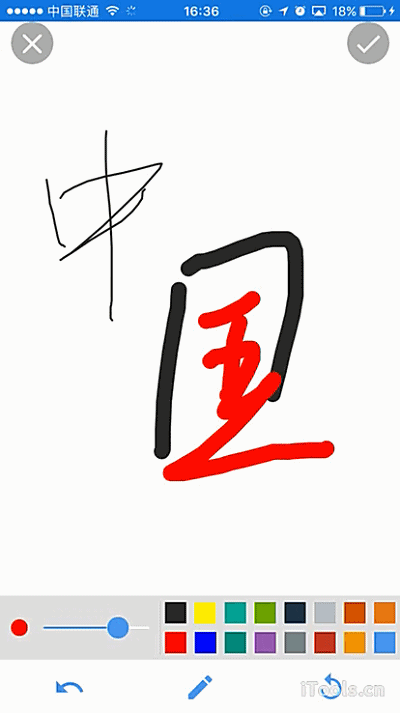
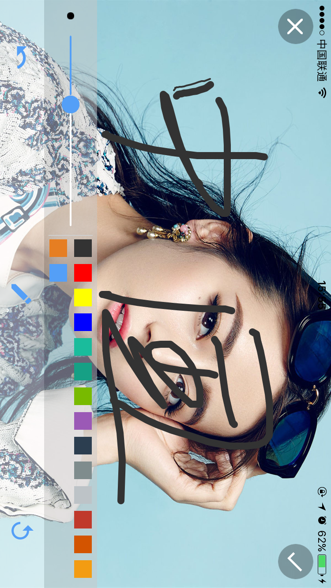

# superhandsign组件

----------

<h2 id="cid_0">说明</h2>

superhandsign组件为增强型手写签名组件，此组件是在基础组件handsign组件之上封装，可以支持选择16种常用画笔颜色，支持拖动滑条改变画笔粗细，以及撤销功能。  

需要注意的是，该组件不支持在使用过程中进行横竖屏切换，如果需要横屏那么在打开页面的时候就横屏打开，另外这个组件是个全屏组件，一个页面只能放一个superhandsign组件。  

用法：在js里面引入require("superhandsignUI");  

示例：
  

```html
<superhandsign id="superhandsign" folderpah="res:page/handsign/"/>
``` 

<h2 id="cid_1">属性</h2>

<table>
   <tr>
      <td>属性</td>
      <td>描述说明</td>
      <td>示例</td>
   </tr>
   <tr>
      <td>公共属性</td>
      <td>参见公共属性章节，包括：<br/>id<br/>style<br/>class<br/>
</td>
      <td></td>
   </tr>
   <tr>
      <td>folderpah </td>
      <td>需要存放的文件夹目录（不含文件名）。</td>
      <td>folderpah="res: handsign"</td>
   </tr>
</table>

<h2 id="cid_2">样式</h2>

无

<h2 id="cid_3">js方法</h2>

<table>
   <tr>
      <td>Js方法</td>
      <td>描述说明</td>
      <td>示例</td>
   </tr>
   <tr>
      <td>loadData(json)</td>
      <td>加载已有图片 json格式 json.path；<br/>如果想在某一个图片之上作画，要导入一个图片路径，如果是新建一个白板这个方法可以不用执行。</td>
   </tr>
</table>

<h2 id="cid_4">事件</h2>

<table>
   <tr>
      <td>事件</td>
      <td>描述说明</td>
      <td>示例</td>
   </tr>
   <tr>
      <td>backClick</td>
      <td>监听返回点击事件，一般用于关闭页面</td>
      <td></td>
   </tr>
   <tr>
      <td>okClick</td>
      <td>参数(e, path) 监听确定点击事件，其中path是保存路径</td>
      <td></td>
   </tr>
</table>

<h2 id="cid_5">示例</h2>

首先创建一个测试用的uixml文件，用来调用签名控件

```html
<page>
    <script>
        <![CDATA[
        var window = require("Window");
        var document = require("Document");
        var ui = require("UI");
        var time = require("Time");
        var config = require("myconfig");
        var console = require("Console");
        require("titlebarUI");
        require("buttonUI");
        var myappjs = require("myapp");
        var screenWidth = window.getScreenWidth();
        window.on("animator", function () {
            //titlebar关闭页面
            var titlebarid = document.getElement("titlebarid");
            var image1 = document.getElement("image1");
            var image2 = document.getElement("image2");
            var image3 = document.getElement("image3");
            var jizhudom = null;
            titlebarid.on("ltextClick", function (e) {
                window.close({});
            });
            titlebarid.on("liconClick", function (e) {
                window.close({});
            });
            window.on("result", function (e, data) {
                console.log("sssss" + data.path);
                jizhudom.setStyle("display", "block");
                jizhudom.setAttr("src", data.path);
                document.refresh();
            });
            var btn1 = document.getElement("btn1");
            btn1.on("click", function (e) {
                jizhudom = image1;
                var openjson = {};
                openjson.url = "res:yuanhongqian/componentdemo/superhandsign.uixml";
                openjson.target = "_blank";
                openjson.statusBar = "transparent";
                openjson.statusBarColor = "transparent";
                openjson.statusBarMode = "default";
                openjson.orientation = "portrait";
                window.open(openjson);
            });
            image1.on("click", function (e) {
                var openjson = {};
                openjson.url = "res:yuanhongqian/componentdemo/superhandsign.uixml";
                openjson.target = "_blank";
                openjson.statusBar = "transparent";
                openjson.statusBarColor = "transparent";
                openjson.statusBarMode = "default";
                openjson.orientation = "portrait";
                openjson.data = {};
                openjson.data.imageurl = this.getAttr("src");
                window.open(openjson);
            });
            var btn2 = document.getElement("btn2");
            btn2.on("click", function (e) {
                jizhudom = image2;
                var openjson = {};
                openjson.url = "res:yuanhongqian/componentdemo/superhandsign.uixml";
                openjson.target = "_blank";
                openjson.statusBar = "transparent";
                openjson.statusBarColor = "transparent";
                openjson.statusBarMode = "default";
                openjson.orientation = "landscape";
                window.open(openjson);
            });
            image2.on("click", function (e) {
                var openjson = {};
                openjson.url = "res:yuanhongqian/componentdemo/superhandsign.uixml";
                openjson.target = "_blank";
                openjson.statusBar = "transparent";
                openjson.statusBarColor = "transparent";
                openjson.statusBarMode = "default";
                openjson.orientation = "landscape";
                openjson.data = {};
                openjson.data.imageurl = this.getAttr("src");
                window.open(openjson);
            });

            var btn3 = document.getElement("btn3");
            btn3.on("click", function (e) {
                jizhudom = image3;
                var openjson = {};
                openjson.url = "res:yuanhongqian/componentdemo/superhandsign.uixml";
                openjson.target = "_blank";
                openjson.statusBar = "transparent";
                openjson.statusBarColor = "transparent";
                openjson.statusBarMode = "default";
                openjson.orientation = "landscape";
                openjson.data = {};
                openjson.data.imageurl = "res:yuanhongqian/image/1.jpg";
                window.open(openjson);

            });

            image3.on("click", function (e) {
                var openjson = {};
                openjson.url = "res:yuanhongqian/componentdemo/superhandsign.uixml";
                openjson.target = "_blank";
                openjson.statusBar = "transparent";
                openjson.statusBarColor = "transparent";
                openjson.statusBarMode = "default";
                openjson.orientation = "landscape";
                openjson.data = {};
                openjson.data.imageurl = this.getAttr("src");
                window.open(openjson);
            });
        });
    ]]>
    </script>
    <style>
        @import url(res:sprite_component/css/sprite.layout.css);
        @import url(res:sprite_component/css/sprite.color.css);
        text {
            text-overflow: ellipsis;
            singleline: true;
            line-space: 0;
        }
        
        button {
            margin: 4;
        }
    </style>
    }
    <ui>
        <box class="bg-white full" id="box">
            <titlebar id="titlebarid" ltext="返回" title="手写涂鸦控件" licon="res:yuanhongqian/image/icon.png" class="titlebar-hasstatus" style="licon-width:24;licon-height:24"
            />
            <scroll class="flex1">
                <button id="btn1" value="启动涂鸦面板 竖屏显示" />
                <image id="image1" style="width: 200;height:300;display: none" />
                <button id="btn2" value="启动涂鸦面板  横屏显示" />
                <image id="image2" style="width: 300;height:200;display: none" />
                <button id="btn3" value="启动涂鸦面板 带图片 横屏显示" />
                <image id="image3" style="width: 300;height:200;display: none" />
            </scroll>
        </box>
    </ui>
</page>
```

然后在单独创建一个uixml页面来单独放手写签名控件，这个页面会根据前一个页面打开状态进行横屏打开或者竖屏打开。

```html
<page>
    <script>
        <![CDATA[
    var index = 1;
        var window = require("Window");
        var document = require("Document");
        var ui = require("UI");
        var time = require("Time");
        var config = require("myconfig");
        var console = require("Console");

        require("titlebarUI");
        require("superhandsignUI");
        require("buttonUI");

        var myappjs = require("myapp");
        var screenWidth = window.getScreenWidth();
        window.on("animator", function () {
            //titlebar关闭页面
            var superhandsign = document.getElement("superhandsign");
            superhandsign.on("backClick", function (e) {
                console.log("监听了");
                window.close({});
            });
            superhandsign.on("okClick", function (e, path) {
                //console.log("监听了OK"+path);
                var closejson = {};
                closejson.data = {};
                closejson.data.path = path;
                window.close(closejson);
            });
            if (window.getData() != null) {
                var json = {};
                json.path = window.getData().imageurl;
                superhandsign.loadData(json);
            }
        }); 
    ]]>
    </script>
    <style>
        @import url(res:sprite_component/css/sprite.layout.css);
        @import url(res:sprite_component/css/sprite.color.css);
        text {
            text-overflow: ellipsis;
            singleline: true;
            line-space: 0;
        }
        
        button {
            margin: 4;
        }
    </style>
    }
    <ui>
        <box class="bg-white full" id="box">
            <!-- 	<titlebar id="titlebarid" ltext="返回" title="手写涂鸦控件"   licon="res:yuanhongqian/image/icon.png" class="titlebar-hasstatus"  style="licon-width:24;licon-height:24" /> -->
            <superhandsign id="superhandsign" folderpah="res:handsign" />
        </box>
    </ui>
</page>


```
>代码效果图： 

   


