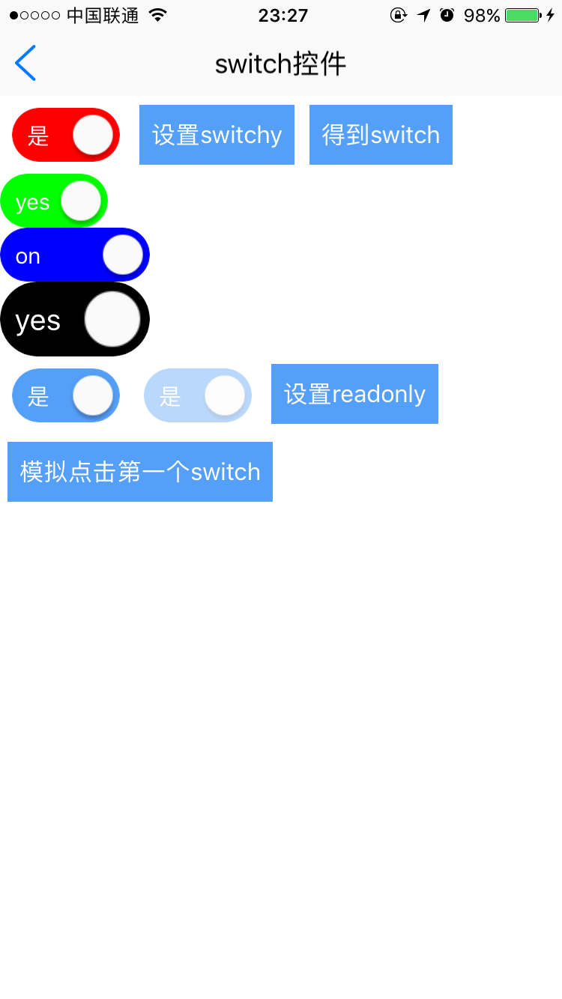

# switch组件

----------

<h2 id="cid_0">说明</h2>

switch控件主要用于开关效果，可作为表单控件使用。该组件封装了change事件，只要该控件内部定义的属性发生变化都会触发该事件（用户自己写的属性改变不会触发change事件）。  

用法：在js里面引入require("switchUI");  

示例：
  
```html
<switch id="switch1" onText="是" offText="否"  checked="false" style="on-background-color:red;margin:8"/>
``` 

<h2 id="cid_1">属性</h2>

<span id="sx_0">**公共属性**</span>  

[参见公共属性章节](https://gitdocument.exmobi.cn/sprite-api/ggsx.html)，包括：id、style、class；


**onText**	

<code>on时的文字</code>

开关开着时候的文字;	

**offText**	

<code>off时的文字</code>

开关关着时候的文字;	
	

**checked**

<code>开关状态</code>	

开关状态true,false (支持js动态修改)，不写默认false	


**readonly**

<code>只读属性</code>		

只读true,false (支持js动态修改)	

**value**

<code>提交的值</code>

用于记录需要提交的值	


<h2 id="cid_2">样式</h2>


[参见公共样式章节](https://gitdocument.exmobi.cn/sprite-api/ggys.html)，包括：  

> 尺寸：默认height:36；width:72
> 
> 定位
> 
> 内边距
> 
> 外边距
> 
> 边框
> 
> 背景
> 
> flexbox布局：align-self


**on-background-color**	

<code>on时候的背景色</code>


<h2 id="cid_3">js方法</h2>

**公共方法**  

[事件相关](https://gitdocument.exmobi.cn/sprite-api/ggff.html#cid_0)，包括：

> [on(messageName:string,callback:Function): void   组件注册事件的触发函数](https://gitdocument.exmobi.cn/sprite-api/ggff.html#jjxg_1)   
> 
> [fire(messageName:string,params:Array&lt;any&gt;): void  组件事件的触发函数](https://gitdocument.exmobi.cn/sprite-api/ggff.html#jjxg_2)   
> 
> [off(messageName:string,callback:Function): void  组件移除事件的触发函数](https://gitdocument.exmobi.cn/sprite-api/ggff.html#jjxg_3)  
>  
> [getOn(messageName:string): Array&lt;Function&gt;  获取已绑定的事件的触发函数](https://gitdocument.exmobi.cn/sprite-api/ggff.html#jjxg_4)   

[动画相关](https://gitdocument.exmobi.cn/sprite-api/ggff.html#cid_1)，包括： 
 
> [startAnimation(jsonData:Object,callback:Function): void  启动UI组件动画](https://gitdocument.exmobi.cn/sprite-api/ggff.html#dhxg_1)   
> 
> [startAnimator(jsonData:Object,callback:Function): void  启动UI组件属性动画](https://gitdocument.exmobi.cn/sprite-api/ggff.html#dhxg_2)   
> 
> [startKeyFrameAnimator(jsonData:Object,callback:Function): void  启动UI组件关键帧动画](https://gitdocument.exmobi.cn/sprite-api/ggff.html#dhxg_3)  
>  
> [ releaseAnimator(): void  结束控件动画](https://gitdocument.exmobi.cn/sprite-api/ggff.html#dhxg_4)   

[尺寸和位置](https://gitdocument.exmobi.cn/sprite-api/ggff.html#cid_2)，包括：  

> [getFrame(): Object  获取组件在父容器中的位置](https://gitdocument.exmobi.cn/sprite-api/ggff.html#cchwz_1)   
> 
> [setFrame(frame:Object): void  设置组件在父容器中的位置](https://gitdocument.exmobi.cn/sprite-api/ggff.html#cchwz_2)   
> 
> [getCenter(): Object  获取组件中心点在父容器中的位置](https://gitdocument.exmobi.cn/sprite-api/ggff.html#cchwz_3)  
>
> [getAbsoluteFrame(): Object  获取组件在绘制窗口中的位置](https://gitdocument.exmobi.cn/sprite-api/ggff.html#cchwz_4)   


[普通Dom节点操作](https://gitdocument.exmobi.cn/sprite-api/ggff.html#cid_3)，包括：  

> [getParent(): IElement  获取父节点](https://gitdocument.exmobi.cn/sprite-api/ggff.html#ptdom_1)   
> 
> [getNext(): IElement  获取同级下一个节点](https://gitdocument.exmobi.cn/sprite-api/ggff.html#ptdom_2)   
> 
> [getPrevious(): IElement  获取同级前一个节点](https://gitdocument.exmobi.cn/sprite-api/ggff.html#ptdom_3)  
> 
> [remove(): void  从父容器中移除自身](https://gitdocument.exmobi.cn/sprite-api/ggff.html#ptdom_4)  
> 
> [clone(isDeep:boolean):IElement  对当前Dom节点进行克隆](https://gitdocument.exmobi.cn/sprite-api/ggff.html#ptdom_5)  
>
> [setAttr(attrName:string,attrValue:string): void  设置节点属性](https://gitdocument.exmobi.cn/sprite-api/ggff.html#ptdom_6)   
>
> [getAttr(attrName:string):string  获取节点属性值](https://gitdocument.exmobi.cn/sprite-api/ggff.html#ptdom_7) 
>
> [getAttrs(): Object  获取节点所有属性](https://gitdocument.exmobi.cn/sprite-api/ggff.html#ptdom_8) 
>
> [removeAttr(attrName:string): void  移除节点属性](https://gitdocument.exmobi.cn/sprite-api/ggff.html#ptdom_9) 
>
> [hasAttr(attrName:string): boolean  节点是否具有该属性](https://gitdocument.exmobi.cn/sprite-api/ggff.html#ptdom_10) 
> 
> [setStyle(styleName:string,styleValue:string): void  设置节点样式值](https://gitdocument.exmobi.cn/sprite-api/ggff.html#ptdom_13)  
>
> [getStyle(styleName:string):string  获取节点样式值](https://gitdocument.exmobi.cn/sprite-api/ggff.html#ptdom_14)   
>
> [clearStyle(styleName:string): void  移除节点样式值](https://gitdocument.exmobi.cn/sprite-api/ggff.html#ptdom_15)    
>
> [setClassStyle(className:string,domobj:IElement): void   设置节点对应Class样式](https://gitdocument.exmobi.cn/sprite-api/ggff.htm#ptdom_16) 
>  
> [getClassStyle(): string  获取节点已设置Class样式](https://gitdocument.exmobi.cn/sprite-api/ggff.html#ptdom_17)  
>  
> [getTag(): string  获取UI组件类型](https://gitdocument.exmobi.cn/sprite-api/ggff.html#ptdom_18)  
>  
> [getId(): string  获取UI组件Id标识](https://gitdocument.exmobi.cn/sprite-api/ggff.html#ptdom_19) 

**click():void**

<code>模拟点击switch组件</code>

模拟点击switch组件，执行click()方法，相当于手动点击了一下switch

参数：无

返回值：无


<h2 id="cid_4">事件</h2>


**change**  

<code>监听switch属性改变</code>

event对象包括：  
 
type：事件类型，字符串类型，固定值：change；  

target：触发事件的目标组件，dom对象；  

timestamp：事件触发的时间戳,单位毫秒，数字类型；


<h2 id="cid_5">示例</h2>

```html
<page>
    <script>
        <![CDATA[
        var window = require("Window");
        var document = require("Document");
        var ui = require("UI");
        var ListAdapter = require("ListAdapter");
        require("titlebarUI");
        require("buttonUI");
        require("switchUI");
        var console = require("Console");
        var myappjs = require("myapp");
        var screenWidth = window.getScreenWidth();
        var adapter = null;
        window.on("animator", function () {
            var setswitch = document.getElement("setswitch");
            var switch1 = document.getElement("switch1");
            var switch2 = document.getElement("switch2");
            setswitch.on("click", function (e) {
                if (switch1.getAttr("checked") == "true")
                    switch1.setAttr("checked", "false");
                else
                    switch1.setAttr("checked", "true");
            });
            var getswitch = document.getElement("getswitch");
            getswitch.on("click", function (e) {
                myappjs.alert(switch1.getAttr("checked"));
            });

            switch1.on("change", function (e) {
                myappjs.alert("监听change:" + this.getAttr("checked"));
            });

            var setreadonly = document.getElement("setreadonly");
            setreadonly.on("click", function (e) {
                if (switch2.getAttr("readonly") == "true")
                    switch2.setAttr("readonly", "false");
                else
                    switch2.setAttr("readonly", "true");
                document.refresh();

            });
            //titlebar关闭页面
            var title = document.getElement("title");
            title.on("liconClick", function (e) {
                var json = {};
                window.close(json);
            });
            var clickbtn = document.getElement("clickbtn");
            clickbtn.on("click", function (e) {
                switch1.click();
            });
        });
    ]]>
    </script>
    <style>
        @import url(res:sprite_component/css/sprite.layout.css);
        @import url(res:sprite_component/css/sprite.color.css);
        button {
            margin: 5 5 5 5;
        }
        
        text {
            font-size: 15dp;
        }
    </style>
    <ui>
        <box class="white full" id="box">
            <titlebar title="switch控件" class="titlebar-hasstatus" licon="res:yuanhongqian/image/icon.png" style="licon-width:24;licon-height:24"
                id="title" />
            <scroll style="flex:1;width:fill_screen;font-size:12;align-items:start;">
                <box style="flex-direction:row;flex-wrap:wrap;align-items:center;">
                    <switch id="switch1" onText="是" offText="否" checked="false" style="on-background-color:red;margin:8" />
                    <button value="设置switchy" id="setswitch" />
                    <button value="得到switch" id="getswitch" />
                </box>
                <switch onText="yes" offText="no" checked="true" style="on-background-color:green" />
                <switch onText="on" offText="off" checked="true" style="on-background-color:blue;width:100" />
                <switch onText="yes" offText="no" checked="true" style="on-background-color:#000000;height:50;width:100;font-size:20" />
                <box style="flex-direction:row;flex-wrap:wrap;align-items:start;">
                    <switch onText="是" offText="否" id="switch2" checked="true" style="margin:8" />
                    <switch onText="是" offText="否" checked="true" readonly="true" style="margin:8" />
                    <button value="设置readonly" id="setreadonly" />
                    <button value="模拟点击第一个switch" id="clickbtn" />
                </box>
            </scroll>
        </box>
    </ui>
</page>
```

>代码效果图： 

 