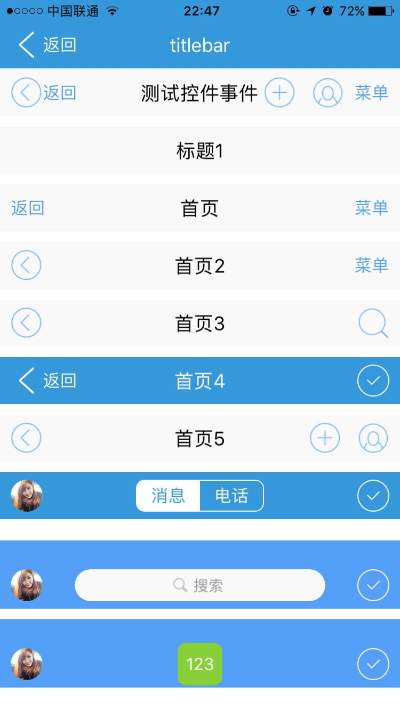

<h1>titlebar组件 <h1/>

----------

<h2 id="cid_0">说明</h2>

titlebar主要用于页面的标题栏展示，为方便开发者布局，封装titlebar-hasstatus 含有系统状态栏高度样式可以直接使用，普通样式是不含状态栏高度的。在使用建议放在垂直布局容器中，宽度会自动填满父容器，如果放在水平布局容器中一定要给出width。  

用法：在js里面引入require("titlebarUI");  


```html
<titlebar  id="title7" licon="res:yuanhongqian/image/touxiang.png" ricon="res:yuanhongqian/image/gou.png" style="background-color:#549FF7;"  />
``` 

<h2 id="cid_1">属性</h2>

本节目录：


> [公共属性](#sx_0)	
> 
> [title	标题 (通过js可以修改)](#sx_1)
>
>[licon	左边图片地址(通过js可以修改)](#sx_2)
>
>[ltext  左边文字(通过js可以修改)	](#sx_3)
>
>[rtext	右边文字(通过js可以修改)](#sx_4)
>
>[ricon	右边图片地址(通过js可以修改)](#sx_5)
>
>[riconsnd	右边第二张图片地址(通过js可以修改)](#sx_6)


<span id="sx_0">**公共属性**</span>  

[参见公共属性章节](https://gitdocument.exmobi.cn/sprite-api/ggsx.html)，包括：id、style、class；

<span id="sx_1">**title**</span>

<code>标题 </code>

标题 (通过js可以修改)

示例：

```javascirpt
var title = document.getElement("titleid");
title.setAttr("title","标题")
```

<span id="sx_2">**licon**</span>

<code>左边图片地址 </code>

左边图片地址(通过js可以修改)；支持res:和相对路径


<span id="sx_3">**ltext**</span>

<code>左边文字 </code>

左边文字(通过js可以修改)

<span id="sx_4">**rtext**</span>

<code>右边文字 </code>

右边文字(通过js可以修改)


<span id="sx_5">**ricon**</span>

<code>右边图片地址 </code>

右边图片地址(通过js可以修改)；支持res:和相对路径

<span id="sx_5">**riconsnd**</span>

<code>右边第二张图片地址 </code>

右边第二张图片地址(通过js可以修改)；支持res:

 
<h2 id="cid_2">样式</h2>

本节目录：

[公共样式 ](#ys_0)

> [title-color  标题颜色](#ys_1)
> 
>[ left-color  左边为文字颜色](#ys_2)
> 
> [right-color  右边文字颜色](#ys_3)
> 
> [licon-width  左边图片宽度](#ys_4)
> 
> [licon-height  左边图片高度](#ys_5)
> 
> [ricon-width 右边图片宽度](#ys_6)
> 
> [ricon-height  右边图片高度](#ys_7)
> 
> [riconsnd-width  右边第二图片宽度](#ys_8)
>  
> [title-font-size  标题文字大小](#ys_9)


<span id="ys_0">**公共样式**</span>

> 尺寸:height默认44;
> 
> 定位;外边距;
> 
> 边框;
> 
> 背景:默认#f9f9f9;
> 
> flexbox布局：align-self，flex


<span id="ys_1">**title-color**</span>

<code>标题颜色</code>

标题颜色(通过js可以修改), 默认色值#000000；

示例：

```javascirpt
var title = document.getElement("titleid");
title.setStyle("title-color”,"red");
```

<span id="ys_2">**left-color**</span>

<code>左边为文字颜色</code>

左边为文字颜色(通过js可以修改)；默认色值#549FF7

<span id="ys_3">**right-color**</span>

<code>右边文字颜色</code>

右边文字颜色(通过js可以修改)；默认色值#549FF7


<span id="ys_4">**licon-width**</span>

<code>左边图片宽度</code>

左边图片宽度(通过js可以修改)；默认宽度30dp

<span id="ys_5">**licon-height**</span >

<code>左边图片高度</code>

左边图片高度(通过js可以修改)；默认高度30dp


<span id="ys_6">**ricon-width**</span>

<code>右边图片宽度</code>

右边图片宽度(通过js可以修改)；默认宽度30dp


<span id="ys_7">**ricon-height**</span>

<code>右边图片高度</code>

右边图片高度(通过js可以修改)；默认高度30

<span id="ys_8">**riconsnd-width**</span>

<code>右边第二图片宽度</code>

右边第二图片宽度(通过js可以修改)；默认高度30

<span id="ys_9">**title-font-size**</span>

<code>右边第二图片宽度</code>

标题文字大小(通过js可以修改)；默认18


<h2 id="cid_3">js方法</h2>

**公共方法**  

[事件相关](https://gitdocument.exmobi.cn/sprite-api/ggff.html#cid_0)，包括：

> [on(messageName:string,callback:Function): void   组件注册事件的触发函数](https://gitdocument.exmobi.cn/sprite-api/ggff.html#jjxg_1)   
> 
> [fire(messageName:string,params:Array&lt;any&gt;): void  组件事件的触发函数](https://gitdocument.exmobi.cn/sprite-api/ggff.html#jjxg_2)   
> 
> [off(messageName:string,callback:Function): void  组件移除事件的触发函数](https://gitdocument.exmobi.cn/sprite-api/ggff.html#jjxg_3)  
>  
> [getOn(messageName:string): Array&lt;Function&gt;  获取已绑定的事件的触发函数](https://gitdocument.exmobi.cn/sprite-api/ggff.html#jjxg_4)   

[动画相关](https://gitdocument.exmobi.cn/sprite-api/ggff.html#cid_1)，包括： 
 
> [startAnimation(jsonData:Object,callback:Function): void  启动UI组件动画](https://gitdocument.exmobi.cn/sprite-api/ggff.html#dhxg_1)   
> 
> [startAnimator(jsonData:Object,callback:Function): void  启动UI组件属性动画](https://gitdocument.exmobi.cn/sprite-api/ggff.html#dhxg_2)   
> 
> [startKeyFrameAnimator(jsonData:Object,callback:Function): void  启动UI组件关键帧动画](https://gitdocument.exmobi.cn/sprite-api/ggff.html#dhxg_3)  
>  
> [ releaseAnimator(): void  结束控件动画](https://gitdocument.exmobi.cn/sprite-api/ggff.html#dhxg_4)   

[尺寸和位置](https://gitdocument.exmobi.cn/sprite-api/ggff.html#cid_2)，包括：  

> [getFrame(): Object  获取组件在父容器中的位置](https://gitdocument.exmobi.cn/sprite-api/ggff.html#cchwz_1)   
> 
> [setFrame(frame:Object): void  设置组件在父容器中的位置](https://gitdocument.exmobi.cn/sprite-api/ggff.html#cchwz_2)   
> 
> [getCenter(): Object  获取组件中心点在父容器中的位置](https://gitdocument.exmobi.cn/sprite-api/ggff.html#cchwz_3)  
>
> [getAbsoluteFrame(): Object  获取组件在绘制窗口中的位置](https://gitdocument.exmobi.cn/sprite-api/ggff.html#cchwz_4)   


[普通Dom节点操作](https://gitdocument.exmobi.cn/sprite-api/ggff.html#cid_3)，包括：  

> [getParent(): IElement  获取父节点](https://gitdocument.exmobi.cn/sprite-api/ggff.html#ptdom_1)   
> 
> [getNext(): IElement  获取同级下一个节点](https://gitdocument.exmobi.cn/sprite-api/ggff.html#ptdom_2)   
> 
> [getPrevious(): IElement  获取同级前一个节点](https://gitdocument.exmobi.cn/sprite-api/ggff.html#ptdom_3)  
> 
> [remove(): void  从父容器中移除自身](https://gitdocument.exmobi.cn/sprite-api/ggff.html#ptdom_4)  
> 
> [clone(isDeep:boolean):IElement  对当前Dom节点进行克隆](https://gitdocument.exmobi.cn/sprite-api/ggff.html#ptdom_5)  
>
> [setAttr(attrName:string,attrValue:string): void  设置节点属性](https://gitdocument.exmobi.cn/sprite-api/ggff.html#ptdom_6)   
>
> [getAttr(attrName:string):string  获取节点属性值](https://gitdocument.exmobi.cn/sprite-api/ggff.html#ptdom_7) 
>
> [getAttrs(): Object  获取节点所有属性](https://gitdocument.exmobi.cn/sprite-api/ggff.html#ptdom_8) 
>
> [removeAttr(attrName:string): void  移除节点属性](https://gitdocument.exmobi.cn/sprite-api/ggff.html#ptdom_9) 
>
> [hasAttr(attrName:string): boolean  节点是否具有该属性](https://gitdocument.exmobi.cn/sprite-api/ggff.html#ptdom_10) 
> 
> [setStyle(styleName:string,styleValue:string): void  设置节点样式值](https://gitdocument.exmobi.cn/sprite-api/ggff.html#ptdom_13)  
>
> [getStyle(styleName:string):string  获取节点样式值](https://gitdocument.exmobi.cn/sprite-api/ggff.html#ptdom_14)   
>
> [clearStyle(styleName:string): void  移除节点样式值](https://gitdocument.exmobi.cn/sprite-api/ggff.html#ptdom_15)    
>
> [setClassStyle(className:string,domobj:IElement): void   设置节点对应Class样式](https://gitdocument.exmobi.cn/sprite-api/ggff.htm#ptdom_16) 
>  
> [getClassStyle(): string  获取节点已设置Class样式](https://gitdocument.exmobi.cn/sprite-api/ggff.html#ptdom_17)  
>  
> [getTag(): string  获取UI组件类型](https://gitdocument.exmobi.cn/sprite-api/ggff.html#ptdom_18)  
>  
> [getId(): string  获取UI组件Id标识](https://gitdocument.exmobi.cn/sprite-api/ggff.html#ptdom_19) 

**setTitleContent(xmlstr:string):void **

<code>根据xml字符串自定义内容</code>

把内容放入titlebar的title中间区域。

参数：

xmlstr：uixml格式的标签字符串片段

返回值：无

注：标签要注入到组件内部，这里注入的标签里面如果有图片，路径不能是相对路径，否则组件内部会认为是基于组件目录的相对路径，所以只能写res:绝对路径

示例：

```javascript
var xmlstr2 = '<button licon="res:yuanhongqian/image/1.png"  id="btn1" class="margin4 radius8 submit"  value="123"/>';
var title8= document.getElement("title8");  
title8.setTitleContent(xmlstr2);
```

**getDomById(id:string):void**

<code>根据id得到自定内容中控件的dom</code>

参数：

id：自定义内容中按钮组件的id

```javascript
//btn1是自定义内容中按钮组件的id。
var btn1 = title8.getDomById("btn1");
 ```


<h2 id="cid_4">事件</h2>

 **ltextClick**

<code>监听左侧文字点击事件；</code>

event对象包括：  
 
> type：事件类型，字符串类型，固定值：ltextClick；  
> 
> target：触发事件的目标组件，dom对象；  
> 
> timestamp：事件触发的时间戳,单位毫秒，数字类型；

示例：

```javascript
var titlebarid = document.getElement("titlebarid");
titlebarid.on("ltextClick",function(e) {
	var tag = e.target;
	var json = {};
	window.close(json);  
});
```

**rtextClick** 

<code>监听右侧文字点击事件；</code>

event对象包括：  
 
> type：事件类型，字符串类型，固定值：rtextClick；  
> 
> target：触发事件的目标组件，dom对象；  
> 
> timestamp：事件触发的时间戳,单位毫秒，数字类型；


**liconClick**

<code>监听左侧图片点击事件；</code>

event对象包括：  
 
> type：事件类型，字符串类型，固定值：liconClick；  
> 
> target：触发事件的目标组件，dom对象；  
> 
> timestamp：事件触发的时间戳,单位毫秒，数字类型；


**riconClick**

<code>监听右侧图片点击事件；</code>

event对象包括：  
 
> type：事件类型，字符串类型，固定值：riconClick；  
> 
> target：触发事件的目标组件，dom对象；  
> 
> timestamp：事件触发的时间戳,单位毫秒，数字类型；


**riconsndClick**

<code>监听右侧第二张图片点击事件</code>

> event对象包括：  
>  
> type：事件类型，字符串类型，固定值：riconsndClick；  
> 
> target：触发事件的目标组件，dom对象；  
> 
> timestamp：事件触发的时间戳,单位毫秒，数字类型；


<h2 id="cid_5">示例</h2>

```html
<page>
	<script><![CDATA[
    var window = require("Window");
    var document = require("Document");
    var ui = require("UI");     
    var console = require("Console");
    //引用自定义UI模板库
    //require("componentUI");
    require("titlebarUI");
    require("buttonUI"); 
    var myappjs = require("myapp");
    var screenWidth = window.getScreenWidth(); 
    window.on("loaded",function(){
        //关闭页面
	    var titlebarid = document.getElement("titlebarid");
	    titlebarid.on("ltextClick",function(e) {
	    	var tag = e.target;
	        var json = {};
	        window.close(json);      
	    });

	    titlebarid.on("liconClick",function(e) {
	    	var tag = e.target;
	        var json = {};
	        window.close(json);      
	    });
    	
        var titlebartest = document.getElement("titlebartest");
	    titlebartest.on("ltextClick",function(e){ 
	        console.log(titlebartest);
	    	myappjs.alert("点击了左侧文字"+ this.getAttr("title"));
	    	this.setAttr("title","22222");    	
	    });

	    titlebartest.on("rtextClick",function(e){ 
	    	this.setAttr("title","22222");
	    	myappjs.alert("点击了右侧文字");
	    });

	     titlebartest.on("liconClick",function(e){
	    	myappjs.alert("点击了左侧图片");
	    });

	     titlebartest.on("riconClick",function(e){
	    	myappjs.alert("点击了右侧图片");
	    });

	     titlebartest.on("riconsndClick",function(e){
	    	myappjs.alert("点击了右侧第二张图片");
	    });

       //定义自定义内容
    var xmlstr = '<box  class="radius8 row-flex-center align-items-stretch" style="height:30dp;width:120dp;border-color:#ffffff;border-width:1dp" >'
		+'<box id="xiaoxi" class="bg-white flex1 row-flex-center" ><text  class="peter-river">消息</text></box>'
		+'<box id="dianhua" class="bg-transparent flex1 row-flex-center"><text  class="white">电话</text></box>'
		+'</box>';
	  var title6 = document.getElement("title6");					 
      //这个一定要先执行
	  title6.setTitleContent(xmlstr);
	 
	  title6.getDomById("xiaoxi").on("click",function(e){
	  	// myappjs.alert("点击了xiaoxi");
         var classes = this.getClassStyle();         
         	this.setClassStyle("bg-white flex1 row-flex-center");
         	this.getFirstChild().setClassStyle("peter-river");
         	title6.getDomById("dianhua").setClassStyle("bg-transparent flex1 row-flex-center");
            title6.getDomById("dianhua").getFirstChild().setClassStyle("white"); 
	  });

	  title6.getDomById("dianhua").on("click",function(e){
	  	 //myappjs.alert("点击了dianhua");	  
         	this.setClassStyle("bg-white  flex1 row-flex-center");
         	this.getFirstChild().setClassStyle("peter-river");
         	title6.getDomById("xiaoxi").setClassStyle("bg-transparent flex1 row-flex-center");
            title6.getDomById("xiaoxi").getFirstChild().setClassStyle("white");
         
	  });

	  var title7 = document.getElement("title7");
	  var xmlstr = '<box id="search"   class="row-flex-center align-items-center flex1" style="height:30dp;border-radius:15;background-color:#f9f9f9;margin:0 70 0 70" >'
			+'<image style="width:16;height:16"  src="res:yuanhongqian/image/icon_search.png" />'
			+'<text class="margin4" style="font-size:14dp;color:#999999">搜索</text>'
			+'</box>';

	  //这个一定要先执行
	  title7.setTitleContent(xmlstr);
	  title7.getDomById("search").on('click',function(e){
	  	 myappjs.alert("点击了搜索");
	  });

      var xmlstr2 = '<button id="btn1" class="margin4 radius8 submit"  value="123"/>';
	  var title8 = document.getElement("title8");
	  title8.setTitleContent(xmlstr2);
	  title8.getDomById("btn1").on('click',function(e){
	  	 myappjs.alert("测试放入自定义控件");
	  });

    });
    ]]>
	</script>
	<style>
       @import url(res:sprite_component/css/sprite.layout.css);
	   @import url(res:sprite_component/css/sprite.color.css);  	   
    </style>
	<ui>
		<box  class="bg-white full" id="box">
		  <titlebar id="titlebarid" ltext="返回" title="titlebar"   licon="res:yuanhongqian/image/back1.png"   class="titlebar-hasstatus bg-peter-river" style="title-color:#ffffff;left-color:#ffffff"/>
		  <line />			
		 <scroll class="flex1">        			
			<box id="boxid" class="row-flex-start flex-wrap full-width">
                <titlebar id="titlebartest" title="测试控件事件" ltext="返回" rtext="菜单"   licon="res:yuanhongqian/image/bx.png"  ricon="res:yuanhongqian/image/lxr.png" riconsnd="res:yuanhongqian/image/cjr.png"/>

                <box style="height:10;" class="full-width"></box>
				<titlebar  title="标题1"/>
				<box style="height:10;" class="full-width"></box>
				<titlebar title="首页" ltext="返回" rtext="菜单" />
				<box style="height:10;" class="full-width"></box>
				<titlebar title="首页2"  rtext="菜单" licon="res:yuanhongqian/image/bx.png" />
				 <box style="height:10;" class="full-width"></box>
				 <titlebar title="首页3"   licon="res:yuanhongqian/image/bx.png"  ricon="res:yuanhongqian/image/ss.png"/>

				 <box style="height:10;" class="full-width"></box>
				 <titlebar ltext="返回" title="首页4"   licon="res:yuanhongqian/image/back1.png"  ricon="res:yuanhongqian/image/gou.png" class="bg-peter-river" style="title-color:#ffffff;left-color:#ffffff"/>
				 
				 <box style="height:10;" class="full-width"></box>
				 <titlebar id="title5"  title="首页5"   licon="res:yuanhongqian/image/bx.png"  ricon="res:yuanhongqian/image/lxr.png" riconsnd="res:yuanhongqian/image/cjr.png"/>

				 <box style="height:10;" class="full-width"></box>
				 <titlebar id="title6"  title="首页6"   licon="res:yuanhongqian/image/touxiang.png"  ricon="res:yuanhongqian/image/gou.png" class="bg-peter-river" style="title-color:#ffffff;left-color:#ffffff"/>				 
				 <box style="height:10;" class="full-width"></box>				 
				 <box style="height:10;" class="full-width"></box>
				 <titlebar  id="title7" licon="res:yuanhongqian/image/touxiang.png" ricon="res:yuanhongqian/image/gou.png" style="background-color:#549FF7;" class="titlebar-hasstatus"  />

				  <box style="height:10;" class="full-width"></box>
				 <titlebar  id="title8" licon="res:yuanhongqian/image/touxiang.png" ricon="res:yuanhongqian/image/gou.png" style="background-color:#549FF7;" class="titlebar-hasstatus"  />			
			</box>
			</scroll>
		</box>
	</ui>
</page>
```

>代码效果图： 

 
